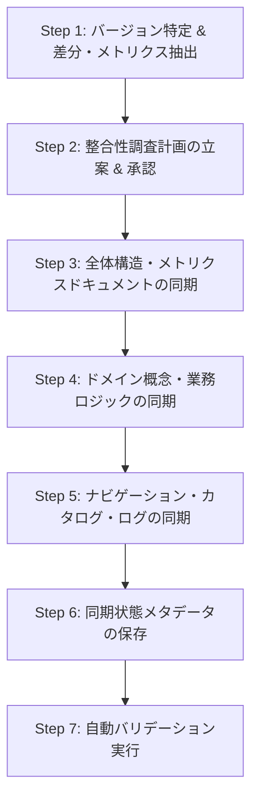

# CDM 一次ソース更新・Wiki 整合性同期スキル (`cdm-source-sync`)

本スキルは、ユーザーが一次ソース（`common-domain-model/rosetta-source/src`）を新しいバージョンやブランチに更新した際に、一次ソースの定義・構造と `cdm_wiki/` 内の各ドキュメントとの整合性を調査し、漏れなく最新仕様へ同期・更新するための標準作業手順書（SOP）です。

---

## 🚫 厳格な遵守ルール（Rules of Engagement）

一次ソース更新の同期作業においては、以下の行動規範を例外なく徹底しなければなりません：

1. **現在の一次ソース断面に基づく客観的解説の徹底（絶対ルール）**:
   - バージョニング解説を目的とするドキュメント（`overview/versioning_and_compatibility.md`）以外において、**「最新のバージョンでは」「7.xでは」「7.xバージョンではｘｘｘ追加・拡張されました」「+xxx 拡充」「新設されました」などの変更経緯や差分ベースの語り口を記載してはならない。**
   - Wiki は変更履歴の通知ではなく、**「現在の一次ソースに定義されている仕様・構造」を解説するリファレンス**である。
   - すべて「〜が定義されています」「〜の構造を持ちます」「〜の関数が提供されています」といった客観的な解説に統一すること。
2. **本文不変ドキュメントの `last_updated` 保持原則**:
   - 一次ソースと整合しているかを点検・監査しただけで、**ドキュメント本文の実質的な内容変更を行わなかったファイルについては、`last_updated` を機械的に更新してはならない（元の更新日を厳格に維持する）。**
   - 本文に新しい仕様やクラス等の実質的な記述変更が行われたファイルのみ、`last_updated` を作業日に更新する。
3. **一次ソース不可変の原則**:
   - `common-domain-model/` 配下のソースコード（`.rosetta`、Java、設定ファイル）は**読み取り専用（一次情報）**であり、直接編集してはならない。
4. **計画立案とユーザー合意の先行（Planning First）**:
   - Wiki ドキュメントを直接編集する前に、必ず更新前後のバージョン・差分規模・影響を受けるドキュメント一覧を整理した計画書（`implementation_plan.md`）を作成し、ユーザーの承認を得てから更新に着手する。
5. **整合性バリデーション完了の義務**:
   - 全更新完了後は、必ず付属のリンタースクリプト（`validate_wiki.py`）を実行し、リンク切れ・Frontmatter不正・孤立ページ・ログ形式不正が 0 件であることを確認する。

---

## 🛠️ 付属スクリプトツール

本スキルには、一次ソースの差分解析とメトリクス集計を自動化する 2 つのスクリプトが配備されています：

| スクリプト | コマンド例 | 主な役割 |
|---|---|---|
| **`extract_git_diff_symbols.py`** | `python .agents/skills/cdm-source-sync/scripts/extract_git_diff_symbols.py` | `cdm_wiki/.source_sync.json` から前回同期コミットを自動検出し、HEAD までの差分（新規追加・削除 Type, Func, Enum, 変更ファイル）を自動抽出。同期完了時は `--save-state` で状態更新。 |
| **`calc_rosetta_stats.py`** | `python .agents/skills/cdm-source-sync/scripts/calc_rosetta_stats.py` | 全 Rosetta DSL（145ファイル）の Type 数、Func 数、Enum 数および 7 大ドメイン別の内訳を精密集計。 |

---

## 📋 標準作業手順（SOP: Step-by-Step）

一次ソース更新時の作業は、以下の 7 つのステップに沿って進行します。



### Step 1: バージョン特定 & 差分・メトリクス抽出
1. **リポジトリ状態 & 前回到達点の確認**:
   - 一次ソースの前回同期コミットは、単一の真実（Single Source of Truth）として `cdm_wiki/.source_sync.json` に記録されています。
   - `common-domain-model` の現在のブランチ、タグ、コミットハッシュを確認：
     ```bash
     git -C common-domain-model describe --tags --always
     git -C common-domain-model branch --show-current
     ```
2. **差分シンボル抽出スクリプトの実行（引数不要）**:
   ```bash
   python .agents/skills/cdm-source-sync/scripts/extract_git_diff_symbols.py
   ```
   - スクリプトが自動的に `.source_sync.json` から前回の同期コミット（`last_synced_commit`）を読み取り、`<last_synced_commit>..HEAD` の差分を解析します（任意の特定範囲を調べたい場合は `--range <old_rev>..<new_rev>` を指定可能）。
   - 新規追加された Type、Function、Enum の名称および対象 `.rosetta` ファイルを把握。
   - 削除・リファクタリングされたシンボルを把握。
3. **最新メトリクス集計スクリプトの実行**:
   ```bash
   python .agents/skills/cdm-source-sync/scripts/calc_rosetta_stats.py
   ```
   - 総ファイル数、総 Type 数、総 Func 数、総 Enum 数、およびドメインプレフィックス別（`base-`, `product-`, `event-`, `legaldocumentation-`, `observable-`, `ingest-fpml-`, `margin-schedule-`）の内訳数値を取得。

### Step 2: 整合性調査計画の立案 & ユーザー承認
1. **影響度マトリクスの作成**:
   - 抽出した差分に基づき、Wiki 内の各ドキュメントへの影響度（High / Medium / Low）を評価。
2. **実装計画書（`implementation_plan.md`）の作成**:
   - 背景（更新前バージョン $\rightarrow$ 更新後バージョン）
   - メトリクス変化（Wiki 記載値 vs 一次ソース最新値）
   - ドキュメント別の調査・更新計画
   - 検証計画
3. **ユーザー承認の取得**:
   - 計画書を提示し、ユーザーの承認（Proceed）を得てから次のステップへ進む。

### Step 3: 全体構造・メトリクスドキュメントの同期
1. **`overview/rosetta_dsl_inventory.md` の更新**:
   - 全体サマリー表の数値を最新値に更新。
   - ドメイン別集計表、Mermaid 円グラフ、機能別内訳を最新の集計値に更新。
   - **【注意】** 「+xx 拡充」「新設」「最新の7.xでは」などの差分表現は記載せず、現在の定義数および機能説明として記述すること。
   - 本文を変更したため `last_updated` を更新。
2. **`overview/versioning_and_compatibility.md` の更新**:
   - バージョニングを解説する目的のドキュメントであるため、最新のメジャー・マイナーリリーストレイン（例: `7.4.0` 安定本番版、`7.x.x` 開発ブランチ、コミットハッシュ等）の位置づけを更新。
   - 本文を変更したため `last_updated` を更新。

### Step 4: ドメイン概念・業務ロジックドキュメントの同期
差分のあった領域に応じて、該当する `concepts/` や `entities/`、`functions/` のドキュメントを更新します：

- **イベント・ライフサイクル（`concepts/event_lifecycle.md`）**:
  - リセット処理（Reset Step 2〜6: `event-instructioncomposition-reset-*`）など、新設・再編された Instruction Composition 機構を解説。
- **契約日付・営業日調整（`concepts/contract_dates_modeling.md`）**:
  - `base-datetime-func.rosetta` で提供される営業日調整・日付シフト関数群（`AdjustDateToFollowingBusinessDay`, `ShiftBusinessDays` 等）および Java 実装（`CalculationPeriodImpl`）の解説を反映。
- **外部データ取込（`concepts/fpml_ingestion.md`）**:
  - 執行通知（`executionNotification`）マッピングや自然人識別子スキーム（`MapPersonIdentifierTypeEnum`）の仕様を解説。
- **市場データ・参照金利（`concepts/observables_and_rates.md`）**:
  - FRO 観測種別の自動判定ロジック（`DetermineObservationType`）等の仕様を反映。
- **【重要チェック】**:
  - 各ドキュメントにおいて、「追加されました」「7.xでは」といった経緯表現を用いず、「〜が定義されています」「〜をサポートします」という現在の仕様解説として記述すること。
  - **本文の実質的変更を行わなかったドキュメントは、絶対に `last_updated` を変更しないこと。**

### Step 5: ナビゲーション・カタログ・ログの同期
1. **`CDM_INDEX.md`**:
   - 目的別ファイル検索ガイドに、新設された主要型・関数・ファイルリンクを反映。
2. **`index.md`**:
   - 更新された各ドキュメントの要約文を最新化（バージョン経緯表現は含めない）。
3. **`log.md`**:
   - 時系列操作ログに、一次ソース最新版への全面同期作業を記録：
     ```markdown
     ## [YYYY-MM-DD] update | 一次ソース最新版（CDM <old_ver> → <new_ver>）への Wiki 全面整合性同期
     - 一次ソース common-domain-model/rosetta-source/src の更新に伴う整合性調査を実施。
     - ... (実施内容の箇条書き)
     ```

### Step 6: 同期状態メタデータの保存
Wiki 本文およびカタログの更新が完了したら、現在のリポジトリ状態（HEAD コミット、タグ、ブランチ、日付）を `cdm_wiki/.source_sync.json` に保存します：
```bash
python .agents/skills/cdm-source-sync/scripts/extract_git_diff_symbols.py --save-state
```
- これにより、次回一次ソースが更新された際に、このコミットが `old_ver` として自動参照され、コンテキスト浪費や手動確認なしで決定論的な差分解析が可能となります。

### Step 7: 自動バリデーション実行
全ファイルの更新後、リンタースクリプトを実行して健全性を検証します：
```bash
python .agents/skills/cdm-wiki-manager/scripts/validate_wiki.py --skip-external
```
- エラー 0 件（Error: 0）であることを確認。
- 外部 URL を追加・変更した場合は外部接続チェックも実行して 200 OK を確認。

---

## ⚠️ アンチパターン・チェックリスト（作業完了前に必ず確認）

| チェック項目 | NG 例（やってはいけないこと） | OK 例（正しい記述） |
|---|---|---|
| **バージョン経緯の混入** | 「7.xバージョンでは、リセット命令合成が追加されました。」 | 「浮動金利のリセット処理においては、リセット命令合成機構（`event-instructioncomposition-reset-*`）が定義されています。」 |
| **メトリクスの差分表記** | `総 Type 数: 780 型 (+21型 拡充)` | `総 Type 数: 780 型` |
| **関数説明での新設表現** | `営業日調整関数（... 等が新設）` | `営業日調整関数（AdjustDateToFollowingBusinessDay, ShiftBusinessDays 等）` |
| **本文不変での更新日変更** | 本文を一切変更していないのに `last_updated` を今日の日付に進める | 本文に変更がない場合は元の `last_updated` をそのまま維持する |
| **一次ソースの編集** | `common-domain-model/` 配下のファイルを修正する | `common-domain-model/` は絶対に編集しない（読み取り専用） |
