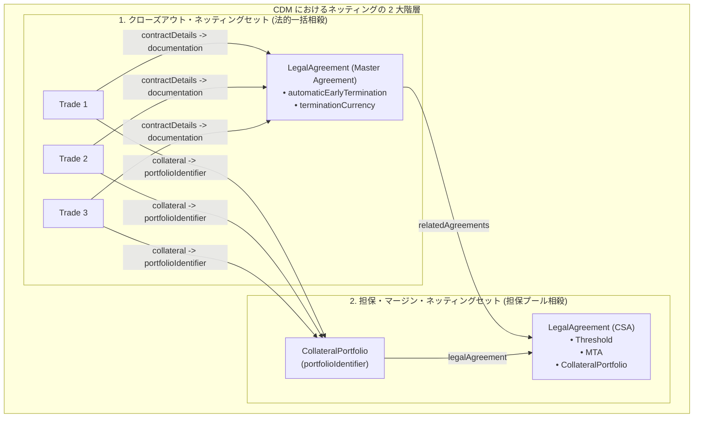

# CVA計算に必要な担保・契約・顧客・ネッティング情報のCDM DSLモデリング仕様

本ドキュメントは、金融機関のカウンターパーティ信用リスク管理および XVA 業務において不可欠となる **CVA（Credit Valuation Adjustment: 信用評価調整）計算** に必要とされる4大データ要素（**担保情報**、**契約情報**、**顧客・カウンターパーティ情報**、**ネッティング情報**）について、FINOS Common Domain Model (CDM) の Rosetta DSL 一次ソースにおける定義構造・型関係・属性仕様を体系化したリファレンスです。

---

## 1. CVA 計算と CDM データモデルの対応総括

CVA は、取引相手（カウンターパーティ）のデフォルトリスクによる将来の期待損失の割引現在価値であり、一般に以下の式に基づいて算定されます：

$$\text{CVA} \approx (1 - R) \int_0^T \text{EE}^*(t) \, d\text{PD}(0, t)$$

ここで：
- $\text{EE}^*(t)$: リスク中立期待エクスポージャー（担保・ネッティング控除後）
- $\text{PD}(0, t)$: カウンターパーティの累積デフォルト確率
- $R$: デフォルト時回収率（$1-R$ は LGD: 損失率）

CDM の Rosetta DSL コードベースには、これらのパラメータ算定およびシミュレーションに必要なデータ構造がすべて網羅的に定義されています。

| CVA 計算の必須データ要素 | CDM における主要ドメイン / ファイル | 中核となる Rosetta DSL 型 |
| :--- | :--- | :--- |
| **1. 担保情報 (Collateral)** | [`legaldocumentation-csa-type.rosetta`](../../common-domain-model/rosetta-source/src/main/rosetta/legaldocumentation-csa-type.rosetta)<br>[`product-collateral-type.rosetta`](../../common-domain-model/rosetta-source/src/main/rosetta/product-collateral-type.rosetta)<br>[`event-common-type.rosetta`](../../common-domain-model/rosetta-source/src/main/rosetta/event-common-type.rosetta) | `Threshold`, `MinimumTransferAmount`, `Collateral`, `CollateralPortfolio`, `CollateralBalance`, `CollateralValuationTreatment` |
| **2. 契約情報 (Legal Documentation)** | [`legaldocumentation-common-type.rosetta`](../../common-domain-model/rosetta-source/src/main/rosetta/legaldocumentation-common-type.rosetta)<br>[`legaldocumentation-master-isda-type.rosetta`](../../common-domain-model/rosetta-source/src/main/rosetta/legaldocumentation-master-isda-type.rosetta)<br>[`event-common-type.rosetta`](../../common-domain-model/rosetta-source/src/main/rosetta/event-common-type.rosetta) | `Trade -> contractDetails: ContractDetails`, `LegalAgreement`, `MasterAgreement`, `AgreementTerms`, `GoverningLaw` |
| **3. 顧客・相手方情報 (Party & Rating)** | [`base-staticdata-party-type.rosetta`](../../common-domain-model/rosetta-source/src/main/rosetta/base-staticdata-party-type.rosetta)<br>[`observable-asset-type.rosetta`](../../common-domain-model/rosetta-source/src/main/rosetta/observable-asset-type.rosetta) | `Party`, `PartyIdentifier` (LEI), `LegalEntity`, `RelatedParty` (Guarantor), `CreditNotation` (Rating) |
| **4. ネッティング情報 (Netting)** | [`legaldocumentation-master-isda-type.rosetta`](../../common-domain-model/rosetta-source/src/main/rosetta/legaldocumentation-master-isda-type.rosetta)<br>[`event-common-type.rosetta`](../../common-domain-model/rosetta-source/src/main/rosetta/event-common-type.rosetta)<br>[`product-common-settlement-enum.rosetta`](../../common-domain-model/rosetta-source/src/main/rosetta/product-common-settlement-enum.rosetta) | `AutomaticEarlyTermination`, `TerminationCurrency`, `CollateralPortfolio -> portfolioIdentifier`, `StandardSettlementStyleEnum` |

---

## 2. 担保情報（Collateral / Margin）の DSL 定義

担保契約（CSA）条件および現在の担保ポジション・残高は、エクスポージャー $\text{EE}(t)$ の担保控除シミュレーション（MPOR: Margin Period of Risk 内の担保コールのモデリング）に直接使用されます。

### 2.1 CSA 条件の型定義 (`legaldocumentation.csa`)

[`legaldocumentation-csa-type.rosetta`](../../common-domain-model/rosetta-source/src/main/rosetta/legaldocumentation-csa-type.rosetta) にて定義されています。

- **`Threshold`（無担保許容枠 / 閾値）**:
  相手方の信用リスクに対して担保を要求せずに許容する無担保エクスポージャーの上限。
  ```rosetta
  type Threshold:
      partyElection ThresholdElection (2..2)  // 当事者双方（Party1, Party2）ごとの個別設定

  type ThresholdElection:
      party CounterpartyRoleEnum (1..1)
      fixedAmount ThresholdMinimumTransferAmountFixedAmount (0..1)  // 固定金額
      ratingsBased ThresholdRatingsBased (0..1)                      // 格付け連動閾値マトリクス
      infinity boolean (0..1)                                      // 無制限（完全無担保）
  ```
  - **`ThresholdRatingsBased`**: 外部格付機関（S&P, Moody's, Fitch等）の格付区分に応じて閾値が段階的に変動するテーブル（`variableSet: CSAThresholdVariableSet`）を定義。
  - **ゼロ転落条項 (`ThresholdMinimumTransferAmountBase -> zeroEvent`)**: 特定の信用事象（格下げ、債務不履行等）の発生により閾値が強制的にゼロ（完全担保化）になるトリガー条件をモデル化。

- **`MinimumTransferAmount`（最低振替金額 / MTA）**:
  担保の受渡請求を行う最小単位。固定金額または格付連動で指定。
  ```rosetta
  type MinimumTransferAmount:
      partyElection MinimumTransferAmountElection (2..2)
  ```

- **`CreditSupportAgreementInitialMarginElections` / `CreditSupportAgreementVariationMarginElections`**:
  当初証拠金（IM: ISDA SIMM または規制スケジュール）および変動証拠金（VM）の運用規定、基本通貨（`baseAndEligibleCurrency`）、マージンコール計算タイミング（`calculationAndTiming`）、担保受渡期日等を包括管理。

### 2.2 取引・ポートフォリオ担保とヘアカット (`product.collateral` & `event.common`)

- **`Collateral`（取引レベル担保定義）**:
  [`product-collateral-type.rosetta`](../../common-domain-model/rosetta-source/src/main/rosetta/product-collateral-type.rosetta)
  ```rosetta
  type Collateral:
      independentAmount IndependentAmount (0..1)       // 追加担保 / インディペンデント・アマウント
      portfolioIdentifier Identifier (0..*)             // 担保ポートフォリオ（ネッティングセット）識別子
      collateralPortfolio CollateralPortfolio (0..*)    // 担保ポートフォリオへの直接参照
      collateralProvisions CollateralProvisions (0..1)  // 適格担保・差替規定
  ```

- **`CollateralValuationTreatment`（ヘアカット・評価調整）**:
  差入担保の時価掛目・割引率。
  - `haircutPercentage`: 有価証券等の担保価値に対するヘアカット率（例: 0.05 = 5%）。
  - `fxHaircutPercentage`: 担保通貨と解約通貨/基本通貨の通貨不一致に伴う為替ヘアカット率（例: 8%）。
  - `marginPercentage`: マージン比率（100%超の所要額設定）。

- **`CollateralPortfolio` & `CollateralBalance`（担保残高・ポジション）**:
  [`event-common-type.rosetta`](../../common-domain-model/rosetta-source/src/main/rosetta/event-common-type.rosetta)
  ```rosetta
  type CollateralPortfolio:
      portfolioIdentifier Identifier (0..1)
      collateralPosition CollateralPosition (0..*)      // 個別の担保銘柄・現金ポジション
      collateralBalance CollateralBalance (0..*)        // 合算担保残高
      legalAgreement LegalAgreement (0..1)              // 準拠する CSA への参照

  type CollateralBalance:
      collateralBalanceStatus CollateralStatusEnum (0..1)  // Settled, InTransit 等
      haircutIndicator HaircutIndicatorEnum (0..1)         // ヘアカット前/後
      amountBaseCurrency Money (1..1)                      // 基準通貨換算の担保残高
      payerReceiver PartyReferencePayerReceiver (1..1)      // 差入(Posted) / 受入(Held)
  ```

---

## 3. 契約情報（Legal Documentation / Agreement）の DSL 定義

取引がどのマスター契約（ISDA Master Agreement等）および CSA に準拠しているかを特定し、デフォルト時の一括清算効力を決定します。

### 3.1 取引からの契約参照構造

[`event-common-type.rosetta`](../../common-domain-model/rosetta-source/src/main/rosetta/event-common-type.rosetta) の `Trade` 型において、`contractDetails` 属性を介して法的な契約情報と紐付けられます。

```rosetta
type Trade extends TradableProduct:
    tradeIdentifier TradeIdentifier (1..*)
    tradeDate date (1..1)
    contractDetails ContractDetails (0..1)  // 契約詳細情報
    collateral Collateral (0..1)            // 担保情報

type ContractDetails:
    documentation LegalAgreement (0..*)     // 準拠する法的契約書（Master Agreement, CSA）
    governingLaw GoverningLawEnum (0..1)    // 準拠法（EnglishLaw, NewYorkLaw, JapaneseLaw 等）
```

### 3.2 法的合意の構造 (`cdm.legaldocumentation.common`)

[`legaldocumentation-common-type.rosetta`](../../common-domain-model/rosetta-source/src/main/rosetta/legaldocumentation-common-type.rosetta)

- **`LegalAgreement` / `LegalAgreementBase`**:
  - `agreementDate` / `effectiveDate`: 締結日・発効日
  - `contractualParty Party (2..2)`: 契約締結の2当事者
  - `legalAgreementIdentification`: 契約の体系的識別情報
    - `agreementName`: 契約名称（MasterAgreement, CreditSupportAnnex 等）
    - `publisher`: 発行団体（ISDA, ICMA, ISLA 等）
    - `governingLaw`: 準拠法
    - `vintage`: 発行年（1992, 2002, 2016 等）
  - `agreementTerms AgreementTerms`: 各種契約スケジュール・選挙項目（ISDA Schedule や CSA Elections）
  - `relatedAgreements LegalAgreement (0..*)`: マスター契約と CSA 間の相互関連付けリンク

---

## 4. 顧客・カウンターパーティ情報（Party & Rating）の DSL 定義

カウンターパーティの法的属性、一意の識別コード（LEI）、およびデフォルト確率 $\text{PD}(t)$ の推計・マッピングに不可欠な外部信用格付をモデル化します。

### 4.1 当事者・法人識別 (`cdm.base.staticdata.party`)

[`base-staticdata-party-type.rosetta`](../../common-domain-model/rosetta-source/src/main/rosetta/base-staticdata-party-type.rosetta)

- **`Party`**:
  ```rosetta
  type Party:
      partyId PartyIdentifier (1..*)      // 20桁の LEI (Legal Entity Identifier) 等
      name string (0..1)                  // 法人名称
      businessUnit BusinessUnit (0..*)    // 取引部署・トレーディングデスク
      person NaturalPerson (0..*)         // 担当者
      account Account (0..1)              // 口座情報
  ```
- **`LegalEntity`**: 正式な法人情報（`name`, `entityIdentifier: EntityIdentifier`）。
- **`RelatedParty`（保証人・信用補完）**:
  親会社保証や信用補完提供者の関係をモデル化。
  - `role`: `PartyRoleEnum -> Guarantor` / `CreditSupportProvider`
  - これにより、子会社取引であっても親会社の信用力（PD/格付）を代替適用（Guarantee Substitution）する CVA モデリングが可能になります。

### 4.2 信用格付 (`cdm.observable.asset`)

[`observable-asset-type.rosetta`](../../common-domain-model/rosetta-source/src/main/rosetta/observable-asset-type.rosetta)

- **`CreditNotation`**:
  格付け機関、格付け記号、債務区分、アウトルックを統合表現。
  ```rosetta
  type CreditNotation:
      agency CreditRatingAgencyEnum (1..1)          // StandardAndPoors, Moodys, Fitch 等
      notation string (1..1)                        // "AAA", "AA+", "Baa1" 等の格付記号
      scale string (0..1)                           // 短期 / 長期スケール
      debt CreditRatingDebt (0..1)                  // シニア無担保債、劣後債、預金等
      outlook CreditRatingOutlookEnum (0..1)        // Positive, Stable, Negative
      creditWatch CreditRatingCreditWatchEnum (0..1)// クレジット・ウォッチ情報
  ```

---

## 5. ネッティング情報（Netting & Portfolio）の DSL 定義

CVA 計算において、カウンターパーティ破綻時に契約群を一括清算・相殺して正味のエクスポージャーを算出する「**クローズアウト・ネッティングセット（Close-out Netting Set）**」の単位を決定します。

### 5.1 クローズアウト・ネッティングと ISDA マスター契約条項

[`legaldocumentation-master-isda-type.rosetta`](../../common-domain-model/rosetta-source/src/main/rosetta/legaldocumentation-master-isda-type.rosetta)

ISDA Master Agreement（1992/2002）Section 6 に基づくクローズアウト・ネッティング処理に関連する条項が明示的にモデル化されています。

```rosetta
type MasterAgreement extends MasterAgreementBase:
    automaticEarlyTermination AutomaticEarlyTermination (1..1)  // 自動早期終了（AET）条項
    terminationCurrency TerminationCurrency (1..1)              // 清算通貨（一本化する通貨）
    creditSupportDocument CreditSupportDocument (1..1)          // 担保契約（CSA）の指定
    creditSupportProvider CreditSupportProvider (1..1)          // 信用補完提供者
    specifiedEntities SpecifiedEntities (4..4)                  // 指定事業体
```

- **`AutomaticEarlyTermination`（自動早期終了 / AET: Section 6(a)）**:
  相手方の破産等（Insolvency）の事象が発生した際、通知なしに全取引が自動的に終了（Early Termination）するかどうか。特定の法域（ドイツ法やスイス法など、破産開始後の解約権行使に制限がある管轄）において CVA のモデリング（デフォルト時点での即時一括清算の成立可否）に極めて重要な影響を与えます。
  ```rosetta
  type AutomaticEarlyTermination:
      fallbackAET boolean (1..1)
      indemnity boolean (1..1)
      partyElection AutomaticEarlyTerminationElection (0..2)
  ```
- **`TerminationCurrency`（解約・清算通貨）**:
  ネッティングセット内の全取引の時価評価額および未決済債権債務を 1 つの通貨に換算して合算（Netting）するための基準通貨。

### 5.2 ネッティングセットの識別・紐付けメカニズム

CDM において、ある取引（Trade）がどのネッティングセットに属するかは、以下の 2 つの階層で識別されます：



1. **法的一括相殺（Close-out Netting Set）**:
   - `Trade -> contractDetails -> documentation -> LegalAgreement`
   - 同一のマスター契約（`MasterAgreement`）を参照する取引群が、法的に有効なクローズアウト・ネッティングセットを形成します。
2. **担保プール相殺（Margin Netting Set）**:
   - `Trade -> collateral -> portfolioIdentifier`（または `collateralPortfolio`）
   - 同一の担保ポートフォリオ識別子（`portfolioIdentifier`）を参照する取引群が、同一の CSA 担保プール（マージン計算対象）にグループ化されます。

---

## 6. CVA エンジンへの入力マッピング一覧

CVA 計算エンジン（モンテカルロ・シミュレーション基盤）に投入する際の CDM 属性マッピング早見表です。

| CVA エンジンの入力項目 | CDM の参照パス・属性 | 役割・活用法 |
| :--- | :--- | :--- |
| **Counterparty ID** | `Trade -> party -> partyId` (LEI) | 顧客・取引相手の一意識別 |
| **PD カーブ / 格付** | `Party -> CreditNotation` (agency, notation) | 信用スプレッド / デフォルト確率曲線の特定 |
| **親会社保証** | `Party -> RelatedParty` (role = Guarantor) | 親会社信用力への代替（Substitution）判定 |
| **Netting Set ID** | `Trade -> contractDetails -> documentation -> identifier` | 取引を合算するクローズアウト・ネッティングセットID |
| **AET 適用有無** | `MasterAgreement -> automaticEarlyTermination -> isApplicable` | デフォルト発生時の即時解約シミュレーション |
| **清算基準通貨** | `MasterAgreement -> terminationCurrency` | 複数通貨取引を合算・純額化する通貨 |
| **Margin Netting Set ID** | `Trade -> collateral -> portfolioIdentifier` | 担保控除を行う担保プール単位の識別 |
| **Threshold (閾値)** | `Threshold -> partyElection -> fixedAmount / ratingsBased` | 無担保許容枠（格付別テーブルおよびゼロ転落判定） |
| **MTA (最低振替金額)** | `MinimumTransferAmount -> partyElection -> fixedAmount` | マージンコール発生閾値の判定 |
| **担保ヘアカット** | `CollateralValuationTreatment -> haircutPercentage / fxHaircutPercentage` | 有価証券担保および通貨不一致時の担保価値割引 |
| **現有担保残高** | `CollateralPortfolio -> collateralBalance -> amountBaseCurrency` | 現時点で差入/受入済みの担保控除額（初期値） |
| **独立担保額 (IA)** | `Trade -> collateral -> independentAmount` | 信用リスク上乗せ担保（追加証拠金）の反映 |
