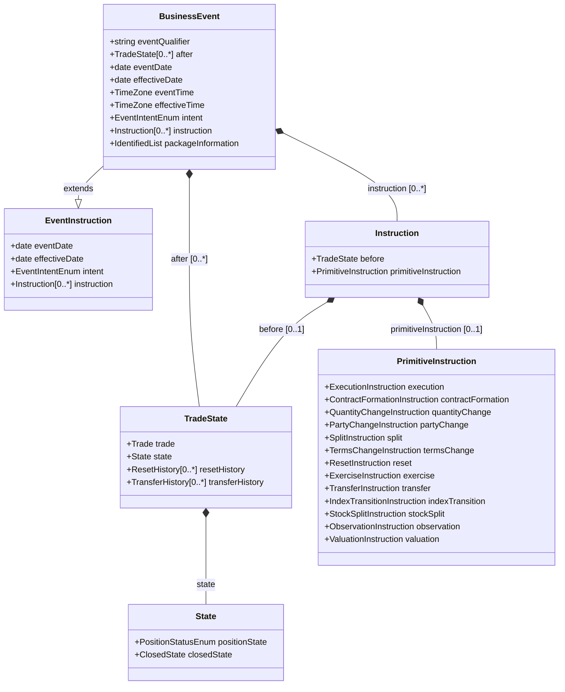
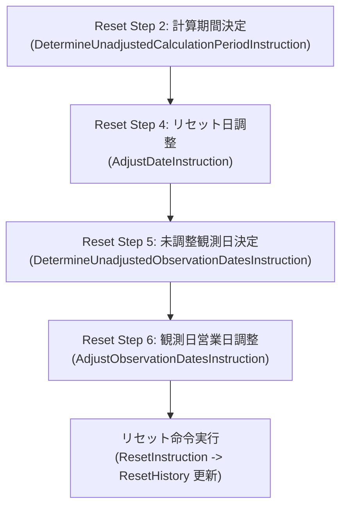

# 取引イベント & ライフサイクル (Business Event データ構造)

FINOS Common Domain Model (CDM) における取引ライフサイクルイベントの中心的概念である **`BusinessEvent`** のデータ構造、関数型状態遷移モデル（Before $\rightarrow$ Primitive $\rightarrow$ After）、および関連クラス群の解説です。

---

## 1. Business Event の全体アーキテクチャ & クラス図

CDM のイベントモデルは、取引オブジェクト（`Trade`）を直接ミュータブルに変更するのではなく、**「変更前の状態（`before`）」に「最小単位の不可分操作（`primitiveInstruction`）」を適用して「変更後の新しい状態（`after`）」を生成する純粋関数（Pure Function）** として設計されています。



---

## 2. BusinessEvent の主要属性

`BusinessEvent` (`cdm.event.common.BusinessEvent` extends `EventInstruction`) は以下の属性で構成されます：

| 属性名                      | 型                 | 多重度      | 役割・解説                                                                                                                                            |
| ------------------------ | ----------------- | -------- | ------------------------------------------------------------------------------------------------------------------------------------------------ |
| **`eventQualifier`**     | `string`          | `(0..1)` | 自動分類されたビジネスイベント区分名（例: `"Execution"`, `"Novation"`, `"Allocation"`, `"PartialTermination"` 等）。`event-qualification-func.rosetta` のルールにより自動判定されます。 |
| **`instruction`**        | `Instruction`     | `(0..*)` | イベントを構成するプリミティブ操作のリスト。変更前状態（`before`）と実行指示（`primitiveInstruction`）をカプセル化。                                                                        |
| **`after`**              | `TradeState`      | `(0..*)` | イベント実行によって新しく生成された取引状態（After TradeState）。1対1の変更だけでなく、1対N（Allocation）、N対1（Compression）をサポートするため複数指定可能。                                            |
| **`eventDate`**          | `date`            | `(1..1)` | イベント発生日（約定日、解約合意日、利率決定日等）。                                                                                                                       |
| **`effectiveDate`**      | `date`            | `(0..1)` | イベントの法的・契約上の効力発生日（Value Date）。                                                                                                                   |
| **`intent`**             | `EventIntentEnum` | `(0..1)` | イベント意図のアノテーション（例: 数量減額が「部分解約」か「ポートフォリオ再調整」か「エラー訂正」かを明示的に区別する際に使用）。                                                                               |
| **`packageInformation`** | `IdentifiedList`  | `(0..1)` | 複数取引がパッケージとして同時約定・処理された場合の識別子・共通情報。                                                                                                              |

---

## 3. 13 種類の最小単位操作（Primitive Instructions）

`Instruction` の内部で指定される `PrimitiveInstruction` は、取引状態を変化させる **13 の不可分操作（Primitives）** のいずれか（または組み合わせ）を定義します。

| プリミティブ名 | 命令型 | 主なユースケース・対応ビジネスイベント |
|---|---|---|
| **`execution`** | `ExecutionInstruction` | **新規取引約定**（`before` は存在せず、新規の `TradeState` を生成）。 |
| **`contractFormation`** | `ContractFormationInstruction` | **契約締結・法的確定**（マスター契約への紐付け、契約日確定）。 |
| **`quantityChange`** | `QuantityChangeInstruction` | **数量・元本変更**（部分解約 `PartialTermination`、全額解約 `Termination`、増額 `Increase`）。 |
| **`partyChange`** | `PartyChangeInstruction` | **当事者交代**（契約更改 `Novation`、一部更改 `PartialNovation`）。 |
| **`split`** | `SplitInstruction` | **取引分割**（ブロック取引のファンド配分 `Allocation`、清算機関への提出 `ClearingSubmission`）。 |
| **`termsChange`** | `TermsChangeInstruction` | **契約条件変更**（金利スプレッド変更、スケジュール変更、経済条件の修正 `Amendment`）。 |
| **`reset`** | `ResetInstruction` | **金利・指標リセット**（浮動金利 Fixing、観測利率の決定と `resetHistory` への記録）。 |
| **`exercise`** | `ExerciseInstruction` | **オプション行使**（スワップション行使、現物スワップの生成または差金決済）。 |
| **`transfer`** | `TransferInstruction` | **資金・証券決済**（クーポン支払、元本交換、プレミアム支払、担保受渡）。 |
| **`indexTransition`** | `IndexTransitionInstruction` | **参照金利移行**（LIBOR 廃止に伴う SOFR/TONA へのフォールバック適用）。 |
| **`stockSplit`** | `StockSplitInstruction` | **株式分割**（株式デリバティブに対するコーポレートアクション適用）。 |
| **`observation`** | `ObservationInstruction` | **市場データ観測値の記録**（バリア観測、価格観測）。 |
| **`valuation`** | `ValuationInstruction` | **時価評価の更新**（日次 Mark-to-Market 評価額の追記）。 |

---

## 4. ライフサイクルイベントの具体例と状態遷移フロー

### 4.1 新規約定（Execution）
```
[ Before: null ] ──( ExecutionInstruction )──> [ Create_Execution ] ──> [ BusinessEvent ]
                                                                             ├── eventQualifier: "Execution"
                                                                             └── after: [ TradeState (Position: Executed) ]
```

### 4.2 契約更改（Novation: A-B 間契約を A-C 間に更改）
```
[ Before: TradeState(A vs B) ]
         │
         ├──( PartyChangeInstruction: B -> C )──> [ Create_Novation ] ──> [ BusinessEvent ]
         └──( TransferInstruction: Novation Fee )                             ├── eventQualifier: "Novation"
                                                                              ├── after[0]: TradeState(A vs B, State: Closed-Novated)
                                                                              └── after[1]: TradeState(A vs C, State: Executed)
```

### 4.3 ブロック取引配分（Allocation: 1つの親取引を 2 つのサブファンドに配分）
```
[ Before: TradeState(親ブロック: 100M) ]
         │
         └──( SplitInstruction: 60M to Fund1, 40M to Fund2 )──> [ Process_Allocation ] ──> [ BusinessEvent ]
                                                                                                 ├── eventQualifier: "Allocation"
                                                                                                 ├── after[0]: TradeState(親: Closed-Allocated)
                                                                                                 ├── after[1]: TradeState(Fund1: 60M, Executed)
                                                                                                 └── after[2]: TradeState(Fund2: 40M, Executed)
```

### 4.4 金利・指標リセット（Reset）と Instruction Composition（命令合成機構）
浮動金利のリセット処理においては、複雑な日付計算や観測日調整を段階的・関数型に合成する **Instruction Composition 機構**（`event-instructioncomposition-reset-*`）が定義されています。



- **段階的命令生成**:
  1. `Create_DetermineUnadjustedCalculationPeriodInstruction`: 金利計算期間（Unadjusted Calculation Period）を特定。
  2. `Create_AdjustDateInstruction`: 営業日カレンダーに基づくリセット日（Reset Date）の営業日調整。
  3. `Create_DetermineUnadjustedObservationDatesInstruction`: 複利・平均計算（Compounding / Averaging）に必要な未調整観測日リストを生成。
  4. `Create_AdjustObservationDatesInstruction`: 祝日・休日カレンダーを考慮した観測日（Observation Dates）の調整。
  5. `UpdateResetCompositionState`: 各ステップの完了状態を管理し、次ステップの合成指示を決定（オーケストレーション）。

---

## 5. 関連ドキュメント
- [contract_dates_modeling.md](contract_dates_modeling.md): 契約レベル・レグレベルの日付階層 & 営業日調整モデル
- [workflow_step_and_lifecycle_samples.md](workflow_step_and_lifecycle_samples.md): WorkflowStep によるライフサイクルイベントの追跡
- [vanilla_irs_trade_structure.md](vanilla_irs_trade_structure.md): バニラ IRS の TradeState / Trade クラス図
- [core_data_types.md](../entities/core_data_types.md): 主要エンティティ & データ型リファレンス
- [qualification_and_calculation.md](../functions/qualification_and_calculation.md): イベント自動適格性判定（`Qualify_`）の解説

