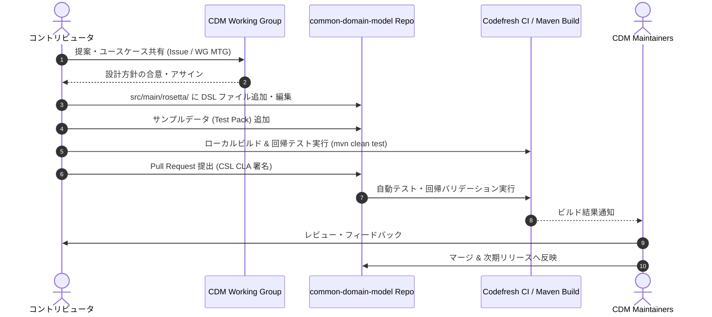

# Rune DSLを用いたCDMモデルの独自拡張ワークフロー

FINOS Common Domain Model (CDM) は、金融取引のプロダクトやイベントを機械可読かつ実行可能な形式で定義した業界標準モデルです。
CDM は技術非依存なモデリング言語 **Rune DSL**（旧称: Rosetta DSL）によって記述されており、利用者は CDM の標準定義をそのまま利用するだけでなく、独自のビジネス要件や社内管理項目に合わせて**独自の Rune DSL 定義を追加して拡張**することが可能です。

本ドキュメントでは、CDM の Rune DSL を独自定義で拡張する手法について、言語構文仕様からプロジェクト構成、ビルドパイプライン、ならびに「自社プロジェクトでの外部拡張（Downstream）」と「CDM コミュニティへの標準コントリビューション（Upstream）」の 2 大ワークフローを体系的に解説します。

---

## 1. CDM 拡張における 2 つのアプローチ

CDM の拡張には、利用目的やガバナンスに応じて 2 つの異なるアプローチが存在します。

```mermaid
graph TD
    subgraph Approach A: 外部下流プロジェクト (In-house / Downstream)
        ExtA[自社固有の独自システム・業務要件] --> A1[独自 Maven/Gradle プロジェクト作成]
        A1 --> A2[CDM をライブラリ依存として import]
        A2 --> A3[独自名前空間で type extends / composition]
        A3 --> A4[rune-maven-plugin で Java/Python コード生成]
    end

    subgraph Approach B: CDM コミュニティ標準化 (Upstream Contribution)
        ExtB[業界共通の新規商品・イベント・規制対応] --> B1[FINOS CDM Working Group での議論]
        B1 --> B2[common-domain-model リポジトリの rosetta-source を編集]
        B2 --> B3[設計原則 & テストパック検証]
        B3 --> B4[Pull Request & Maintainer レビュー]
    end
```

| 項目 | アプローチ A: 外部プロジェクト拡張 (Downstream) | アプローチ B: CDM 本体コントリビューション (Upstream) |
|---|---|---|
| **対象領域** | 自社固有の管理項目、内部勘定コード、非公開の独自デリバティブ商品、社内システム連携 | 金融市場共通の標準商品（新アセットクラス等）、業界標準ライフサイクルイベント、規制レポート定義 |
| **作業リポジトリ** | 利用者/企業独自のプライベートリポジトリ | [finos/common-domain-model](https://github.com/finos/common-domain-model) |
| **名前空間** | 独自名前空間（例: `com.mybank.cdm.extension.*`） | 標準 CDM 名前空間階層（例: `cdm.product.asset.*`, `cdm.event.*`） |
| **依存関係** | CDM アーティファクト（`org.finos.cdm:cdm-java`）を参照 | リポジトリ内の一次ソース（`rosetta-source/src/main/rosetta/`）を直接追加・編集 |
| **ガバナンス** | 自社内の開発・リリースサイクルに準拠 | FINOS ガバナンス（CSL CLA 署名、Working Group 承認、PR レビュー） |

---

## 2. Rune DSL におけるモデリング構文仕様

Rune DSL では、既存の CDM 型資産を再利用しながら独自定義を追加するための強力な構文機能が提供されています。

### 2.1 名前空間の分離とインポート

独自の DSL 定義は、標準 CDM の名前空間（`cdm.*`）との衝突を防ぐため、必ず**独自の名前空間**を宣言します。

```rosetta
namespace com.mycompany.cdm.product.custom : <"Custom extensions for proprietary structured products.">
version "1.0.0"

// CDM 標準名前空間のインポート
import cdm.base.*
import cdm.base.staticdata.party.*
import cdm.product.template.*
import cdm.product.asset.*

// エイリアス付きインポート（衝突防止）
import cdm.event.common.* as cdmEvent
```

- **`namespace`**: モデル要素をグループ化する一意な識別子。
- **`import <namespace>.*`**: 指定した名前空間直下のすべての型・列挙型・関数を参照可能にする。
- **`import ... as <alias>`**: 名前空間にエイリアスを付与し、`<alias>.<TypeName>` で安全に参照する。

### 2.2 型継承（Inheritance / `extends`）

既存の CDM 型をベースに新しい属性を追加する場合、`type <SubType> extends <SuperType>:` 構文を使用します。

```rosetta
type ProprietaryTrade extends Trade: <"Extended Trade with internal risk and booking metadata.">
    internalBookId string (1..1) <"Internal trading book identifier.">
    deskRiskLimit number (0..1) <"Specific desk risk tolerance limit allocated to this trade.">
    executionVenueType ExecutionVenueTypeEnum (1..1) <"Detailed internal execution venue classification.">
```

- 派生型（`ProprietaryTrade`）は、基底型（`Trade`）が持つすべての属性（`tradeLot`, `product`, `contractDetails`, `party` 等）および検証ルールを自動的に継承します。

### 2.3 型合成（Composition）

継承ではなく、CDM の基本型や複合型を独自型の属性として組み込む手法です。疎結合な設計に適しています。

```rosetta
type InternalPortfolioPosition: <"Represents an internal aggregated position referencing CDM trades.">
    portfolioId string (1..1) <"Unique portfolio identifier.">
    managedTrades TradeState (1..*) <"List of active CDM TradeStates contained in this portfolio.">
    netValuation PriceQuantity (0..1) <"Net portfolio valuation expressed using CDM PriceQuantity.">
```

### 2.4 列挙型の拡張（Enum Extension）

既存の列挙型に独自コード値を追加する場合、`enum <SubEnum> extends <SuperEnum>:` を使用します。

```rosetta
enum InternalExecutionMethodEnum extends ExecutionTypeEnum: <"Extended execution methods with proprietary internal order routing.">
    SmartOrderRouted <"Executed via proprietary internal smart order router.">
    InternalCrossingNetwork <"Matched internally within crossing engine.">
```

### 2.5 ビジネス関数（Function）と検証条件（Condition）

型定義だけでなく、独自のビジネスロジックや整合性バリデーションを追加できます。

```rosetta
// 独自の検証条件
condition ValidRiskLimit: <"Risk limit must be positive when specified.">
    deskRiskLimit is absent or deskRiskLimit > 0

// 独自の計算関数
func CalculateCustomNetExposure: <"Calculates proprietary net exposure from a portfolio.">
    inputs:
        position InternalPortfolioPosition (1..1)
    output:
        exposure number (1..1)

    assign-output exposure:
        position -> netValuation -> quantity -> amount sum
```

---

## 3. アプローチ A: 外部プロジェクトでの拡張ワークフロー（Downstream）

自社システムやプライベートリポジトリにおいて、CDM を取り込みつつ独自の Rune DSL をビルド・運用する具体的な手順です。

### 3.1 プロジェクト構造と `rune-config.yml`

独自の DSL 定義を含む拡張プロジェクトの基本レイアウトです。DSL ファイル（`.rosetta`）の配置とコンパイラ設定（`rune-config.yml`）は、**Java 版・Python 版のいずれにおいても共通**です。

```text
my-cdm-extension/
├── pom.xml                                    # 【Java 版】Maven ビルド定義 (rune-maven-plugin)
├── rune-config.yml                            # Rune DSL コンパイラ・名前空間保護設定
├── src/
│   └── main/
│       └── rosetta/
│           └── custom-structured-product-type.rosetta  # 独自の DSL 定義
└── (生成成果物の出力先)
    ├── src/generated/java/                    # 【Java 版】自動生成 Java クラス群
    └── src/generated/python/                  # 【Python 版】自動生成 Python パッケージ & pyproject.toml
```

#### `rune-config.yml` の定義
外部から取り込んだ標準 CDM の名前空間（`cdm.*`, `com.rosetta.model.*`）を誤って改変しないよう `readOnly: true` で保護し、自社の拡張名前空間のみをコード生成対象（`generators.namespaces`）に指定します。

```yaml
model:
  name: My Company CDM Extension
  defaultSerialisationFormat: RUNE_JSON

# 外部から取り込んだ CDM コア名前空間を読み取り専用として保護
namespaceConfig:
  - namespace: com.rosetta.model.*
    readOnly: true
  - namespace: cdm.*
    readOnly: true
  - namespace: com.mycompany.cdm.*
    readOnly: false

# コード生成の対象とする名前空間を指定
generators:
  namespaces:
    - com.mycompany.cdm.*
```

#### `rune-config.yml` が使われる場所と役割の違い（Java 版 vs Python 版）

`rune-config.yml` はモデル定義プロジェクトの標準構成要素ですが、**Java 版と Python 版で利用されるコンポーネントとタイミングが異なります**：

| 利用区分 | 【Java 版】での利用場所・役割 | 【Python 版】での利用場所・役割 |
|---|---|---|
| **コードジェネレータでの直接参照** | **直接参照される**。<br/>[`rosetta-source/pom.xml`](../../common-domain-model/rosetta-source/pom.xml) の `<runeConfig>` タグでパスが渡され、`rune-maven-plugin` が `generators.namespaces` を読み取って Java クラス生成対象をフィルタリングする。 | **直接参照されない（現行 CLI 仕様）**。<br/>`rune-python-generator` の CLI（`PythonCodeGeneratorCLI`）は設定ファイルを直接引数で取らず、コマンドライン引数（`-p`, `-x`, `-v`, `-s`）によってプロジェクト名や接頭辞を受け取る。 |
| **CI/CD ガバナンス（名前空間保護）** | **共通で利用される**。<br/>GitHub Actions ワークフロー（`read-only-namespaces`）が本ファイルを解析し、`readOnly: true` に設定された外部/コア名前空間（`cdm.*`）の手動改変 PR を自動検知・ブロックする。 | **共通で利用される**。<br/>Java 版と同様、モデルリポジトリの PR レビューにおいて外部名前空間の不変性を保護する。 |
| **ランタイム / 配布成果物への同梱** | `src/main/resources/` に配置され、ビルド後の **JAR ファイル（`target/classes/`）内に封入**される。モデル名やメタデータの識別リソースとして機能。 | Python パッケージ（Wheel）内には直接同梱されず、Python のパッケージメタデータは `pyproject.toml` に出力される。 |

##### Python 版プロジェクトにおいて `rune-config.yml` が果たす 3 つの役割

現行の `PythonCodeGeneratorCLI` はコマンドライン引数（`-p`, `-x`, `-v`）で直接パラメータを受け取るため、コード生成ツール単体では本ファイルを直接パースしません。しかし、Python 版 CDM を含むプロジェクト全体において、`rune-config.yml` は以下の 3 つの重要な役割を担っています：

1. **CI/CD ガバナンス（GitHub Actions による名前空間保護）**:
   - FINOS 公式の [`read-only-namespaces`](https://rune.finos.org/docs/developers/read-only-namespaces/) ワークフローが `namespaceConfig:` を解析します。
   - `cdm.*` や FpML 由来のモデルなど、手動変更を禁止すべき外部・基底名前空間（`readOnly: true`）に対する誤ったプルリクエストを自動検知してブロックします。
2. **言語中立なモデルリポジトリの標準メタデータ宣言（Canonical Metadata）**:
   - Python 版の生成元となる Rosetta DSL リポジトリにおいて、モデル名称（`model.name`）やデフォルトのシリアライズ形式（`defaultSerialisationFormat: RUNE_JSON`）を一元定義・管理する「マスター構成ファイル」として配置されます。
3. **多言語ジェネレータ共通仕様への統合（ロードマップ）**:
   - FINOS Rune コミュニティの標準化ロードマップでは、Java の `rune-maven-plugin` と同様に、Python、TypeScript、C#、Go などの各言語ジェネレータ CLI も `rune-config.yml` からメタデータを自動取得し、引数指定を省略できるアーキテクチャへの統合が進められています。

---

### 3.2 【Java 版】`rune-maven-plugin` による自動生成・ビルドパイプライン

Java 版では、Maven のビルドライフサイクル（`generate-sources` フェーズ）に `rune-maven-plugin` を統合して Java コードを自動生成します。

#### `pom.xml` の設定例

```xml
<project xmlns="http://maven.apache.org/POM/4.0.0"
         xmlns:xsi="http://www.w3.org/2001/XMLSchema-instance"
         xsi:schemaLocation="http://maven.apache.org/POM/4.0.0 http://maven.apache.org/xsd/maven-4.0.0.xsd">
    <modelVersion>4.0.0</modelVersion>

    <groupId>com.mycompany.cdm</groupId>
    <artifactId>my-cdm-extension</artifactId>
    <version>1.0.0-SNAPSHOT</version>

    <properties>
        <maven.compiler.release>21</maven.compiler.release>
        <cdm.version>0.0.0.master-SNAPSHOT</cdm.version>
        <rosetta.dsl.version>10.13.0</rosetta.dsl.version>
        <rosetta.code-gen.version>12.19.0</rosetta.code-gen.version>
    </properties>

    <dependencies>
        <!-- CDM Java ライブラリ（標準モデルおよびランタイム基盤） -->
        <dependency>
            <groupId>org.finos.cdm</groupId>
            <artifactId>cdm-java</artifactId>
            <version>${cdm.version}</version>
        </dependency>
        <!-- Rune ランタイム基盤 -->
        <dependency>
            <groupId>org.finos.rune</groupId>
            <artifactId>rune-runtime</artifactId>
            <version>${rosetta.dsl.version}</version>
        </dependency>
    </dependencies>

    <build>
        <plugins>
            <!-- 1. Rune DSL コードジェネレータ プラグイン -->
            <plugin>
                <groupId>org.finos.rune</groupId>
                <artifactId>rune-maven-plugin</artifactId>
                <version>${rosetta.dsl.version}</version>
                <dependencies>
                    <dependency>
                        <groupId>com.regnosys.rosetta.code-generators</groupId>
                        <artifactId>default-cdm-generators</artifactId>
                        <version>${rosetta.code-gen.version}</version>
                    </dependency>
                    <dependency>
                        <groupId>org.finos.rune</groupId>
                        <artifactId>rune-lang</artifactId>
                        <version>${rosetta.dsl.version}</version>
                    </dependency>
                </dependencies>
                <executions>
                    <execution>
                        <id>generate-model-sources</id>
                        <phase>generate-sources</phase>
                        <goals>
                            <goal>generate</goal>
                        </goals>
                        <configuration>
                            <runeConfig>${project.basedir}/rune-config.yml</runeConfig>
                            <sourceRoots>
                                <sourceRoot>${project.basedir}/src/main/rosetta</sourceRoot>
                            </sourceRoots>
                            <languages>
                                <language>
                                    <setup>com.regnosys.rosetta.RosettaStandaloneSetup</setup>
                                    <outputConfigurations>
                                        <outputConfiguration>
                                            <outputDirectory>${project.basedir}/src/generated/java</outputDirectory>
                                        </outputConfiguration>
                                    </outputConfigurations>
                                </language>
                            </languages>
                        </configuration>
                    </execution>
                </executions>
            </plugin>

            <!-- 2. 自動生成ソースディレクトリをコンパイル対象に追加 -->
            <plugin>
                <groupId>org.codehaus.mojo</groupId>
                <artifactId>build-helper-maven-plugin</artifactId>
                <version>3.5.0</version>
                <executions>
                    <execution>
                        <phase>generate-sources</phase>
                        <goals>
                            <goal>add-source</goal>
                        </goals>
                        <configuration>
                            <sources>
                                <source>src/generated/java</source>
                            </sources>
                        </configuration>
                    </execution>
                </executions>
            </plugin>
        </plugins>
    </build>
</project>
```

#### ビルドと Java 利用

```bash
# DSL から Java コードを自動生成
mvn generate-sources

# コンパイルおよび JAR パッケージング
mvn clean package
```

```java
import com.mycompany.cdm.product.custom.ProprietaryTrade;
import cdm.product.template.TradableProduct;

// 生成された Builder を用いてインスタンス化
ProprietaryTrade customTrade = ProprietaryTrade.builder()
    .setInternalBookId("BOOK-EQUITY-DERIV-01")
    .setDeskRiskLimit(BigDecimal.valueOf(5000000))
    // 継承された CDM 標準属性のセット
    .setTradableProduct(tradableProductInstance)
    .build();
```

---

### 3.3 【Python 版】`rune-python-generator` による自動生成と Wheel パッケージング

Python 版では、Java 版のような Maven プラグイン組み込み型ではなく、スタンドアロンの **Rune Python Generator（Java CLI Fat JAR）** を用いて Python ソースコード（Pydantic v2 クラス群）および `pyproject.toml` を直接出力し、PEP 517 / `wheel` でパッケージングします。

#### ① 前提環境要件
- **Java 21**: コードジェネレータ CLI の実行基盤（ Temurin 21 推奨）。
- **Python 3.11 以上**: 生成されたコードの実行・パッケージング基盤（Pydantic v2.10+, `rune.runtime>=2.2.0,<3.0.0`）。

#### ② コードジェネレータ Fat JAR の取得
FINOS の `rune-python-generator` リポジトリから、CDM で使用している Rosetta DSL バージョン（`10.13.0`）に対応するリリース JAR をダウンロードします：

```bash
# DSL バージョン 10.13.0 に対応するタグ 10.13.0.0 の JAR を取得
curl -LO https://github.com/finos/rune-python-generator/releases/download/10.13.0.0/python-10.13.0.0.jar
```

#### ③ PythonCodeGeneratorCLI によるコード生成実行
`com.regnosys.rosetta.generator.python.PythonCodeGeneratorCLI` を実行します。入力ソース（`-s`）には、CDM 標準の rosetta ディレクトリと自社拡張の rosetta ディレクトリの両方を指定します。

```bash
java -cp python-10.13.0.0.jar com.regnosys.rosetta.generator.python.PythonCodeGeneratorCLI \
    -s "common-domain-model/rosetta-source/src/main/rosetta,src/main/rosetta" \
    -t "src/generated/python" \
    -p "my-custom-cdm" \
    -x "mycompany" \
    -v "1.0.0"
```

| 引数 | 役割・指定内容 |
|---|---|
| **`-s` (`--sourceRoots`)** | 入力 Rosetta DSL ディレクトリ（カンマ区切りで CDM コアと自作拡張の双方を指定可能） |
| **`-t` (`--targetDir`)** | 生成物の出力先ディレクトリ（`src/generated/python`） |
| **`-p` (`--packageName`)** | 生成される Python パッケージ名（`pyproject.toml` 内の `name = "..."`） |
| **`-x` (`--namespacePrefix`)** | 生成される Python モジュールのルート名前空間接頭辞（例: `mycompany`） |
| **`-v` (`--version`)** | 生成される Python パッケージのバージョン番号（例: `1.0.0`） |

#### ④ 出力される成果物構造
実行後、`src/generated/python/` 配下に PEP 517 準拠の完全な Python パッケージプロジェクトが出力されます：

```text
src/generated/python/
├── pyproject.toml                             # setuptools.build_meta 構成、rune.runtime / pydantic 依存定義
└── src/
    └── mycompany/
        ├── __init__.py
        ├── cdm/
        │   ├── base/                          # CDM 標準型から変換された Python モジュール群
        │   ├── product/
        │   └── custom/
        │       └── custom_product.py          # 独自定義した型（Pydantic v2 クラス）
```

#### ⑤ Wheel パッケージングと Python 利用

```bash
cd src/generated/python

# 仮想環境を作成してビルドツールを導入
python -m venv .venv
source .venv/bin/activate  # Windows: .venv\Scripts\Activate.ps1
pip install --upgrade pip build wheel

# Wheel パッケージのビルド (.whl 生成)
python -m build --wheel
```

生成された Python クラスは、Pydantic v2 および `rune.runtime.BaseDataClass` を継承しており、型ヒントとランタイムバリデーション、および Rune JSON 相互変換メソッド（`rune_serialize()` / `rune_deserialize()`）を備えています：

```python
from decimal import Decimal
from mycompany.cdm.product.custom.custom_product import ProprietaryTrade
from finos.cdm.product.template.tradable_product import TradableProduct

# 生成された Pydantic クラスのインスタンス化
custom_trade = ProprietaryTrade(
    internalBookId="BOOK-EQUITY-01",
    deskRiskLimit=Decimal("10000000.0"),
    tradableProduct=tradable_product_instance # 継承された CDM 標準属性
)

# Rune JSON 形式（@type, @model を含む）へのシリアライズ
json_payload = custom_trade.rune_serialize()
print(json_payload)

# JSON からの復元
restored_trade = ProprietaryTrade.rune_deserialize(json_payload)
assert restored_trade.internalBookId == "BOOK-EQUITY-01"
```

---

### 3.4 Java 版 vs Python 版のコード生成・実行モデル分岐対比

DSL 定義（型・列挙型・関数）自体の記述は両者で 100% 共通ですが、コードジェネレータ以降の技術スタックは以下のように分岐します。

| 比較項目 | Java 版拡張ワークフロー | Python 版拡張ワークフロー |
|---|---|---|
| **コードジェネレータ** | `org.finos.rune:rune-maven-plugin` (Maven 実行) | `finos/rune-python-generator` (`PythonCodeGeneratorCLI` Fat JAR) |
| **起動方式** | Maven ビルドパイプライン（`mvn generate-sources`） | Java CLI コマンドライン（`java -cp python-${TAG}.jar ...`） |
| **出力ソースコード** | Java インターフェース + Builder 実装クラス (`.java`) | Pydantic v2 準拠の Python モジュール (`.py`) + `pyproject.toml` |
| **オブジェクト設計** | 不変インターフェース (`RosettaModelObject`) + Builder | 不変/可変データクラス (`rune.runtime.BaseDataClass`) |
| **シリアライゼーション** | Jackson 拡張モジュール (`RosettaObjectMapper`) | Rune Python Runtime 組み込みシリアライザ (`rune_serialize()`) |
| **実行時ランタイム** | `org.finos.rune:rune-runtime` (JAR) | `rune.runtime` (PyPI: `>=2.2.0,<3.0.0`) |
| **パッケージング成果物** | JAR ファイル (`my-cdm-extension-1.0.0.jar`) | Wheel ファイル (`my_custom_cdm-1.0.0-py3-none-any.whl`) |
| **ネイティブ関数の扱い** | Java クラスとして直接フル実装 | スタブが生成され、`rune_register_native` で Python 実装を差し替え注入 |
| **DRR / 規制レポート** | 完全対応（`ReportFunction` 実装クラスの自動生成） | 生成対象外（スキップ） |

---

## 4. アプローチ B: CDM 本体へのコントリビューション・ワークフロー（Upstream）

業界標準としての CDM コードベース（[`finos/common-domain-model`](https://github.com/finos/common-domain-model)）に対して、新しい型や関数を追加・拡張する場合の標準ワークフローです。



### 4.1 モデリング設計原則の遵守

CDM リポジトリに DSL を追加する際は、[`docs/design-principles.md`](../../common-domain-model/docs/design-principles.md) に規定されているコア原則を満たす必要があります：

1. **Normalisation（正規化）**: 同一の機能を持つ要素を資産クラス横断で共通抽象化し、特定ユースケースに特化した重複型を作らない。
2. **Composability（合成性）**: 基本構成要素（Primitive）からボトムアップに金融オブジェクトを組み立てる。
3. **Mapping（マッピング）**: FpML、FIX、ISO 20022 などの既存業界電文標準と相互変換可能な構造を維持する。
4. **Embedded Logic（組み込みロジック）**: データの妥当性制約（`condition`）や状態遷移関数（`func`）を実行可能コードとしてモデル内に埋め込む。
5. **Modularisation（モジュール化）**: 適切な階層の名前空間（`cdm.base.*`, `cdm.product.*`, `cdm.event.*` 等）に配置する。

### 4.2 ソースコードの配置規約

- **配置ディレクトリ**: `common-domain-model/rosetta-source/src/main/rosetta/`
- **命名規則**: `<domain>-<subdomain>-<type|func|enum>.rosetta`
  - 例: `product-asset-type.rosetta`、`event-common-func.rosetta`
- **ドキュメンテーション**: すべての型、属性、関数、引数に `<"説明文">` を付与することが義務付けられています（[`docs/editing.md`](../../common-domain-model/docs/editing.md)）。

### 4.3 テストと回帰検証

CDM ではテスト駆動開発（TDD）が採用されており、既存のテストパックに対する回帰テストの成功が必須条件です：

```bash
# 全テストおよびマッピング・バリデーション回帰検証の実行
mvn clean test
```

---

## 5. 調査根拠一覧（一次ファイル & 検証済み公式URL）

### 5.1 リポジトリ内 一次ソースファイル

- [`common-domain-model/rosetta-source/pom.xml`](../../common-domain-model/rosetta-source/pom.xml): `rune-maven-plugin`（Line 511–541）、Java ソースディレクトリ生成設定。
- [`common-domain-model/rosetta-source/src/main/resources/rune-config.yml`](../../common-domain-model/rosetta-source/src/main/resources/rune-config.yml): モデル設定、シリアライズ形式、コード生成名前空間。
- [`common-domain-model/pom.xml`](../../common-domain-model/pom.xml): `rune-maven-plugin` および `default-cdm-generators` の依存関係定義（Line 234–254）。
- [`cdm_wiki/overview/python_cdm_build_and_packaging.md`](../overview/python_cdm_build_and_packaging.md): Rune Python Generator の CLI オプション、依存関係（Fat JAR 構成、`rune.runtime`、Pydantic v2）、Wheel パッケージング手順、および実機検証エビデンス。
- [`common-domain-model/docs/editing.md`](../../common-domain-model/docs/editing.md): モデル編集チェックリスト、Syntax、Compilation、Testing、Contribution ガイドライン。
- [`common-domain-model/docs/namespace.md`](../../common-domain-model/docs/namespace.md): 名前空間階層構造、インポート規約、レイヤー設計思想。
- [`common-domain-model/docs/dev-guidelines.md`](../../common-domain-model/docs/dev-guidelines.md): 開発ガイドライン、後方互換性ルール、ロール定義。
- [`common-domain-model/docs/design-principles.md`](../../common-domain-model/docs/design-principles.md): 5つのモデリングコア原則。

### 5.2 検証済み公式外部 URL（HTTP 200 OK 確認済み）

- **[Rune DSL 公式ポータル](https://rune.finos.org/)**: Rune DSL の公式ドキュメントトップ。
- **[Rune DSL 入門ガイド](https://rune.finos.org/docs/get-started/introducing-rune/)**: 開発環境セットアップ、GitHub リポジトリ案内。
- **[Rune DSL データモデリング仕様](https://rune.finos.org/docs/modelling-components/data/)**: `type`、`extends`（型継承）、属性、多重度、`enum` 定義仕様。
- **[Rune DSL 名前空間仕様](https://rune.finos.org/docs/modelling-components/namespace/)**: `namespace` 宣言、`import`、エイリアス（`as`）構文。
- **[Rune and Java 開発者リファレンス](https://rune.finos.org/docs/developers/rune-and-java/)**: Java クラス生成仕様、`RosettaModelObject`、Builder パターン、Prune 機能。
- **[Read-only Namespaces ガイド](https://rune.finos.org/docs/developers/read-only-namespaces/)**: `rune-config.yml` による外部・基盤名前空間の保護設定。
- **[Code Generator 仕様](https://rune.finos.org/docs/developers/code-generator/)**: 多言語（Java, Python, TypeScript等）コード生成の仕組み。
- **[FINOS Rune DSL リポジトリ (GitHub)](https://github.com/finos/rune-dsl)**: コアパーサー、文法定義、バリデータ基盤。
- **[FINOS Rune Python Generator リポジトリ (GitHub)](https://github.com/finos/rune-python-generator)**: Python コード生成エンジン（CLI Fat JAR）リポジトリ。
- **[FINOS Rune Python Runtime リポジトリ (GitHub)](https://github.com/finos/rune-python-runtime)**: Python 版実行時基盤（`rune.runtime`）リポジトリ。
- **[FINOS Common Domain Model リポジトリ (GitHub)](https://github.com/finos/common-domain-model)**: CDM 公式オープンソースコードベース。

