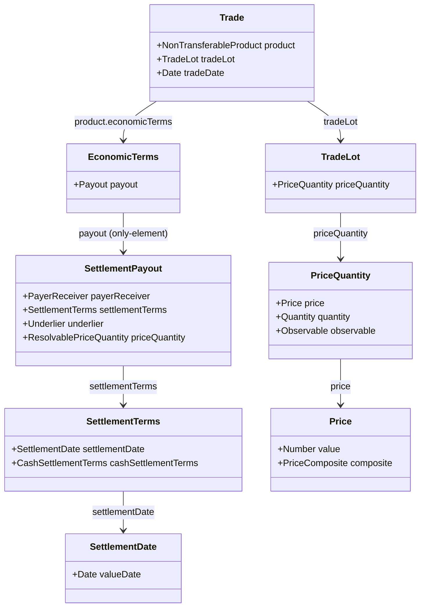
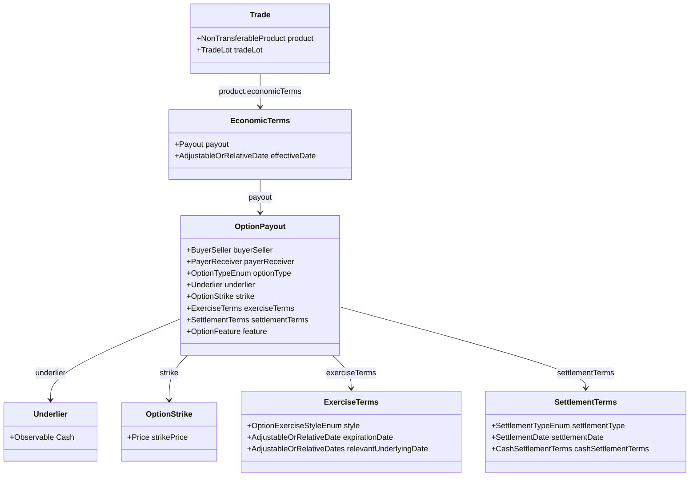
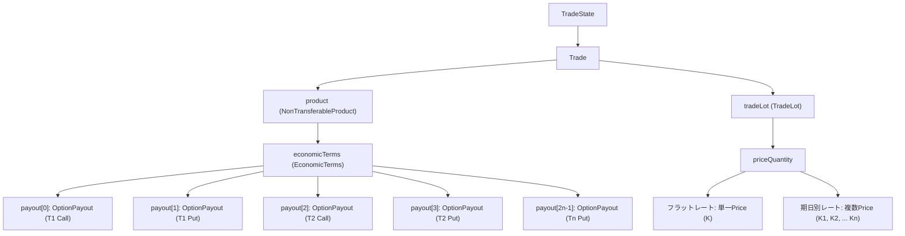
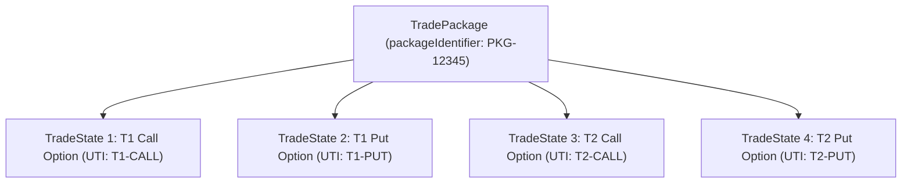
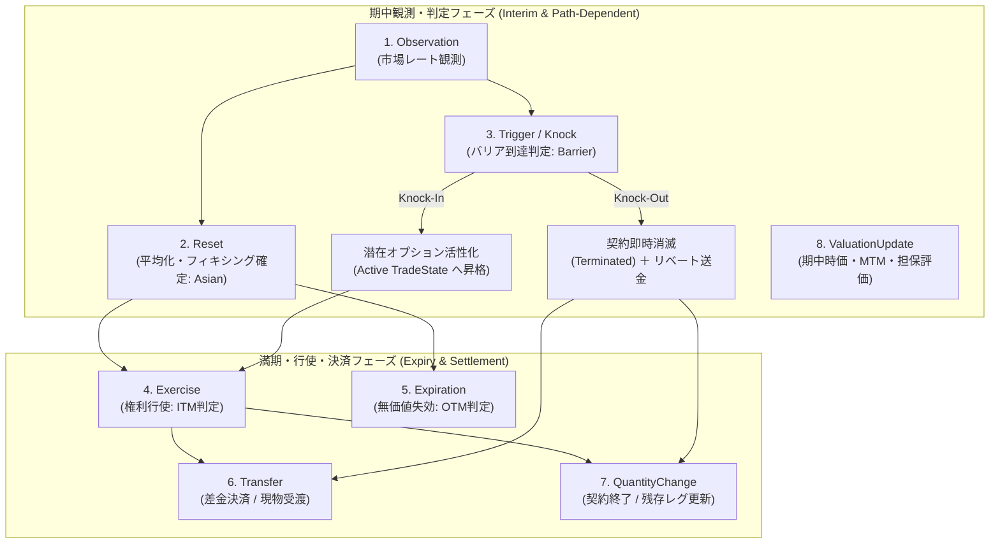

# 為替プロダクト（スポット・フォワード・オプション・シンセティック）のCDMモデリング

本ドキュメントでは、FINOS Common Domain Model (CDM) における為替スポット（FX Spot）、プレーンな為替先渡（FX Forward / Outright Forward）、通貨オプション（FX Option）、および複数受渡日を持つシンセティックフォワード（Synthetic Forward）のデータ構造、ライフサイクルイベント処理、ならびに一次サンプル JSON に基づく裏どり検証結果を体系的に解説します。

---

## 1. 為替スポット（FX Spot）とプレーンフォワード（FX Forward）の単体CDM表現

### 1.1 統一モデル設計思想（`SettlementPayout` による共用）

CDM において、為替スポット（FX Spot）と単体プレーンフォワード（FX Outright Forward）は、**完全に同一のデータ構造である [`SettlementPayout`](../../common-domain-model/rosetta-source/src/main/rosetta/product-template-type.rosetta)** を用いて表現されます。

> **Rosetta DSL における公式定義注釈 (`product-template-type.rosetta` L406)**:
> *"Represents a forward settling payout. The underlier attribute captures the underlying payout, which is settled according to the settlementTerms attribute (which is part of PayoutBase). **Both FX Spot and FX Forward should use this component.**"*

経済的本質として、スポット取引とフォワード取引はどちらも「約定日（Trade Date）に合意した為替レート（Exchange Rate）に基づき、将来の特定期日（Settlement Date / Value Date）に2通貨を交換する」という点で同一です。両者の違いは、受渡期日が「スポット日（通常 $T+2$ 等の標準市場慣習）」か「スポット日以降の先渡期日（Outright Forward Date）」かという**決済期日のオフセットのみ**に帰着します。



---

### 1.2 スポットとプレーンフォワードの構造比較

| 構成要素 | 為替スポット (FX Spot) | プレーン為替先渡 (FX Forward) | 補足・CDM構造 |
|---|---|---|---|
| **Payout 型** | `SettlementPayout` (1..1) | `SettlementPayout` (1..1) | 同一の型を使用 |
| **ISDA 分類** | `ForeignExchange_Spot_Forward` | `ForeignExchange_Spot_Forward` | `Qualify_ForeignExchange_Spot_Forward` で共通判定 |
| **受渡日 (`valueDate`)** | 約定日 $T$ から標準スポット日（例: $T+2$） | スポット日より先の特定将来期日 | `settlementTerms.settlementDate.valueDate` に設定 |
| **為替レート構造** | 単一の直物レート（Spot Rate） | 先渡レート（Outright Forward Rate）または **直物＋スワップポイント合成** | [`Price`](../../common-domain-model/rosetta-source/src/main/rosetta/observable-asset-type.rosetta) の `composite` 属性 |
| **受渡形態** | 現物受渡（`Physical`） | 現物受渡（`Physical`） | 差金決済（NDF）の場合は `cashSettlementTerms` を指定 |

---

### 1.3 為替レートの合成表現（`Price.composite` によるフォワードポイント）

プレーンフォワードでは、為替レートを単一の数値（例: 0.9175）として保持するだけでなく、直物レート（Spot Rate）とフォワードポイント（Forward Points / スワップポイント）の計算関係を [`composite`](../../common-domain-model/rosetta-source/src/main/rosetta/observable-asset-type.rosetta) 属性により構造化して保持することが可能です。

- `baseValue`: 直物スポットレート（例: 0.9130）
- `operand`: フォワードポイント（例: 0.0045）
- `arithmeticOperator`: 演算子（`Add` または `Subtract`）
- `operandType`: `ForwardPoint`

---

### 1.4 実サンプル JSON の対比（Evidence）

#### (1) FX Spot 実例: [`fx-ex01-fx-spot.json`](../../common-domain-model/rosetta-source/src/main/resources/ingest/output/fpml-confirmation-to-trade-state/fpml-5-13-products-fx-derivatives/fx-ex01-fx-spot.json)
- `tradeDate`: `"2001-10-23"`
- `settlementTerms.settlementDate.valueDate`: `"2001-10-25"`（ちょうど2営業日後のスポット日）
- `price[0].value`: `1.48`（USD per GBP）

#### (2) FX Forward 実例: [`fx-ex03-fx-fwd.json`](../../common-domain-model/rosetta-source/src/main/resources/ingest/output/fpml-confirmation-to-trade-state/fpml-5-13-products-fx-derivatives/fx-ex03-fx-fwd.json)
- `tradeDate`: `"2001-11-19"`
- `settlementTerms.settlementDate.valueDate`: `"2001-12-21"`（約1ヶ月先のアウトライト先渡期日）
- `price[0]`:
  ```json
  {
    "@key:scoped": "price-1",
    "value": 0.9175,
    "unit": { "currency": { "@data": "USD" } },
    "perUnitOf": { "currency": { "@data": "EUR" } },
    "priceType": "ExchangeRate",
    "composite": {
      "baseValue": 0.9130,
      "operand": 0.0045,
      "arithmeticOperator": "Add",
      "operandType": "ForwardPoint"
    },
    "derivedQuantity": { "value": 9175000, "unit": { "currency": { "@data": "USD" } } }
  }
  ```

---

## 2. 通貨オプション単体（FX Option）の CDM 表現

通貨オプションは、CDM の汎用オプション構造である [`OptionPayout`](../../common-domain-model/rosetta-source/src/main/rosetta/product-template-type.rosetta) をベースに、通貨資産（[`Cash`](../../common-domain-model/rosetta-source/src/main/rosetta/base-staticdata-asset-common-type.rosetta)）をアンダーライングとして定義されます。



### 主要構成フィールド一覧

| フィールド | 型 | 役割とFXオプションにおける具体値 |
|---|---|---|
| `underlier` | `Underlier` -> `Observable` | 対象通貨資産（[`Cash`](../../common-domain-model/rosetta-source/src/main/rosetta/base-staticdata-asset-common-type.rosetta)）。例えば USD/AUD オプションの場合、被交換通貨（AUD）。 |
| `optionType` | `OptionTypeEnum` | `Call` または `Put`。 |
| `buyerSeller` | `BuyerSeller` | オプションの買い手（Buyer）と売り手（Seller）。 |
| `payerReceiver` | `PayerReceiver` | 権利行使時の資金受渡における支払側と受取側。 |
| `strike` | `OptionStrike` | 行使価格（為替レート [`Price`](../../common-domain-model/rosetta-source/src/main/rosetta/observable-asset-type.rosetta)）。`priceType = ExchangeRate`、単位通貨と基準通貨を指定。 |
| `exerciseTerms` | `ExerciseTerms` | 権利行使条件。<br>- `style`: ヨーロピアン (`European`) または アメリカン (`American`)<br>- `expirationDate`: オプション満期日・行使期限<br>- `relevantUnderlyingDate`: 行使に伴う受渡日（Value Date） |
| `settlementTerms` | `SettlementTerms` | 決済方法および期日。<br>- `settlementType`: 現物受渡 (`Physical`) または 差金決済 (`Cash`)<br>- `settlementDate`: 受渡日（`valueDate`）<br>- `cashSettlementTerms`: NDO（Non-Deliverable Option）の場合のフィキシングソース・評価日 |
| `feature` | `OptionFeature` | バリア（`barrier`）、平均レート型（`averagingFeature`）などのエキゾチック条項（任意）。 |

### 自動商品分類（Product Qualification）
[`product-qualification-func.rosetta`](../../common-domain-model/rosetta-source/src/main/rosetta/product-qualification-func.rosetta) の `Qualify_ForeignExchange_VanillaOption` では、以下の条件がすべて満たされた場合にバニラ通貨オプションとして認定されます：
1. アセットクラスが `ForeignExchange` であること
2. `payout` が単一の `OptionPayout` であること
3. 行使スタイルが `Bermuda` ではないこと（European または American）
4. エキゾチック機能がないこと（または平均レートのみ）
5. `cashSettlementTerms` が非存在（差金決済の場合は `Qualify_ForeignExchange_NDO` と判定）

---

## 3. ストリップ型シンセティックフォワードの TradeState データ構造

複数受渡日（$T_1, T_2, \dots, T_n$）を持つシンセティックフォワード（Strip of Synthetic Forwards）について、CDM で正統とされる **2つの表現アプローチ** を比較・解説します。

### アプローチ 1: 単一 Trade 内の複数 Payout 構造（Single Trade, Multi-Payout）

1つの [`Trade`](../../common-domain-model/rosetta-source/src/main/rosetta/event-common-type.rosetta) 内の `EconomicTerms.payout`（多重度 `1..*`）に、各受渡期日 $T_i$ に対応する Call と Put の [`OptionPayout`](../../common-domain-model/rosetta-source/src/main/rosetta/product-template-type.rosetta) を合計 $2 \times n$ 個並べる構造です。



#### ストライク表現の2つのバリエーション
1. **フラットレート型（単一行使価格 $K$）**:
   - すべての期日 $T_i$ で同一の為替レート（例: 150.00 JPY/USD）が適用される。
   - `TradeLot.priceQuantity` に単一の `Price` が定義され、すべての `OptionPayout` の `strike.strikePrice` が同一のグローバルキー／アドレス（`@ref:scoped`）を参照。
2. **期日別レート型（マルチフォワード: スワップポイント加味 $K_i$）**:
   - 各受渡日 $T_i$ までの金利差（フォワードスプレッド）を反映し、期日ごとに異なる行使価格 $K_1, K_2, \dots, K_n$ を設定する。
   - `TradeLot.priceQuantity` に期日分の `Price`（$K_1 \dots K_n$）を定義し、各期日の Call/Put ペアが対応する $K_i$ を個別に参照します（実サンプル `fx-ex08-fx-swap.json` と同一の構造）。

#### 純粋先渡（Non-synthetic Strip of Forwards）との対比
シンセティックではなく通常の先渡ストリップの場合、CDM では [`SettlementPayout`](../../common-domain-model/rosetta-source/src/main/rosetta/product-template-type.rosetta) を期日分（$n$ 個）並べる構造となります（FX Swap の `nearLeg` / `farLeg` 構造の多期間拡張）。

---

### アプローチ 2: マルチ Trade パッケージ構造（TradePackage / Multi-Trade）

各受渡期日 $T_i$ の Call / Put（または期日ごとの合成先渡ペア）をそれぞれ独立した [`TradeState`](../../common-domain-model/rosetta-source/src/main/rosetta/event-common-type.rosetta) として生成し、[`executionDetails.packageInformation`](../../common-domain-model/rosetta-source/src/main/rosetta/event-common-type.rosetta)（`TradePackage`）で共通のパッケージ識別子を付与して束ねる構造です。



#### 2つのアプローチの比較評価

| 評価軸 | アプローチ 1: 単一 Trade（Multi-Payout） | アプローチ 2: マルチ Trade（TradePackage） |
|---|---|---|
| **契約のアトミック性** | 高（1つの TradeState で全期日・全レグを包括） | 低（各レグが独立した TradeState） |
| **規制報告（EMIR / CFTC）** | 複合取引としての単一 UTI 付番またはカスタム報告 | 各レグ個別に店頭オプションとしての UTI 付番・報告が容易 |
| **清算機関（CCP）登録** | 単一プロダクトとして取り扱いにくい場合がある | オプションレグ単位でそのまま登録可能 |
| **CDM ライフサイクル管理** | 1つの TradeState に対し複数 Payout の部分変更を管理 | 各期日の TradeState を独立して終了（Terminated）可能 |

---

## 4. CDM が取り扱う動的ライフサイクルイベント（Lifecycle Events）

CDM のイベントモデルでは、状態（[`TradeState`](../../common-domain-model/rosetta-source/src/main/rosetta/event-common-type.rosetta)）と不可分な操作（[`PrimitiveInstruction`](../../common-domain-model/rosetta-source/src/main/rosetta/event-common-type.rosetta)）を組み合わせた [`BusinessEvent`](../../common-domain-model/rosetta-source/src/main/rosetta/event-common-type.rosetta) により、取引のライフサイクル遷移を決定論的かつ監査可能（Audit-proof）に処理します。

プレーンバニラやシンセティックフォワードでは「権利行使（Exercise）」「資金決済（Transfer）」「元本・契約残高管理（QuantityChange）」が基本ですが、**バリアオプション（Barrier Option: Knock-in / Knock-out）やアベレージオプション（Asian Option: Average Rate / Average Strike）といった経路依存型（Path-dependent）エキゾチックオプションを網羅する場合、CDM では全 8 大ライフサイクルイベントとして体系化**されています。



---

### 全 8 大ライフサイクルイベント一覧と CDM マッピング

| # | ライフサイクルイベント | CDM プリミティブ / 関数 / 型 | 対象商品・発生契機 | CDM における処理と状態遷移 |
|---|---|---|---|---|
| **1** | **市場観測<br>(Observation)** | `TradeState.resetHistory`<br>[`Reset.observations`](../../common-domain-model/rosetta-source/src/main/rosetta/event-common-type.rosetta)<br>[`Observation`](../../common-domain-model/rosetta-source/src/main/rosetta/observable-event-type.rosetta) | **バリア / アベレージ共通**<br>期中の観測スケジュール（日次、引け値、特定時刻等） | 市場データ（為替レート）を観測・記録。市場レート観測値（`Observation`）は `Reset` の `observations` 属性として紐づけられ、確定値とともに `resetHistory` に監査蓄積される（※`TradeState.observationHistory` はクレジット・コーポレートアクション専用型）。 |
| **2** | **フィキシング / 平均化確定<br>(Reset)** | `PrimitiveInstruction.reset`<br>[`ResetInstruction`](../../common-domain-model/rosetta-source/src/main/rosetta/event-common-type.rosetta)<br>[`Create_Reset`](../../common-domain-model/rosetta-source/src/main/rosetta/event-common-func.rosetta)<br>`Qualify_Reset` | **アベレージオプション（Asian）の核**<br>観測終了時または期間確定時 | 複数観測値（`observations (1..*)`）から平均化規則（[`AveragingCalculation`](../../common-domain-model/rosetta-source/src/main/rosetta/product-template-type.rosetta)）に基づき確定レート（`resetValue: Price`）を計算。`TradeState.resetHistory` に蓄積。 |
| **3** | **バリア到達判定<br>(Trigger / Knock)** | 条件定義: [`Barrier`](../../common-domain-model/rosetta-source/src/main/rosetta/product-template-type.rosetta), [`TriggerEvent`](../../common-domain-model/rosetta-source/src/main/rosetta/observable-event-type.rosetta)<br>イベント実行: `PrimitiveInstruction.quantityChange` / `transfer`<br>認定: `Qualify_Termination` | **バリアオプションの核**<br>観測レートがバリア水準（`Trigger.level`）にヒットした瞬間 | **Knock-out**: 独立した Trigger プリミティブは存在せず、残存数量を 0 とする `QuantityChange`（契約状態: [`ClosedStateEnum -> Terminated`](../../common-domain-model/rosetta-source/src/main/rosetta/event-common-enum.rosetta)）として実行。リベートがある場合は `TriggerEvent.featurePayment` に基づき `Transfer` を同時発行。<br>**Knock-in**: 潜在状態から権利行使可能な有効契約へ状態遷移。 |
| **4** | **権利行使<br>(Exercise)** | `PrimitiveInstruction.exercise`<br>[`ExerciseInstruction`](../../common-domain-model/rosetta-source/src/main/rosetta/event-common-type.rosetta)<br>[`Create_Exercise`](../../common-domain-model/rosetta-source/src/main/rosetta/event-common-func.rosetta)<br>`Qualify_Exercise` | **全オプション共通**<br>満期日または行使期間において ITM と判定された場合 | `exerciseOption` で特定 Payout を指定。行使済レグを終了し、差金決済または現物受渡取引（FX Spot 約定）を派生生成。 |
| **5** | **満期失効・無価値終了<br>(Expiration)** | `TradeState.state.closedState`<br>[`ClosedStateEnum -> Expired`](../../common-domain-model/rosetta-source/src/main/rosetta/event-common-enum.rosetta) | **全オプション共通**<br>満期到来時に OTM で行使されなかった場合、またはノックイン未到達のまま満期終了 | 権利行使されずに契約が終了。契約状態を明示的に `Expired`（失効）としてクローズし、ポジションを閉鎖。 |
| **6** | **資金移動・決済<br>(Transfer / Settlement)** | `PrimitiveInstruction.transfer`<br>[`TransferInstruction`](../../common-domain-model/rosetta-source/src/main/rosetta/event-common-type.rosetta)<br>[`Create_Transfer`](../../common-domain-model/rosetta-source/src/main/rosetta/event-common-func.rosetta)<br>`Qualify_CashTransfer` | **全商品共通**<br>契約締結時、行使決済時、ノックアウト時 | プレミアム支払（`UnscheduledTransfer`）、ノックアウト時のリベート支払、差金決済（Cash Settlement）、現物受渡資金移動を `transferHistory` に記録。 |
| **7** | **契約残高・条件変更<br>(QuantityChange / TermsChange)** | `PrimitiveInstruction.quantityChange`<br>[`QuantityChangeInstruction`](../../common-domain-model/rosetta-source/src/main/rosetta/event-common-type.rosetta)<br>`Qualify_PartialTermination` / `Termination` | **ストリップ型 / バリア共通**<br>期日ごとの順次決済、一部解約、ノックアウト消滅 | 期日 $T_i$ の行使後に残存期日 $T_{i+1} \dots T_n$ を残す（単一 Trade の場合）、またはノックアウト時に残存数量を 0 にして契約終了（`Terminated`）させる。 |
| **8** | **時価評価・担保評価更新<br>(ValuationUpdate)** | `PrimitiveInstruction.valuation`<br>[`ValuationInstruction`](../../common-domain-model/rosetta-source/src/main/rosetta/event-common-type.rosetta)<br>[`Valuation`](../../common-domain-model/rosetta-source/src/main/rosetta/event-position-type.rosetta)<br>`Qualify_ValuationUpdate` | **全デリバティブ共通**<br>日次 MTM（時価評価）および感応度・マージン計算 | 期中のバリア接近度や平均化進捗を反映した時価評価額（PV / MTM）を `TradeState.valuationHistory` に追跡・記録。 |

---

### エキゾチック特有イベントの深層解説

#### A. アベレージオプション（Asian）における `Reset` イベントのメカニズム
アベレージオプションでは、満期時のペイオフ計算に用いるレートが単一のスポットレートではなく、**観測期間中のレートの平均値（算術平均等）**となります。
- **データ構造の排他ルール**:
  [`OptionPayout`](../../common-domain-model/rosetta-source/src/main/rosetta/product-template-type.rosetta) の条件制約により、以下が厳密に区別されます：
  - **Average Rate Option (平均レート型)**: `feature -> averagingFeature` を使用（ペイオフ: $\max(\bar{S} - K, 0)$）。
  - **Average Strike Option (平均行使価格型)**: `strike -> averagingStrikeFeature` を使用（ペイオフ: $\max(S_T - \bar{S}, 0)$）。
  - 条件制約 `AsianOptionChoice`: 2つの表現は排他（`if feature -> averagingFeature exists then strike -> averagingStrikeFeature is absent`）。
- **`Reset` の計算構造と観測値の紐づけ**:
  [`Reset`](../../common-domain-model/rosetta-source/src/main/rosetta/event-common-type.rosetta) は複数の市場観測値（`observations: Observation (1..*)`）と平均化方法（`averagingMethodology: AveragingCalculation`）を結びつけ、算出された平均為替レート（`resetValue: Price`）を確定します。
  Rosetta 条件制約 `condition AveragingMethodologyExists`:
  ```rosetta
  if observations count > 1 then averagingMethodology exists
  ```
  複数観測値が存在する場合、平均化計算ロジック（`averagingMethod` や `precision`（端数処理規則））の指定が必須と定義されています。
  > **注記（観測値の格納設計）**: CDM の `TradeState.observationHistory`（型: `ObservationEvent`）はクレジットイベント（`CreditEvent`）やコーポレートアクション（`CorporateAction`）専用として設計されており、為替レート等の市場クォート観測値は `Reset.observations`（型: `Observation`）内に監査参照として保持され、`TradeState.resetHistory` に蓄積されます。

#### B. バリアオプション（Barrier）における `Trigger` と状態遷移メカニズム
バリアオプションでは、為替レートがバリア水準に達したかどうかに応じて契約の存続状態が劇的に変化します。
- **データ構造（プロダクト側の静的条件）**:
  [`OptionPayout.feature.barrier`](../../common-domain-model/rosetta-source/src/main/rosetta/product-template-type.rosetta)（型: [`Barrier`](../../common-domain-model/rosetta-source/src/main/rosetta/product-template-type.rosetta)）：
  - `knockIn`: [`TriggerEvent`](../../common-domain-model/rosetta-source/src/main/rosetta/observable-event-type.rosetta)（バリア到達により権利が有効化）
  - `knockOut`: [`TriggerEvent`](../../common-domain-model/rosetta-source/src/main/rosetta/observable-event-type.rosetta)（バリア到達により権利が無効・消滅）
- **判定条件（Trigger）**:
  - `level`: バリアレート水準（[`PriceSchedule`](../../common-domain-model/rosetta-source/src/main/rosetta/observable-asset-type.rosetta)）
  - `triggerType`: 突破方向（[`TriggerTypeEnum`](../../common-domain-model/rosetta-source/src/main/rosetta/observable-event-enum.rosetta) -> `EqualOrGreater`, `EqualOrLess` 等）
  - `triggerTimeType`: 監視時刻（[`TriggerTimeTypeEnum`](../../common-domain-model/rosetta-source/src/main/rosetta/observable-event-enum.rosetta) -> `Continuous` / `Anytime`（常時監視）または `Closing`（引け値のみ））
  - `featurePayment`: ノックアウト時に買い手に支払われるリベート金額（[`FeaturePayment`](../../common-domain-model/rosetta-source/src/main/rosetta/product-template-type.rosetta)）
- **イベント発生時の状態遷移（イベントプリミティブ）**:
  CDM のイベントモデルにおいて `Trigger` は独立したプリミティブ操作ではなく、以下の既存プリミティブの組み合わせによって表現されます：
  - **Knock-Out 発生時**:
    1. [`QuantityChangeInstruction`](../../common-domain-model/rosetta-source/src/main/rosetta/event-common-type.rosetta) により残存数量が 0 となり、`State.closedState` に [`ClosedStateEnum -> Terminated`](../../common-domain-model/rosetta-source/src/main/rosetta/event-common-enum.rosetta) が設定され契約終了。イベント認定は `Qualify_Termination` となる。
    2. リベート（`featurePayment`）が存在する場合、[`TransferInstruction`](../../common-domain-model/rosetta-source/src/main/rosetta/event-common-type.rosetta) によりリベート受渡（`ContingentTransfer`）が実行される。
  - **Knock-In 発生時**:
    - バリアヒットにより休眠状態から有効契約へ状態遷移し、満期日に向けた通常の `Exercise` / `Expiration` 待機状態へと移行する。

---

## 5. 実サンプル JSON による要素レベルの裏どり検証 (Evidence & Mapping)

CDM 一次リポジトリ（`rosetta-source/src/main/resources/ingest/output/`）配下に実在する JSON 出力成果物と照合し、上記仕様の妥当性を確認したエビデンス一覧です。

### 5.1 スポットおよびプレーンフォワードの要素対応
- **検証ファイル**:
  - スポット: [`fx-ex01-fx-spot.json`](../../common-domain-model/rosetta-source/src/main/resources/ingest/output/fpml-confirmation-to-trade-state/fpml-5-13-products-fx-derivatives/fx-ex01-fx-spot.json)
  - プレーンフォワード: [`fx-ex03-fx-fwd.json`](../../common-domain-model/rosetta-source/src/main/resources/ingest/output/fpml-confirmation-to-trade-state/fpml-5-13-products-fx-derivatives/fx-ex03-fx-fwd.json)

| CDM モデル要素 | 実サンプル JSON パス / キー名 | スポット (`fx-ex01`) | プレーンフォワード (`fx-ex03`) |
|---|---|---|---|
| 商品タクソノミ | `trade.product.taxonomy[0]` | `ForeignExchange_Spot_Forward` | `ForeignExchange_Spot_Forward` |
| ペイアウト型 | `trade.product.economicTerms.payout[0]` | `@type: "cdm.product.template.SettlementPayout"` | `@type: "cdm.product.template.SettlementPayout"` |
| 約定日 | `trade.tradeDate` | `2001-10-23` | `2001-11-19` |
| 受渡期日 | `payout[0].settlementTerms.settlementDate` | `valueDate: "2001-10-25"` ($T+2$) | `valueDate: "2001-12-21"` (約1ヶ月先) |
| 為替レート | `tradeLot[0].priceQuantity[0].price[0]` | `value: 1.48` | `value: 0.9175` |
| レート合成 | `price[0].composite` | なし（直物単一値） | `baseValue: 0.9130`, `operand: 0.0045`, `operandType: ForwardPoint` |

---

### 5.2 通貨オプション単体（FX Option）の要素対応
- **検証ファイル**:
  - ヨーロピアン: [`fx-ex09-euro-opt.json`](../../common-domain-model/rosetta-source/src/main/resources/ingest/output/fpml-confirmation-to-trade-state/fpml-5-13-products-fx-derivatives/fx-ex09-euro-opt.json)
  - アメリカン: [`fx-ex10-amer-opt.json`](../../common-domain-model/rosetta-source/src/main/resources/ingest/output/fpml-confirmation-to-trade-state/fpml-5-13-products-fx-derivatives/fx-ex10-amer-opt.json)
  - 差金決済（NDO）: [`fx-ex11-non-deliverable-option.json`](../../common-domain-model/rosetta-source/src/main/resources/ingest/output/fpml-confirmation-to-trade-state/fpml-5-13-products-fx-derivatives/fx-ex11-non-deliverable-option.json)

| CDM モデル要素 | 実サンプル JSON パス / キー名 | `fx-ex09-euro-opt.json` での具体値 |
|---|---|---|
| 商品タクソノミ | `trade.product.taxonomy[1]` | `source: "ISDA"`, `name: "ForeignExchange_VanillaOption"`, `calculated: true` |
| ペイアウト型 | `trade.product.economicTerms.payout[0]` | `@type: "cdm.product.template.OptionPayout"` |
| 買手・売手 | `payout[0].buyerSeller` | `buyer: "Party1"`, `seller: "Party2"` |
| オプション種別 | `payout[0].optionType` | `"Put"`（または `"Call"`） |
| 行使価格 | `payout[0].strike.strikePrice` | `value: 0.4920`, `unit.currency: "USD"`, `perUnitOf.currency: "AUD"`, `priceType: "ExchangeRate"` |
| 権利行使条件 | `payout[0].exerciseTerms` | `style: "European"`, `expirationDate[0].adjustableDate.adjustedDate: "2002-06-04"` |
| 受渡期日 | `payout[0].settlementTerms.settlementDate` | `valueDate: "2002-06-06"` |
| アンダーライング | `payout[0].underlier` | `@type: "cdm.observable.asset.Observable"`, `@ref:scoped: "observable-1"`（`Cash: AUD`） |
| 元本・数量 | `trade.tradeLot[0].priceQuantity[0]` | `quantity.value: 75000000 AUD`, `price[0].derivedQuantity.value: 36900000 USD` |

---

### 5.3 複数受渡日・期日別ストライク（マルチフォワード）の要素対応
- **検証ファイル**: [`fx-ex08-fx-swap.json`](../../common-domain-model/rosetta-source/src/main/resources/ingest/output/fpml-confirmation-to-trade-state/fpml-5-13-products-fx-derivatives/fx-ex08-fx-swap.json)
  - `payout` 配列内に複数要素が並び、各要素が独立した `settlementDate.valueDate`（`2002-01-25`, `2002-02-25`）を持つ。
  - `tradeLot.priceQuantity` 配列内に期日別の `price-1`（1.48）、`price-2`（1.50）が定義され、各 Payout からスコープ参照（`@ref:scoped`）される。

---

### 5.4 レグ独立識別子（複数 UTI / USI）の要素対応
- **検証ファイル**: [`fx-ex26-fxswap-multiple-USIs.json`](../../common-domain-model/rosetta-source/src/main/resources/ingest/output/fpml-confirmation-to-trade-state/fpml-5-13-products-fx-derivatives/fx-ex26-fxswap-multiple-USIs.json)
  - `tradeIdentifier` 配列内にレグごとの独立した UTI（末尾 `...012` と `...013`）を保持できる実機仕様を裏どり。

---

### 5.5 ライフサイクルイベント（動的状態遷移）の要素対応
- **検証ファイル**: [`msg-ex54-execution-advice-trade-partial-termination-C11-00.json`](../../common-domain-model/rosetta-source/src/main/resources/ingest/output/fpml-confirmation-to-workflow-step/fpml-5-13-processes-execution-advice/msg-ex54-execution-advice-trade-partial-termination-C11-00.json)
  - `primitiveInstruction.quantityChange`（`direction = "Replace"`）による元本減額、および `primitiveInstruction.transfer` による資金移動の連動を実証。

---

### 5.6 エキゾチックオプション（アベレージ・バリア）の要素対応とサンプル JSON 実態調査

CDM 一次リポジトリにおけるエキゾチックオプション（アベレージ型およびバリア型）のサンプル JSON 提供状況および要素レベルの整合性を調査した結果、以下の実態が明らかになっています。

#### A. アベレージオプション（Asian Option）
- **検証ファイル（契約成立 TradeState）**: [`fx-ex21-avg-rate-option-parametric-plus-rate-observation.json`](../../common-domain-model/rosetta-source/src/main/resources/ingest/output/fpml-confirmation-to-trade-state/fpml-5-13-products-fx-derivatives/fx-ex21-avg-rate-option-parametric-plus-rate-observation.json)
- **実証された契約要素**:
  - `OptionPayout.observationTerms`: 観測スケジュール（`observationDates.periodicSchedule.startDate: 2010-11-01`, `endDate: 2010-11-30`, `periodFrequency: 1D`）。
  - `observationTerms.informationSource`: フィキシング配信元（`sourceProvider: "Reuters"`, `sourcePage: "BNBX"`）。
  - `observationTerms.observationTime`: 観測時刻（`hourMinuteTime: 18:00:00`, `businessCenter: MXMC`）。
  - `OptionPayout.strike.strikePrice`: 行使価格 12.40 MXN per USD。
- **ライフサイクルイベント（Reset）のサンプル JSON 有無**:
  - **為替（FX）における `Reset` イベントのサンプル JSON は CDM リポジトリ内に存在しません（0件）**。
  - 上記ファイルは契約約定時点の `TradeState`（初期プレミアム支払の `transferHistory` のみ）であり、期中観測値（`Observation`）の蓄積や確定レートを計算・適用した `BusinessEvent` / `resetHistory` は含まれません。
  - ※なお CDM 全体でも、`Reset` イベントの出力サンプルは証券貸借の請求書計算（`sec-lending`）に限定されています。

#### B. バリアオプション（Barrier Option）
- **検証ファイル（契約成立 TradeState）**: [`fx-ex13-fx-dbl-barrier-option.json`](../../common-domain-model/rosetta-source/src/main/resources/ingest/output/fpml-confirmation-to-trade-state/fpml-5-13-incomplete-products-fx-derivatives/fx-ex13-fx-dbl-barrier-option.json)（および [`fx-ex12-fx-barrier-option.json`](../../common-domain-model/rosetta-source/src/main/resources/ingest/output/fpml-confirmation-to-trade-state/fpml-5-13-incomplete-products-fx-derivatives/fx-ex12-fx-barrier-option.json)）
- **Ingest 変換における現状の制約と要素欠落**:
  - 上記ファイルは FpML からの Ingest 変換結果ですが、`incomplete-products`（不完全変換）ディレクトリに分類されています。
  - 為替オプションの Ingest マッピング関数（[`ingest-fpml-confirmation-product-fxoption-func.rosetta`](../../common-domain-model/rosetta-source/src/main/rosetta/ingest-fpml-confirmation-product-fxoption-func.rosetta)）においてバリア機能（`barrier`）の変換ロジックが未実装であるため、**出力された CDM JSON 内には `OptionPayout.feature.barrier`（`TriggerEvent` やトリガー水準等）が出力されず欠落**しています（商品タクソノミ名 `DOUBLEBARRIER` のみ保持）。
  - ※CDM の JSON サンプルで `feature.barrier` が出力されるのは、クレジットイベントをトリガーとするクレジット・スワップション（`cd-swaption-1.json` 等）に限られます。
- **ライフサイクルイベント（バリアタッチ）のサンプル JSON 有無**:
  - **バリア到達（Knock-In / Knock-Out）を表現したイベント（`BusinessEvent` / `WorkflowStep`）のサンプル JSON は存在しません（0件）**。
  - CDM のイベントモデル上、ノックアウト消滅は `QuantityChangeInstruction`（数量0・`State.closedState = Terminated`）およびリベート送金（`Transfer`）の複合イベントとしてモデル化（認定: `Qualify_Termination`）されますが、これを実機実行したテストデータセットは未収録です。

---

## 6. 関連ドキュメント
- [金融商品モデリング & 経済条件](product_modeling.md)
- [取引ライフサイクルイベント](event_lifecycle.md)
- [TradableProduct と TradeLot の分離設計](tradable_product_and_tradelot.md)
- [契約日付モデリング](contract_dates_modeling.md)
- [WorkflowStep とライフサイクルサンプル解析](workflow_step_and_lifecycle_samples.md)
- [Rosetta DSL 定義インベントリ](../overview/rosetta_dsl_inventory.md)
