# 為替プロダクト（スポット・フォワード・NDF・オプション・シンセティック・TARF・デジタル）のCDMモデリング

本ドキュメントでは、FINOS Common Domain Model (CDM) における為替スポット（FX Spot）、プレーンな為替先渡（FX Forward / Outright Forward）、直物差金決済為替先渡（NDF: Non-Deliverable Forward）、通貨オプション（FX Option）、複数受渡日を持つシンセティックフォワード（Synthetic Forward）、目標累積型為替先渡（FX TARF: Target Accrual Redemption Forward）、デジタル系通貨オプション（Digital / Binary / Touch Options）、および権利行使後に派生生成されるペイアウト（Physical Exercise による FX Spot 派生 vs Cash Settlement）のデータ構造、ライフサイクルイベント処理、ならびに一次ソースコード・サンプルに基づく裏どり検証結果を体系的に解説します。

---

## 1. 為替スポット（FX Spot）とプレーンフォワード（FX Forward）の単体CDM表現

### 1.1 統一モデル設計思想（`SettlementPayout` による共用）

CDM において、為替スポット（FX Spot）と単体プレーンフォワード（FX Outright Forward）は、**完全に同一のデータ構造である [`SettlementPayout`](../../common-domain-model/rosetta-source/src/main/rosetta/product-template-type.rosetta)** を用いて表現されます。

> **Rosetta DSL における公式定義注釈 (`product-template-type.rosetta` L406)**:
> *"Represents a forward settling payout. The underlier attribute captures the underlying payout, which is settled according to the settlementTerms attribute (which is part of PayoutBase). **Both FX Spot and FX Forward should use this component.**"*

経済的本質として、スポット取引とフォワード取引はどちらも「約定日（Trade Date）に合意した為替レート（Exchange Rate）に基づき、将来の特定期日（Settlement Date / Value Date）に2通貨を交換する」という点で同一です。両者の違いは、受渡期日が「スポット日（通常 $T+2$ 等の標準市場慣習）」か「スポット日以降の先渡期日（Outright Forward Date）」かという**決済期日のオフセットのみ**に帰着します。

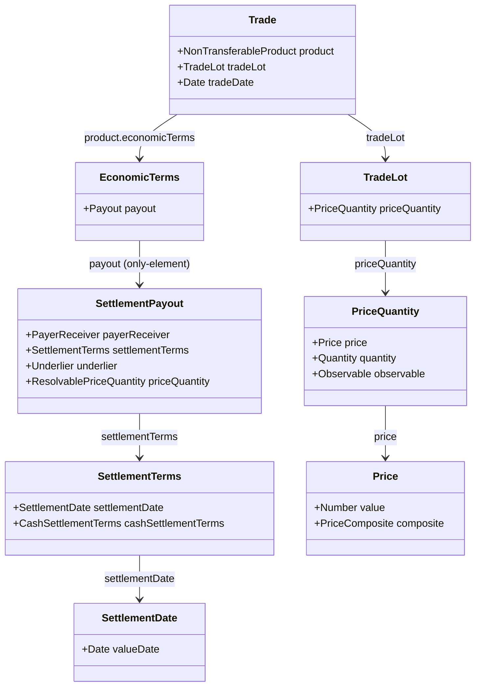

---

### 1.2 スポットとプレーンフォワードの構造比較

| 構成要素 | 為替スポット (FX Spot) | プレーン為替先渡 (FX Forward) | 補足・CDM構造 |
|---|---|---|---|
| **Payout 型** | `SettlementPayout` (1..1) | `SettlementPayout` (1..1) | 同一の型を使用 |
| **ISDA 分類** | `ForeignExchange_Spot_Forward` | `ForeignExchange_Spot_Forward` | `Qualify_ForeignExchange_Spot_Forward` で共通判定 |
| **受渡日 (`valueDate`)** | 約定日 $T$ から標準スポット日（例: $T+2$） | スポット日より先の特定将来期日 | `settlementTerms.settlementDate.valueDate` に設定 |
| **為替レート構造** | 単一の直物レート（Spot Rate） | 先渡レート（Outright Forward Rate）または **直物＋スワップポイント合成** | [`Price`](../../common-domain-model/rosetta-source/src/main/rosetta/observable-asset-type.rosetta) の `composite` 属性 |
| **受渡形態** | 現物受渡（`Physical`） | 現物受渡（`Physical`） | 差金決済（NDF）の場合は `cashSettlementTerms` を指定 |

---

### 1.3 為替レートの合成表現（`Price.composite` によるフォワードポイント）

プレーンフォワードでは、為替レートを単一の数値（例: 0.9175）として保持するだけでなく、直物レート（Spot Rate）とフォワードポイント（Forward Points / スワップポイント）の計算関係を [`composite`](../../common-domain-model/rosetta-source/src/main/rosetta/observable-asset-type.rosetta) 属性により構造化して保持することが可能です。

- `baseValue`: 直物スポットレート（例: 0.9130）
- `operand`: フォワードポイント（例: 0.0045）
- `arithmeticOperator`: 演算子（`Add` または `Subtract`）
- `operandType`: `ForwardPoint`

---

### 1.4 実サンプル JSON の対比（Evidence）

#### (1) FX Spot 実例: [`fx-ex01-fx-spot.json`](../../common-domain-model/rosetta-source/src/main/resources/ingest/output/fpml-confirmation-to-trade-state/fpml-5-13-products-fx-derivatives/fx-ex01-fx-spot.json)
- `tradeDate`: `"2001-10-23"`
- `settlementTerms.settlementDate.valueDate`: `"2001-10-25"`（ちょうど2営業日後のスポット日）
- `price[0].value`: `1.48`（USD per GBP）

#### (2) FX Forward 実例: [`fx-ex03-fx-fwd.json`](../../common-domain-model/rosetta-source/src/main/resources/ingest/output/fpml-confirmation-to-trade-state/fpml-5-13-products-fx-derivatives/fx-ex03-fx-fwd.json)
- `tradeDate`: `"2001-11-19"`
- `settlementTerms.settlementDate.valueDate`: `"2001-12-21"`（約1ヶ月先のアウトライト先渡期日）
- `price[0]`:
  ```json
  {
    "@key:scoped": "price-1",
    "value": 0.9175,
    "unit": { "currency": { "@data": "USD" } },
    "perUnitOf": { "currency": { "@data": "EUR" } },
    "priceType": "ExchangeRate",
    "composite": {
      "baseValue": 0.9130,
      "operand": 0.0045,
      "arithmeticOperator": "Add",
      "operandType": "ForwardPoint"
    },
    "derivedQuantity": { "value": 9175000, "unit": { "currency": { "@data": "USD" } } }
  }
  ```

---

## 2. 直物差金決済為替先渡（NDF: Non-Deliverable Forward）の CDM モデリング

### 2.1 NDF の経済的背景と市場慣習（規制通貨と米ドル差金決済）

**直物差金決済為替先渡（NDF: Non-Deliverable Forward）** は、資本規制や外国為替管理令により自国通貨の国外持ち出し・非居住者間での現物受渡（Physical Delivery）が制限されている新興国通貨（規制通貨 / Non-Deliverable Currency / Reference Currency: 例 INR, KRW, BRL, TWD, CNY, IDR など）を対象としたデリバティブ取引です。

現物交換（2通貨の元本交換）を行わず、約定時に合意した先渡レート（Forward Rate: $K$）と、満期前の評価日（Fixing Date）に観測された公表直物レート（Fixing Spot Rate: $S$）との差額を、**国際決済通貨（Settlement Currency: 通常は米ドル USD）** で片道ネット差金決済（Net Cash Settlement）します。

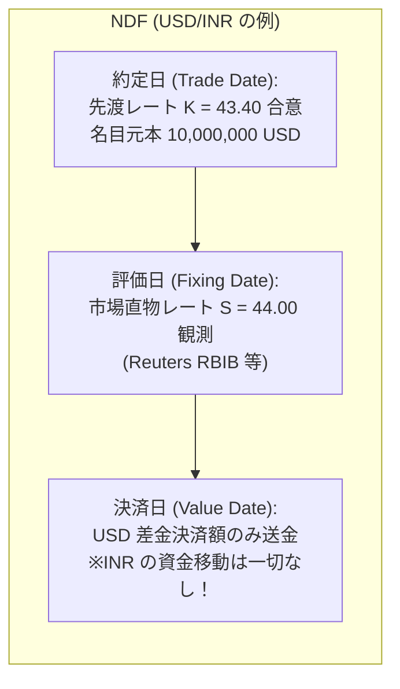

#### 差金決済額（Cash Settlement Amount）の計算式（USD 決済の場合）
ドル買い・規制通貨売りの場合、直物レート $S > K$ でクライアントの利益となり、以下の算式によって算出された米ドル金額が売り手から買い手へ送金されます：

$$\text{Cash Settlement Amount (USD)} = N_{USD} \times \frac{S - K}{S}$$

ここで $N_{USD}$ は米ドル名目元本、$K$ は約定先渡レート、$S$ は評価日の公表フィキシングレートです。

---

### 2.2 CDM における統一データ構造（`SettlementPayout` ＋ `cashSettlementTerms`）

CDM において、NDF は特別な独立した Payout 型を新設するのではなく、為替スポットやプレーンフォワードと**全く同一の基底型である [`SettlementPayout`](../../common-domain-model/rosetta-source/src/main/rosetta/product-template-type.rosetta)** を用いて統一的に表現されます。

両者を決定論的に分かつのは、[`SettlementTerms`](../../common-domain-model/rosetta-source/src/main/rosetta/product-common-settlement-type.rosetta) の内部に **[`cashSettlementTerms`](../../common-domain-model/rosetta-source/src/main/rosetta/product-common-settlement-type.rosetta)** が付与されているか否かです。

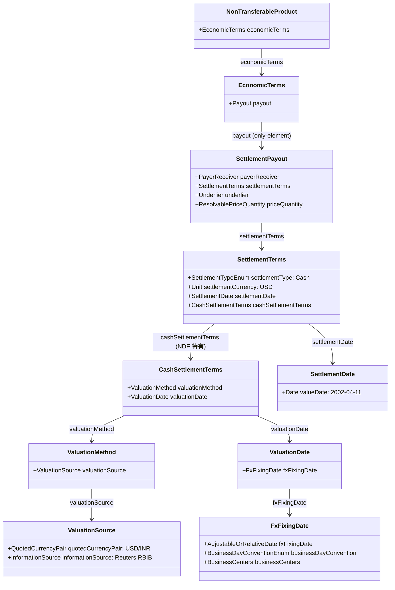

---

### 2.3 自動商品分類（Qualification）における決定的差異

[`product-qualification-func.rosetta`](../../common-domain-model/rosetta-source/src/main/rosetta/product-qualification-func.rosetta) において、現物受渡先渡（Deliverable Forward）と NDF は、**`cashSettlementTerms` の有無（absent vs exists）** という 1 つの条件制約によって明確に峻別されます。

```rosetta
// 1. プレーン為替先渡 / スポット (Deliverable) の判定
func Qualify_ForeignExchange_Spot_Forward:
    set is_product:
        Qualify_AssetClass_ForeignExchange(economicTerms) = True
            and economicTerms -> payout only-element as SettlementPayout exists
            and economicTerms -> payout as SettlementPayout -> settlementTerms -> cashSettlementTerms is absent

// 2. 直物差金決済先渡 (NDF) の判定
func Qualify_ForeignExchange_NDF:
    set is_product:
        Qualify_AssetClass_ForeignExchange(economicTerms) = True
            and economicTerms -> payout only-element as SettlementPayout exists
            and economicTerms -> payout as SettlementPayout -> settlementTerms -> cashSettlementTerms exists
```

| 構成要素 | プレーン為替先渡 (Outright Forward) | 直物差金決済先渡 (NDF) |
|---|---|---|
| **Payout 型** | `SettlementPayout` (1..1) | `SettlementPayout` (1..1) |
| **ISDA タクソノミ** | `ForeignExchange_Forward` | `ForeignExchange_NDF` |
| **決済種別 (`settlementType`)** | 通常 `Physical`（現物交換） | **`Cash`（差金決済）** |
| **決済通貨 (`settlementCurrency`)** | 2通貨双方 | **単一の決済通貨（USD 等）** |
| **差金決済条件 (`cashSettlementTerms`)** | **存在しない（`is absent`）** | **必須（`exists`）** |
| **評価日 (`valuationDate`)** | なし | **`fxFixingDate`（通常決済日の2営業日前）** |
| **為替参照レート源** | なし（約定レートで現物決済） | **中央銀行・公表レート源（Reuters, BFIX 等）** |

---

### 2.4 フィキシング日（評価日）と受渡日（決済日）の日付構造

FpML では伝統的に `nonDeliverableSettlement` という為替固有の型が使われていましたが、CDM では汎用的な **[`CashSettlementTerms`](../../common-domain-model/rosetta-source/src/main/rosetta/product-common-settlement-type.rosetta)** へと完全に調和（Harmonise）されています。

1. **満期決済期日 (`settlementTerms.settlementDate.valueDate`)**:
   - 差金額が送金される最終決済日（例: `2002-04-11`）。
2. **フィキシング期日（二重ネスト構造: `cashSettlementTerms.valuationDate.fxFixingDate.fxFixingDate`）**:
   - 市場実勢直物レートを観測・確定させる評価日（例: `2002-04-09`）。
   - **Rosetta DSL 型定義の二重構造**: [`ValuationDate`](../../common-domain-model/rosetta-source/src/main/rosetta/product-common-settlement-type.rosetta) の属性 `fxFixingDate`（型: [`FxFixingDate`](../../common-domain-model/rosetta-source/src/main/rosetta/product-common-settlement-type.rosetta)）内に、さらに同名の属性 `fxFixingDate`（型: `AdjustableOrRelativeDate`）が定義されています。そのため、実サンプルの JSON パス上は `valuationDate.fxFixingDate.fxFixingDate.adjustableDate.adjustedDate` のように二重ネストとなります。
   - 固定日付として指定する（`adjustableDate`）ほか、満期決済日から一定の営業日オフセット（例: $-2$ Business Days in Mumbai & New York）として相対指定（`Offset`）することも可能です。
3. **情報源 (`valuationMethod.valuationSource`)**:
   - 参照する通貨ペア（`quotedCurrencyPair`）および公表ベンダー（`sourceProvider: "Reuters"`, `sourcePage: "RBIB"` 等）を厳密に構造化します。

---

### 2.5 NDF のライフサイクルイベント遷移と計算責務の境界

> **CDM の計算境界（一次ソース上の重要事実）**:
> 金融工学的には差金決済額 $(S - K)/S \times N_{USD}$ が算出されますが、**CDM（Rosetta DSL）内部には NDF（`SettlementPayout`）の差金決済額を自動計算する関数は存在しません**（[`CalculateReset`](../../common-domain-model/rosetta-source/src/main/rosetta/event-common-func.rosetta) は `PerformancePayout` と `InterestRatePayout` のみ対応）。
> レートの観測および差金額の計算は**外部の基幹／決済システム**が実行し、CDM はその確定結果を [`ResetInstruction`](../../common-domain-model/rosetta-source/src/main/rosetta/event-common-type.rosetta) / [`TransferInstruction`](../../common-domain-model/rosetta-source/src/main/rosetta/event-common-type.rosetta) として受け取り、決定論的に監査履歴（`resetHistory`, `transferHistory`, `closedState`）へ記録・確定するプロトコルとして機能します。

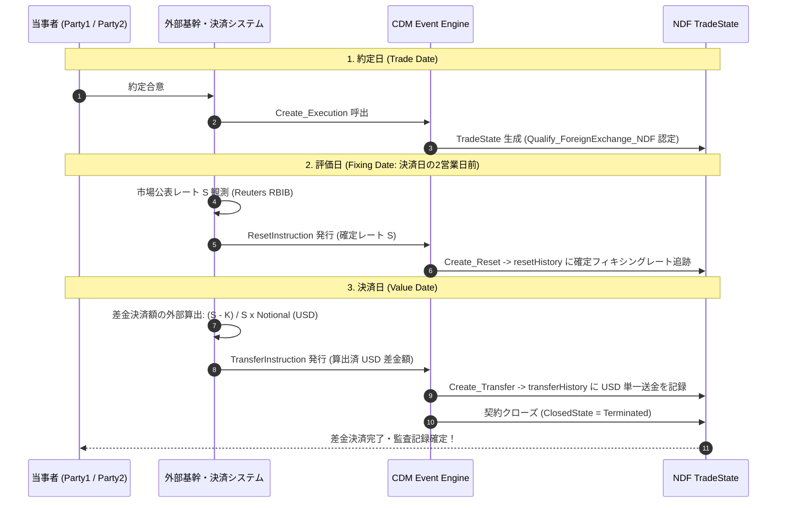

1. **約定形成（Execution）**:
   - `SettlementPayout` ＋ `cashSettlementTerms` を持つ `TradeState` が組成され、`Qualify_ForeignExchange_NDF` として認定。
2. **フィキシング観測・確定（Observation & Reset）**:
   - フィキシング日に公表レート（$S$）が外部で観測され、[`ResetInstruction`](../../common-domain-model/rosetta-source/src/main/rosetta/event-common-type.rosetta) / [`Create_Reset`](../../common-domain-model/rosetta-source/src/main/rosetta/event-common-func.rosetta) により確定レートが `TradeState.resetHistory` に記録される。
3. **資金移動（Transfer）**:
   - 外部で算出された米ドル差額に基づき、[`TransferInstruction`](../../common-domain-model/rosetta-source/src/main/rosetta/event-common-type.rosetta) / [`Create_Transfer`](../../common-domain-model/rosetta-source/src/main/rosetta/event-common-func.rosetta) によって `TradeState.transferHistory` に単一通貨の送金（`CashTransfer`）として記録される。
4. **契約終了（Termination）**:
   - 資金決済に伴い契約残高がクリアされ、[`State.closedState = Terminated`](../../common-domain-model/rosetta-source/src/main/rosetta/event-common-enum.rosetta) となり契約が完了する。

---

### 2.6 NDS（Non-Deliverable Swap）および NDO（Non-Deliverable Option）との対比

| プロダクト | CDM Payout 型 | 構成と特徴 | Qualification 判定関数 |
|---|---|---|---|
| **NDF**<br>(先渡) | `SettlementPayout` (1..1) | 単一先渡レグ、差金決済条件（`cashSettlementTerms`）を内包 | `Qualify_ForeignExchange_NDF` |
| **NDS**<br>(スワップ) | `SettlementPayout` (2..2) | スワップの 2 レグ（ニアレグ＋ファーレグ）双方が `cashSettlementTerms` を保持 | `Qualify_ForeignExchange_NDS` |
| **NDO**<br>(オプション) | `OptionPayout` (1..1) | 通貨オプションの権利行使に伴い差金決済が行われる（ヨーロピアン型） | `Qualify_ForeignExchange_NDO` |

---

## 3. 通貨オプション単体（FX Option）の CDM 表現

通貨オプションは、CDM の汎用オプション構造である [`OptionPayout`](../../common-domain-model/rosetta-source/src/main/rosetta/product-template-type.rosetta) をベースに、通貨資産（[`Cash`](../../common-domain-model/rosetta-source/src/main/rosetta/base-staticdata-asset-common-type.rosetta)）をアンダーライングとして定義されます。

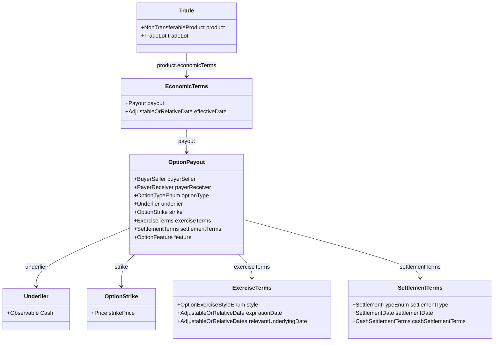

### 主要構成フィールド一覧

| フィールド | 型 | 役割とFXオプションにおける具体値 |
|---|---|---|
| `underlier` | `Underlier` -> `Observable` | 対象通貨資産（[`Cash`](../../common-domain-model/rosetta-source/src/main/rosetta/base-staticdata-asset-common-type.rosetta)）。例えば USD/AUD オプションの場合、被交換通貨（AUD）。 |
| `optionType` | `OptionTypeEnum` | `Call` または `Put`。 |
| `buyerSeller` | `BuyerSeller` | オプションの買い手（Buyer）と売り手（Seller）。 |
| `payerReceiver` | `PayerReceiver` | 権利行使時の資金受渡における支払側と受取側。 |
| `strike` | `OptionStrike` | 行使価格（為替レート [`Price`](../../common-domain-model/rosetta-source/src/main/rosetta/observable-asset-type.rosetta)）。`priceType = ExchangeRate`、単位通貨と基準通貨を指定。 |
| `exerciseTerms` | `ExerciseTerms` | 権利行使条件。<br>- `style`: ヨーロピアン (`European`) または アメリカン (`American`)<br>- `expirationDate`: オプション満期日・行使期限<br>- `relevantUnderlyingDate`: 行使に伴う受渡日（Value Date） |
| `settlementTerms` | `SettlementTerms` | 決済方法および期日。<br>- `settlementType`: 現物受渡 (`Physical`) または 差金決済 (`Cash`)<br>- `settlementDate`: 受渡日（`valueDate`）<br>- `cashSettlementTerms`: NDO（Non-Deliverable Option）の場合のフィキシングソース・評価日 |
| `feature` | `OptionFeature` | バリア（`barrier`）、平均レート型（`averagingFeature`）などのエキゾチック条項（任意）。 |

### 自動商品分類（Product Qualification）
[`product-qualification-func.rosetta`](../../common-domain-model/rosetta-source/src/main/rosetta/product-qualification-func.rosetta) の `Qualify_ForeignExchange_VanillaOption` では、以下の条件がすべて満たされた場合にバニラ通貨オプションとして認定されます：
1. アセットクラスが `ForeignExchange` であること
2. `payout` が単一の `OptionPayout` であること
3. 行使スタイルが `Bermuda` ではないこと（European または American）
4. エキゾチック機能がないこと（または平均レートのみ）
5. `cashSettlementTerms` が非存在（差金決済の場合は `Qualify_ForeignExchange_NDO` と判定）

---

## 4. ストリップ型シンセティックフォワードと FX TARF のモデリング

### 4.1 ストリップ型シンセティックフォワードの2つの表現アプローチ

複数受渡日（$T_1, T_2, \dots, T_n$）を持つシンセティックフォワード（Strip of Synthetic Forwards）について、CDM で正統とされる **2つの表現アプローチ** を比較・解説します。

#### アプローチ 1: 単一 Trade 内の複数 Payout 構造（Single Trade, Multi-Payout）

1つの [`Trade`](../../common-domain-model/rosetta-source/src/main/rosetta/event-common-type.rosetta) 内の `EconomicTerms.payout`（多重度 `1..*`）に、各受渡期日 $T_i$ に対応する Call と Put の [`OptionPayout`](../../common-domain-model/rosetta-source/src/main/rosetta/product-template-type.rosetta) を合計 $2 \times n$ 個並べる構造です。

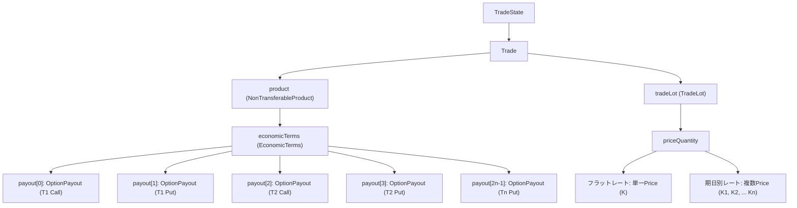

##### ストライク表現の2つのバリエーション
1. **フラットレート型（単一行使価格 $K$）**:
   - すべての期日 $T_i$ で同一の為替レート（例: 150.00 JPY/USD）が適用される。
   - `TradeLot.priceQuantity` に単一の `Price` が定義され、すべての `OptionPayout` の `strike.strikePrice` が同一のグローバルキー／アドレス（`@ref:scoped`）を参照。
2. **期日別レート型（マルチフォワード: スワップポイント加味 $K_i$）**:
   - 各受渡日 $T_i$ までの金利差（フォワードスプレッド）を反映し、期日ごとに異なる行使価格 $K_1, K_2, \dots, K_n$ を設定する。
   - `TradeLot.priceQuantity` に期日分の `Price`（$K_1 \dots K_n$）を定義し、各期日の Call/Put ペアが対応する $K_i$ を個別に参照します（実サンプル `fx-ex08-fx-swap.json` と同一の構造）。

##### 純粋先渡（Non-synthetic Strip of Forwards）との対比
シンセティックではなく通常の先渡ストリップの場合、CDM では [`SettlementPayout`](../../common-domain-model/rosetta-source/src/main/rosetta/product-template-type.rosetta) を期日分（$n$ 個）並べる構造となります（FX Swap の `nearLeg` / `farLeg` 構造の多期間拡張）。

---

#### アプローチ 2: マルチ Trade パッケージ構造（TradePackage / Multi-Trade）

各受渡期日 $T_i$ の Call / Put（または期日ごとの合成先渡ペア）をそれぞれ独立した [`TradeState`](../../common-domain-model/rosetta-source/src/main/rosetta/event-common-type.rosetta) として生成し、[`executionDetails.packageInformation`](../../common-domain-model/rosetta-source/src/main/rosetta/event-common-type.rosetta)（`TradePackage`）で共通のパッケージ識別子を付与して束ねる構造です。

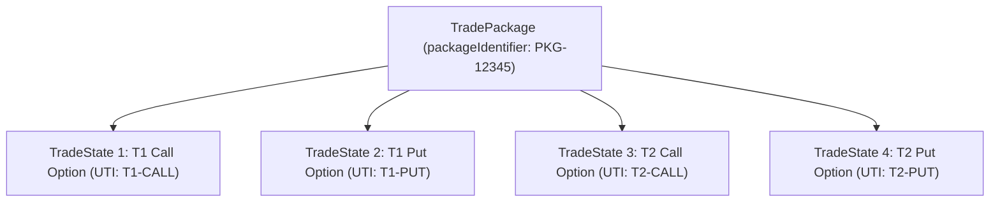

#### 2つのアプローチの比較評価

| 評価軸 | アプローチ 1: 単一 Trade（Multi-Payout） | アプローチ 2: マルチ Trade（TradePackage） |
|---|---|---|
| **契約のアトミック性** | 高（1つの TradeState で全期日・全レグを包括） | 低（各レグが独立した TradeState） |
| **規制報告（EMIR / CFTC）** | 複合取引としての単一 UTI 付番またはカスタム報告 | 各レグ個別に店頭オプションとしての UTI 付番・報告が容易 |
| **清算機関（CCP）登録** | 単一プロダクトとして取り扱いにくい場合がある | オプションレグ単位でそのまま登録可能 |
| **CDM ライフサイクル管理** | 1つの TradeState に対し複数 Payout の部分変更を管理 | 各期日の TradeState を独立して終了（Terminated）可能 |

---

### 4.2 FX TARF (Target Accrual Redemption Forward) の構造とモデリング

#### 4.2.1 TARF の金融工学的構造（レバレッジド・フォワードと累積利益上限）

**FX TARF（Target Accrual Redemption Forward: 目標累積型為替先渡）** は、企業が通常の実勢フォワードレートよりも有利な「ボーナス行使レート」で為替ヘッジを行える一方、不利局面での引き取り義務が倍増（レバレッジ）し、かつ**累積利益が一定の目標値（Target Cap）に達した瞬間に将来の全取引が消滅（Redemption / Knock-out）**する代表的な仕組為替デリバティブです。

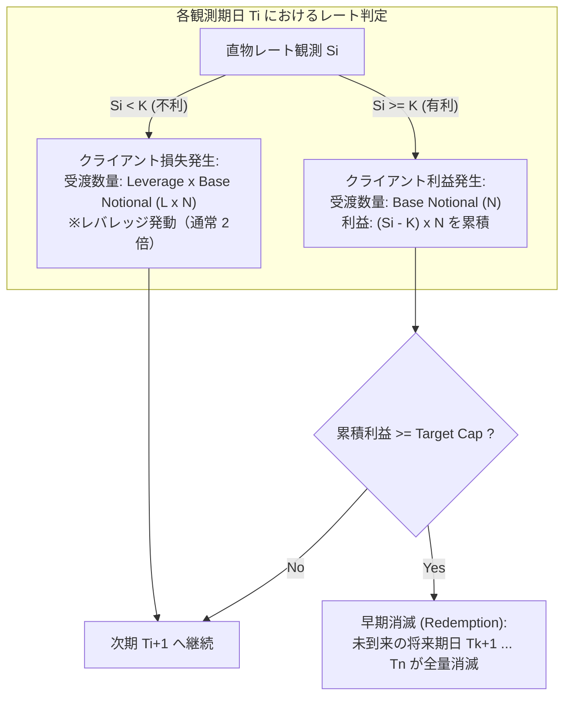

#### TARF の主要パラメータ
1. **行使価格（Strike / Target Rate: $K$）**: 実勢フォワードレートよりも有利なレート（例: ドル売り円買いで実勢 150 円に対し 155 円）。
2. **レバレッジ比率（Leverage Ratio: $L$）**: 不利局面（$S_i < K$）において強制引き取りとなる数量倍率（通常 2.0 倍）。
3. **目標累積利益（Target Cap / Target Profit: $TP$）**: 契約が早期終了する累積利益の閾値（例: 累計 3.00 円、または 100,000 USD）。
4. **超過利益処理（Target Gain Treatment）**:
   - **Full Accrual**: 目標に到達した期も、定められた全額の利益を受け取る。
   - **Exact / Partial Accrual**: 目標上限 $TP$ を超えないよう、最後の期の受渡数量を按分縮小（Cap 調整）する。
   - **Zero**: 累積利益が Target Cap を超える期は、その期の利益がゼロになる。

---

#### 4.2.2 CDM におけるデータ構造設計と一次ソースの限界

> [!CAUTION]
> **一次ソースにおける TARF サポートの実態**:
> - **キーワードの完全皆無**: CDM 一次ソース（Rosetta DSL コードベースおよびサンプル JSON）において、`tarf` や `TargetAccrual` といった文字列・型定義は **0 件（完全未定義）** です。
> - **専用 Qualification の非存在**: バニラや NDF と異なり、TARF を自動認定する関数（例: `Qualify_ForeignExchange_TARF`）は CDM に存在しません。
> - **型定義の誤用**:
>   - 「[`EconomicTerms.terminationProvision.earlyTerminationProvision`](../../common-domain-model/rosetta-source/src/main/rosetta/product-template-type.rosetta) の `mandatoryEarlyTermination` や各レグの `feature.barrier.knockOut` で消滅条件を定義できる」とされることがありますが、これは**明らかな既存型の過剰解釈・誤用**です。
>   - [`MandatoryEarlyTermination`](../../common-domain-model/rosetta-source/src/main/rosetta/product-template-type.rosetta) は金利スワップ等であらかじめ合意された期日（`mandatoryEarlyTerminationDate`）に公正価値（Fair Value）で解約する規定（ISDA ird-44）であり、**累積利益（Target Cap）の監視や超過利益の按分処理（Full / Exact Accrual）を表現する属性は一切持ちません**。
>   - [`Barrier.knockOut`](../../common-domain-model/rosetta-source/src/main/rosetta/product-template-type.rosetta) も単一の為替レート水準（`Trigger.level`）を評価するものであり、期を跨いだ「累積利益（Accrued Profit）」という集計値を評価するデータ構造は存在しません。

##### 現実的な CDM モデリング（非対称ストリップ構造 ＋ 外部ライフサイクル駆動）
一次ソースの制約を踏まえると、CDM において TARF を表現する正統なアプローチは、**「非対称な数量比を持つ期日別オプションのストリップ」としてプロダクトを組成し、非標準的な累積消滅条項は外部管理する** という設計になります。

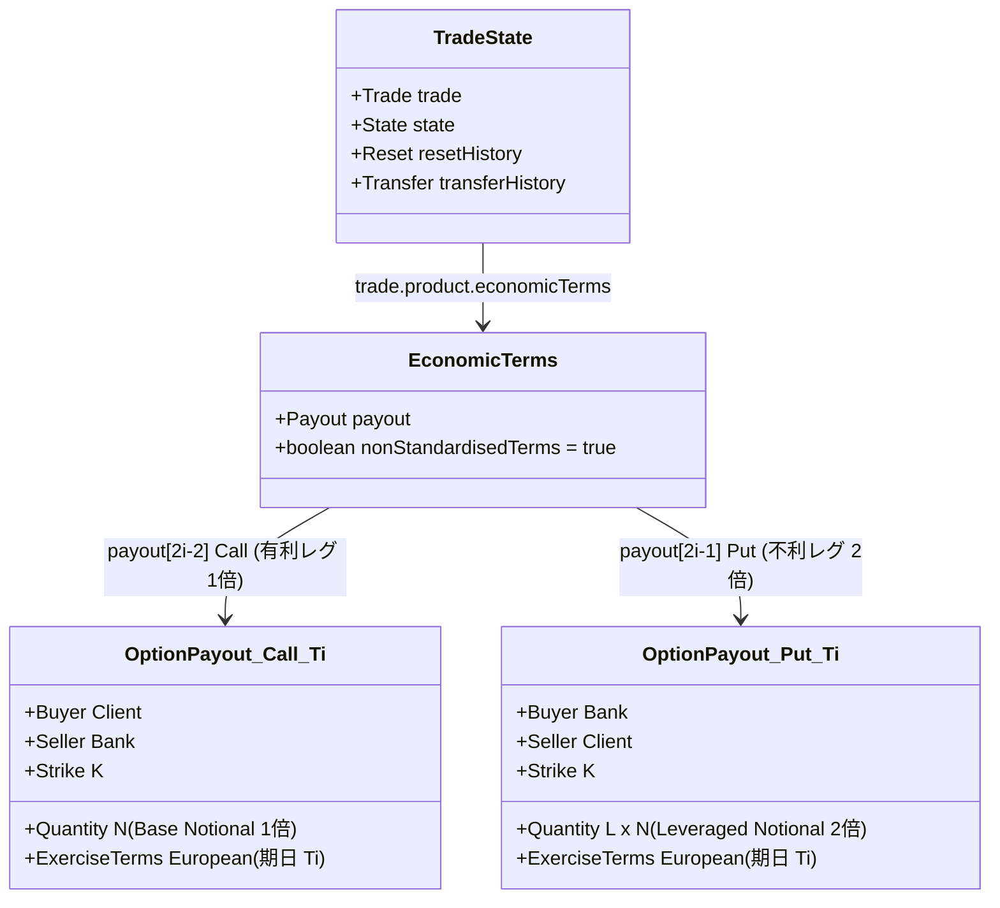

1. **レバレッジの表現（非対称 TradeLot / PriceQuantity）**:
   - 各期日 $T_i$ に対し、クライアント買 Call（数量 $N$）と、クライアント売 Put（数量 $L \times N$）の2つの [`OptionPayout`](../../common-domain-model/rosetta-source/src/main/rosetta/product-template-type.rosetta) をペアで定義します。
   - `TradeLot.priceQuantity` において、Call レグの `quantity` を $N$、Put レグの `quantity` を $L \times N$（例: 2倍）に割り当てます。
2. **累積消滅（Redemption）条件の取り扱い**:
   - CDM スキーマ単体では累積利益上限（Target Cap）を構造化して保持できないため、[`EconomicTerms.nonStandardisedTerms`](../../common-domain-model/rosetta-source/src/main/rosetta/product-template-type.rosetta) を `true` に設定して非標準契約条項が存在することを示し、マスター契約や取引確認書の電子文書に委ねます。
   - したがって、契約期間中の消滅発火（Redemption）は、**完全に外部のリスク管理エンジンが累積計算・判定を行い、イベント発生時に CDM のイベントプリミティブを駆動する** 運用となります。

---

#### 4.2.3 ライフサイクル管理と早期消滅（Redemption）のイベントメカニズム

> **CDM の設計思想と自律計算の境界**:
> CDM は「金融商品の契約データモデル」および「状態遷移の監査ログモデル」を定義するプロトコルであり、**「期をまたいで累積利益を自律計算し、Target Cap と比較して自動発火するビルトイン計算エンジン」は CDM（Rosetta DSL）内部には含まれません**。
> 累積損益の計算や Target 到達の判定は外部の基幹システム（ポジション／リスク管理エンジン）が実行し、その結果として発生した状態遷移を **CDM の標準イベントプリミティブとして決定論的に記録・確定** します。

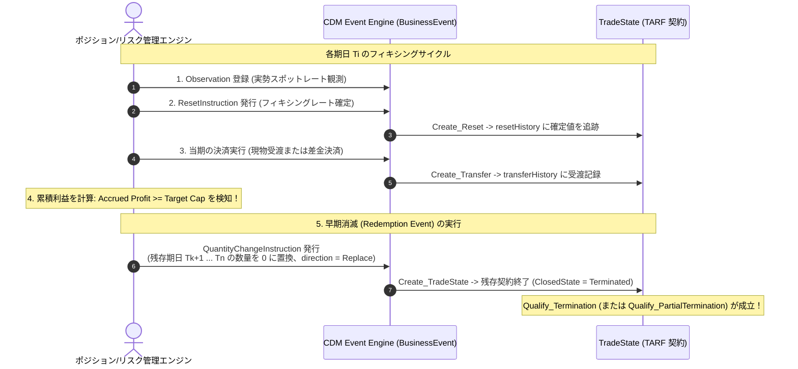

#### Redemption（早期消滅）時の CDM 状態遷移詳細
- **イベントプリミティブ**: [`QuantityChangeInstruction`](../../common-domain-model/rosetta-source/src/main/rosetta/event-common-type.rosetta)
  - `change = QuantityChangeDirectionEnum -> Replace`
  - 対象期日（$T_{k+1} \dots T_n$）の数量を 0 に設定。
- **契約状態（State）の遷移**:
  - 対象レグまたは TradeState 全体の [`State.closedState`](../../common-domain-model/rosetta-source/src/main/rosetta/event-common-type.rosetta) に [`ClosedStateEnum -> Terminated`](../../common-domain-model/rosetta-source/src/main/rosetta/event-common-enum.rosetta) を記録。
- **イベント認定（Qualification）**:
  - 単一 TradeState 全体が終了した場合は `Qualify_Termination`、期日ごとの TradePackage 構造で残存 TradeState を個別に終了させた場合は各 TradeState で `Qualify_Termination` が成立。

---

#### 4.2.4 ターゲット到達時の最終期数量調整（Exact Accrual）の CDM 表現

Exact Accrual（按分調整）ルールが適用される場合、ターゲットに達した最後の期において、累積利益がちょうど Target Cap に一致するよう**当期の受渡数量を縮小（Downsize）**する必要があります。

CDM ではこの調整を、決済前の [`QuantityChangeInstruction`](../../common-domain-model/rosetta-source/src/main/rosetta/event-common-type.rosetta) により当期レグの数量を縮小（例: $1,000,000 \to 450,000$）させた上で、調整後の数量に基づき当期の受渡（`Transfer`）を実行し、同時に残余将来期日を全量消滅（`Terminated`）させる複合イベントとして厳密にモデル化できます。

---

## 5. デジタル系通貨オプション（Digital / Binary Options）の CDM モデリング

### 5.1 デジタルオプションの類型とペイオフ特性

**デジタルオプション（Digital Option / Binary Option）** は、行使条件が満たされた場合に原資産価格に比例した損益ではなく、**あらかじめ定められた固定金額（または原資産そのもの）** を受渡しするエキゾチックオプションです。為替市場（FX）においては、以下のバリエーションが標準的に取引されます。

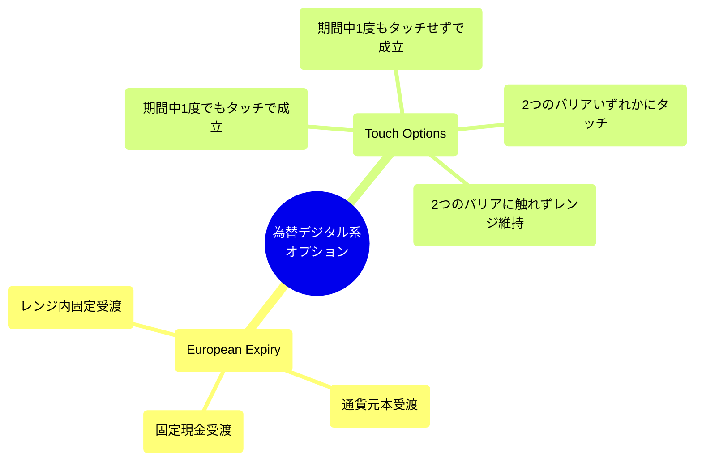

| デジタルオプション種別 | 判定条件（Condition） | ペイオフ（受渡内容） | 支払タイミング |
|---|---|---|---|
| **European Cash-or-Nothing** | 満期日のレート $S_T \ge K$（または $\le K$） | あらかじめ合意した固定金額 $C$（現金） | 満期決済日 |
| **European Asset-or-Nothing** | 満期日のレート $S_T \ge K$（または $\le K$） | 原資産そのもの（基準通貨の額面） | 満期受渡日 |
| **American One-Touch** | 観測期間中に一度でもバリア $B$ にタッチ（$S_t \ge B$） | 固定金額 $C$ | タッチ即時（Immediate）または満期日 |
| **American No-Touch** | 観測期間中、一度もバリア $B$ にタッチしない | 固定金額 $C$ | 満期日 |
| **Double One-Touch (DOT)** | 上限バリア $B_U$ または下限バリア $B_L$ のいずれかにタッチ | 固定金額 $C$ | タッチ即時または満期日 |
| **Double No-Touch (DNT)** | 期間中、為替レートが常にレンジ内（$B_L < S_t < B_U$）に留まる | 固定金額 $C$ | 満期日 |

---

### 5.2 CDM における正規表現設計（`OptionPayout` ＋ `Barrier` ＋ `FeaturePayment`）

CDM において、デジタル／バイナリー系オプションは汎用オプション型 [`OptionPayout`](../../common-domain-model/rosetta-source/src/main/rosetta/product-template-type.rosetta) の拡張機能としてモデル化されます。

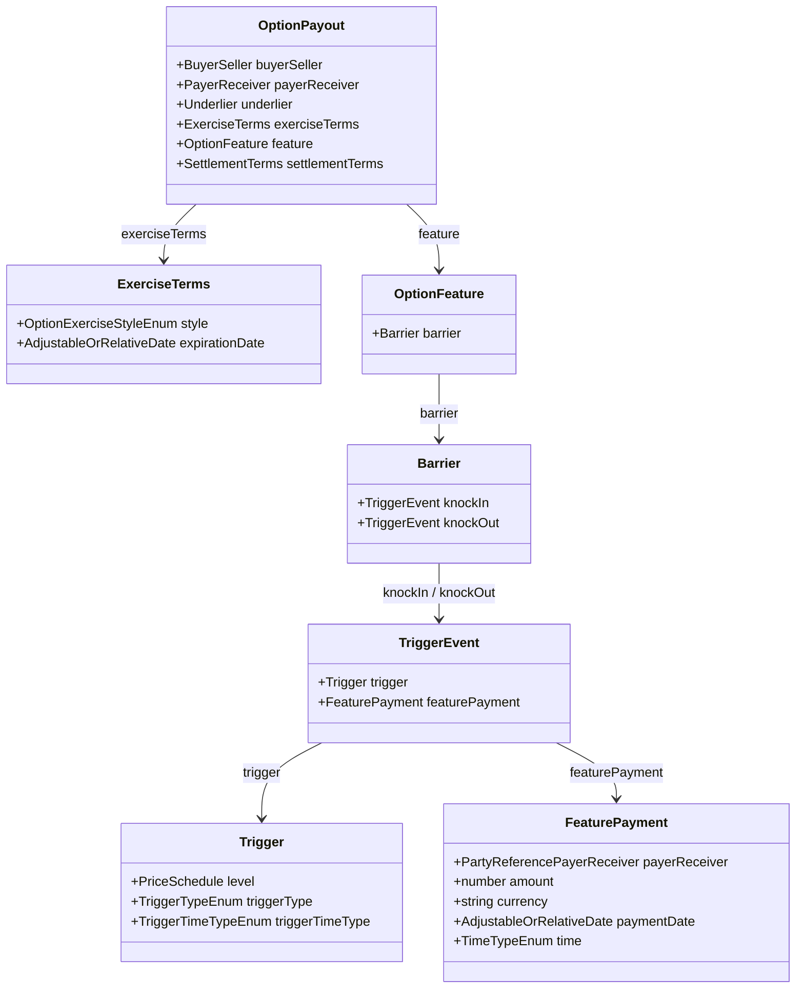

#### 各構成要素の CDM マッピング規則

1. **行使スタイルの指定 (`exerciseTerms.style`)**:
   - ヨーロピアン・デジタル: `OptionExerciseStyleEnum -> European`
   - ワンタッチ／ノータッチ: `OptionExerciseStyleEnum -> American`
2. **タッチ・判定条件の指定 (`Trigger`)**:
   - `level`: バリアレート水準（[`PriceSchedule`](../../common-domain-model/rosetta-source/src/main/rosetta/observable-asset-type.rosetta)）
   - `triggerType`: 判定不等号（[`TriggerTypeEnum`](../../common-domain-model/rosetta-source/src/main/rosetta/observable-event-enum.rosetta) -> `EqualOrGreater`, `EqualOrLess`）
   - `triggerTimeType`: 監視形態（[`TriggerTimeTypeEnum`](../../common-domain-model/rosetta-source/src/main/rosetta/observable-event-enum.rosetta) -> `Continuous`（常時監視・ワンタッチ）または `Closing`（引け値のみ））
3. **固定受渡額の指定 (`FeaturePayment` の構造と一次ソースの仕様)**:
   - **[`FeaturePayment`](../../common-domain-model/rosetta-source/src/main/rosetta/observable-event-type.rosetta)**:
     - 条件充足時に支払われる固定キャッシュフローとして、**`payerReceiver`（型: `PartyReferencePayerReceiver`, 必須 `1..1`）**、`amount`（金額）、`currency`（通貨）、`paymentDate`（支払期日）、`time`（`Immediate` か `Close` か）を定義。
   - **注意（`CashSettlementTerms.cashSettlementAmount` 流用の誤解）**:
     - 一部で「満期差金決済額として `settlementTerms.cashSettlementTerms.cashSettlementAmount` に直接固定額を定義する」代替案が論じられることがありますが、これは ISDA 2003 クレジットイベントや債務不履行時決済（Recovery Factor 等との排他）を想定した型構造です。為替デジタルオプションの固定ペイアウトにこれを適用する Rosetta DSL 上のマッピング関数やサンプル JSON は一次ソースに一切存在せず、正規の表現ではありません。
4. **ノックインとノックアウトの使い分け**:
   - **One-Touch**: タッチによって権利（受取）が発生するため `knockIn` を使用。
   - **No-Touch**: タッチによって権利が消滅するため `knockOut` を使用（満期までノックアウトされなければ満期決済が実行される）。

---

### 5.3 FpML Ingest マッピングの現状と制約（incomplete-products の実態分析）

CDM の一次リポジトリにおけるデジタルオプションの Ingest 変換実装を監査した結果、以下の**実装上の制約・課題**が判明しています。

1. **FpML の XML 構造**:
   - FpML 5.13 では `<fxDigitalOption>` スキーマにより、`<trigger>`（ヨーロピアン）、`<touch>`（アメリカン・タッチ）、`<payout>`（固定受渡額）、`<premium>` が構造化されています。
2. **CDM 側の変換関数 ([`ingest-fpml-confirmation-product-fxdigitaloption-func.rosetta`](../../common-domain-model/rosetta-source/src/main/rosetta/ingest-fpml-confirmation-product-fxdigitaloption-func.rosetta))**:
   - 現在の CDM コードベースでは `MapFxDigitalOptionNonTransferableProduct` が定義されているものの、**初期スケルトン実装にとどまっており、以下の要素が変換されず欠落（empty）** しています：
     - `underlier`: `empty` にハードコード
     - `strike`: マッピング未定義
     - `feature.barrier`: FpML の `<trigger>` / `<touch>` からの変換ロジックが未実装
3. **成果物の隔離配置**:
   - このため、デジタルオプションのサンプル変換結果（[`fx-ex14-euro-digital-option.json`](../../common-domain-model/rosetta-source/src/main/resources/ingest/output/fpml-confirmation-to-trade-state/fpml-5-13-incomplete-products-fx-derivatives/fx-ex14-euro-digital-option.json) 〜 `fx-ex19`）はすべて `incomplete-products`（不完全プロダクト）ディレクトリ配下に配置されており、`OptionPayout` の一部属性（`payerReceiver`, `buyerSeller`, `exerciseTerms`）のみが出力される状態となっています。
4. **商品分類（Qualification）の未定義**:
   - [`product-qualification-func.rosetta`](../../common-domain-model/rosetta-source/src/main/rosetta/product-qualification-func.rosetta) には、バニラオプション認定用の `Qualify_ForeignExchange_VanillaOption` や NDO 認定用の `Qualify_ForeignExchange_NDO` は存在するものの、**デジタル系通貨オプション専用の判定関数（`Qualify_ForeignExchange_DigitalOption` 等）は未実装** です。

---

## 6. 権利行使後のペイアウト（Payout after Exercise）の決定論的メカニズム

通貨オプションの満期到来または権利行使時において、CDM は**「現物受渡（Physical Exercise）」と「差金決済（Cash Settlement / NDO）」の2つの決済形態を決定論的に区別し、異なるライフサイクルパスで処理**します。

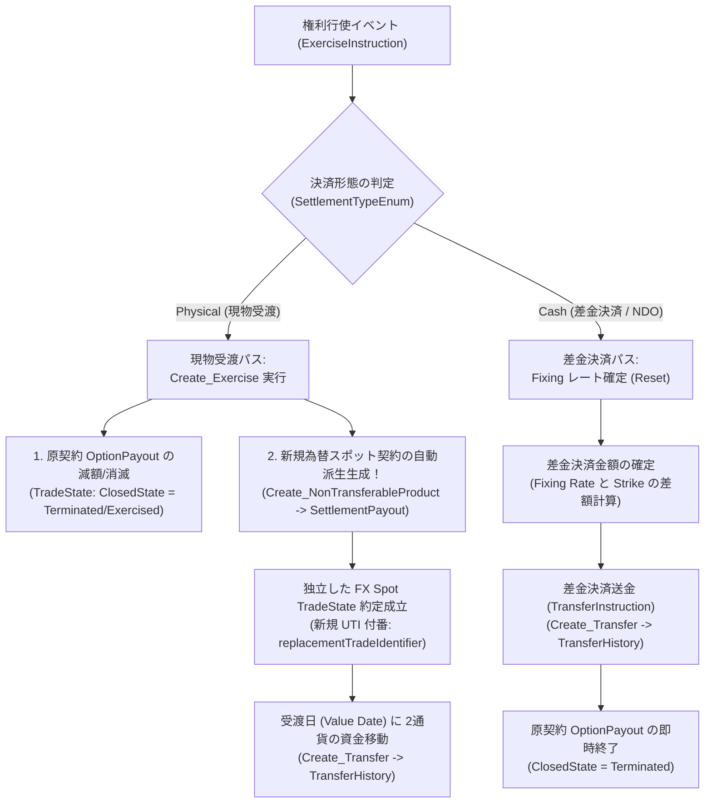

---

### 6.1 オプション権利行使の全体アーキテクチャ（`Create_Exercise` 関数仕様）

CDM のコア関数 [`Create_Exercise`](../../common-domain-model/rosetta-source/src/main/rosetta/event-common-func.rosetta)（`event-common-func.rosetta` L498-553）は、オプションの権利行使に伴う契約の減額および行使結果プロダクトの生成をアトミックに実行します。

```rosetta
func Create_Exercise:
    inputs:
        exerciseInstruction ExerciseInstruction (1..1)
        originalTrade TradeState (1..1)
    output:
        exercise TradeState (1..*)
```

- **入力パラメータ**:
  - `exerciseInstruction`: 行使対象の Payout（`exerciseOption`）、行使数量（`exerciseQuantity`）、および現物行使時の新規取引識別子（`replacementTradeIdentifier`）。
  - `originalTrade`: 行使前の原オプション契約（`TradeState`）。
- **出力パラメータ (`exercise: TradeState (1..*)`)**:
  - 戻り値として**2つの `TradeState`** が返却されます：
    1. **原取引の残高更新**: `Create_TradeState(exerciseInstruction -> exerciseQuantity, originalTrade)`（行使数量分が減額され、全量行使なら `ClosedState = Terminated / Exercised` となる）。
    2. **行使結果の派生取引**: `execution`（行使によって新たに成立した新規契約）。

---

### 6.2 現物受渡（Physical Exercise）: 為替スポット（`SettlementPayout`）の自動派生生成

現物受渡の通貨オプションが行使された場合、CDM は**行使後に2通貨の交換を行う為替スポット契約（FX Spot）を自動生成**します。この一連のメカニズムは、以下の 3 つの Rosetta DSL 関数連携によって実現されています。

#### 1. スポットプロダクトの生成 ([`Create_NonTransferableProduct`](../../common-domain-model/rosetta-source/src/main/rosetta/event-common-func.rosetta) L568-578)
通貨オプションのアンダーライングは通貨資産（`Cash`）です。アンダーライングが完成されたプロダクトではない場合、以下の関数が呼び出されます：

```rosetta
func Create_NonTransferableProduct:
    inputs:
        underlier Underlier (1..1)
        payerReceiver PayerReceiver (1..1)
    output:
        newProduct NonTransferableProduct (1..1)

    set newProduct -> economicTerms -> payout -> SettlementPayout -> underlier: underlier
    set newProduct -> economicTerms -> payout -> SettlementPayout -> payerReceiver:
        payerReceiver
```

> **決定的ポイント**:
> `Create_NonTransferableProduct` は、アンダーライング（通貨資産）と権利行使時の支払受取方向を取り込み、**第1章で詳述した為替スポットの標準データ構造である [`SettlementPayout`](../../common-domain-model/rosetta-source/src/main/rosetta/product-template-type.rosetta) を持つ新規プロダクトを動的に合成**します。

#### 2. Put オプションにおける受渡方向の自動反転 ([`Update_ProductDirection`](../../common-domain-model/rosetta-source/src/main/rosetta/event-common-func.rosetta) L554-567)
Call オプションと Put オプションでは、原資産の受渡方向（買い／売り）が逆転します。CDM では、オプション種別が `Put` の場合に支払側と受取側（Payer と Receiver）を自動的にスワップ（反転）させます：

```rosetta
if optionPayout -> optionType = Put
then Update_ProductDirection(resultProduct, optionPayout -> payerReceiver -> payer, optionPayout -> payerReceiver -> receiver)
else resultProduct
```

#### 3. 新規約定（Execution）の組成と受渡決済（Transfer）
- 合成された `SettlementPayout` に対し、`Create_Execution` が実行されます。
- 行使指示書に指定された `replacementTradeIdentifier` が付番され、独立した新たな **FX Spot 取引（`TradeState`）** として台帳に登録されます。
- この FX Spot 取引は、約定日を行使日、決済期日を受渡日（Value Date）として持ち、期日到来時に通常のスポット取引と全く同様に [`Create_Transfer`](../../common-domain-model/rosetta-source/src/main/rosetta/event-common-func.rosetta) によって 2 通貨の現物送金（`Transfer`）が実行されます。

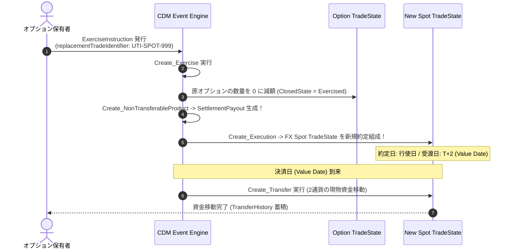

---

### 6.3 差金決済（Cash Settlement / NDO）: キャッシュフロー直結と契約終了

差金決済オプション（Non-Deliverable Option: NDO 等）の場合、現物通貨の交換（FX Spot 約定の生成）は行われません。

1. **フィキシングレートの確定**:
   - 満期日の評価時刻において、参照ソース（Reuters、Bloomberg等）から為替レートを観測（[`Observation`](../../common-domain-model/rosetta-source/src/main/rosetta/observable-event-type.rosetta)）。
   - [`Create_Reset`](../../common-domain-model/rosetta-source/src/main/rosetta/event-common-func.rosetta) により、確定レートが `TradeState.resetHistory` に記録される。
2. **差金決済額（Cash Settlement Amount）の計算**:
   - イン・ザ・マネー（ITM）の場合、決済通貨建てでの差額受渡金額が算出される：
     $$\text{Cash Amount} = \max(S_{fixing} - K, 0) \times \frac{\text{Notional}}{S_{fixing}} \quad (\text{例: USD 決済 NDO})$$
3. **資金移動と契約終了**:
   - [`ExerciseInstruction`](../../common-domain-model/rosetta-source/src/main/rosetta/event-common-type.rosetta) の `exerciseQuantity` に [`TransferInstruction`](../../common-domain-model/rosetta-source/src/main/rosetta/event-common-type.rosetta) が内包され、差金受渡額の送金（[`Create_Transfer`](../../common-domain-model/rosetta-source/src/main/rosetta/event-common-func.rosetta)）が即時実行される。
   - 原契約の `TradeState.state.closedState` に [`ClosedStateEnum -> Terminated`](../../common-domain-model/rosetta-source/src/main/rosetta/event-common-enum.rosetta)（または `Exercised`）が設定され、派生取引を生成することなく取引が完結する。

---

### 6.4 現物受渡 vs 差金決済の決定論的比較表

| 項目 | 現物受渡（Physical Exercise） | 差金決済（Cash Settlement / NDO） |
|---|---|---|
| **行使結果の生成物** | **新規の FX Spot 取引（`SettlementPayout`）** を生成 | 新規契約は生成されず、**単一の差金資金移動（`Transfer`）** のみ発生 |
| **派生契約の UTI** | `replacementTradeIdentifier` により新規付番 | 不要（原契約のライフサイクル内で完結） |
| **資金決済のタイミング** | スポット日（通常行使から $T+2$ 営業日後） | 決済期日（通常フィキシングから $T+2$ 等） |
| **資金移動（Transfer）の内容** | 2通貨の双方向送金（Gross Principal Exchange） | 決済通貨での片道ネット差額送金（Net Cash Settlement） |
| **原契約の最終状態** | `ClosedState = Exercised`（または `Terminated`） | `ClosedState = Terminated` |
| **CDM 呼出関数** | `Create_Exercise` $\to$ `Create_NonTransferableProduct` $\to$ `Create_Execution` | `Create_Reset` $\to$ `Create_Transfer` $\to$ `Create_TradeState` |

---

## 7. CDM が取り扱う動的ライフサイクルイベント（Lifecycle Events）

CDM のイベントモデルでは、状態（[`TradeState`](../../common-domain-model/rosetta-source/src/main/rosetta/event-common-type.rosetta)）と不可分な操作（[`PrimitiveInstruction`](../../common-domain-model/rosetta-source/src/main/rosetta/event-common-type.rosetta)）を組み合わせた [`BusinessEvent`](../../common-domain-model/rosetta-source/src/main/rosetta/event-common-type.rosetta) により、取引のライフサイクル遷移を決定論的かつ監査可能（Audit-proof）に処理します。

プレーンバニラやシンセティックフォワードでは「権利行使（Exercise）」「資金決済（Transfer）」「元本・契約残高管理（QuantityChange）」が基本ですが、**バリアオプション（Barrier Option: Knock-in / Knock-out）やアベレージオプション（Asian Option: Average Rate / Average Strike）といった経路依存型（Path-dependent）エキゾチックオプションを網羅する場合、CDM では全 8 大ライフサイクルイベントとして体系化**されています。

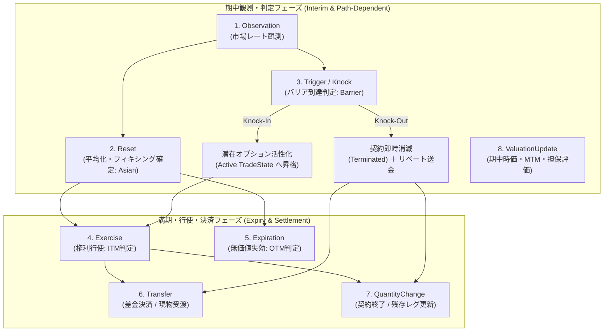

---

### 全 8 大ライフサイクルイベント一覧と CDM マッピング

| # | ライフサイクルイベント | CDM プリミティブ / 関数 / 型 | 対象商品・発生契機 | CDM における処理と状態遷移 |
|---|---|---|---|---|
| **1** | **市場観測<br>(Observation)** | `TradeState.resetHistory`<br>[`Reset.observations`](../../common-domain-model/rosetta-source/src/main/rosetta/event-common-type.rosetta)<br>[`Observation`](../../common-domain-model/rosetta-source/src/main/rosetta/observable-event-type.rosetta) | **バリア / アベレージ共通**<br>期中の観測スケジュール（日次、引け値、特定時刻等） | 市場データ（為替レート）を観測・記録。市場レート観測値（`Observation`）は `Reset` の `observations` 属性として紐づけられ、確定値とともに `resetHistory` に監査蓄積される（※`TradeState.observationHistory` はクレジット・コーポレートアクション専用型）。 |
| **2** | **フィキシング / 平均化確定<br>(Reset)** | `PrimitiveInstruction.reset`<br>[`ResetInstruction`](../../common-domain-model/rosetta-source/src/main/rosetta/event-common-type.rosetta)<br>[`Create_Reset`](../../common-domain-model/rosetta-source/src/main/rosetta/event-common-func.rosetta)<br>`Qualify_Reset` | **アベレージオプション（Asian）の核**<br>観測終了時または期間確定時 | 複数観測値（`observations (1..*)`）から平均化規則（[`AveragingCalculation`](../../common-domain-model/rosetta-source/src/main/rosetta/product-template-type.rosetta)）に基づき確定レート（`resetValue: Price`）を計算。`TradeState.resetHistory` に蓄積。 |
| **3** | **バリア到達判定<br>(Trigger / Knock)** | 条件定義: [`Barrier`](../../common-domain-model/rosetta-source/src/main/rosetta/product-template-type.rosetta), [`TriggerEvent`](../../common-domain-model/rosetta-source/src/main/rosetta/observable-event-type.rosetta)<br>イベント実行: `PrimitiveInstruction.quantityChange` / `transfer`<br>認定: `Qualify_Termination` | **バリアオプションの核**<br>観測レートがバリア水準（`Trigger.level`）にヒットした瞬間 | **Knock-out**: 独立した Trigger プリミティブは存在せず、残存数量を 0 とする `QuantityChange`（契約状態: [`ClosedStateEnum -> Terminated`](../../common-domain-model/rosetta-source/src/main/rosetta/event-common-enum.rosetta)）として実行。リベートがある場合は `TriggerEvent.featurePayment` に基づき `Transfer` を同時発行。<br>**Knock-in**: 潜在状態から権利行使可能な有効契約へ状態遷移。 |
| **4** | **権利行使<br>(Exercise)** | `PrimitiveInstruction.exercise`<br>[`ExerciseInstruction`](../../common-domain-model/rosetta-source/src/main/rosetta/event-common-type.rosetta)<br>[`Create_Exercise`](../../common-domain-model/rosetta-source/src/main/rosetta/event-common-func.rosetta)<br>`Qualify_Exercise` | **全オプション共通**<br>満期日または行使期間において ITM と判定された場合 | `exerciseOption` で特定 Payout を指定。行使済レグを終了し、差金決済または現物受渡取引（FX Spot 約定）を派生生成。 |
| **5** | **満期失効・無価値終了<br>(Expiration)** | `TradeState.state.closedState`<br>[`ClosedStateEnum -> Expired`](../../common-domain-model/rosetta-source/src/main/rosetta/event-common-enum.rosetta) | **全オプション共通**<br>満期到来時に OTM で行使されなかった場合、またはノックイン未到達のまま満期終了 | 権利行使されずに契約が終了。契約状態を明示的に `Expired`（失効）としてクローズし、ポジションを閉鎖。 |
| **6** | **資金移動・決済<br>(Transfer / Settlement)** | `PrimitiveInstruction.transfer`<br>[`TransferInstruction`](../../common-domain-model/rosetta-source/src/main/rosetta/event-common-type.rosetta)<br>[`Create_Transfer`](../../common-domain-model/rosetta-source/src/main/rosetta/event-common-func.rosetta)<br>`Qualify_CashTransfer` | **全商品共通**<br>契約締結時、行使決済時、ノックアウト時 | プレミアム支払（`UnscheduledTransfer`）、ノックアウト時のリベート支払、差金決済（Cash Settlement）、現物受渡資金移動を `transferHistory` に記録。 |
| **7** | **契約残高・条件変更<br>(QuantityChange / TermsChange)** | `PrimitiveInstruction.quantityChange`<br>[`QuantityChangeInstruction`](../../common-domain-model/rosetta-source/src/main/rosetta/event-common-type.rosetta)<br>`Qualify_PartialTermination` / `Termination` | **ストリップ型 / バリア共通**<br>期日ごとの順次決済、一部解約、ノックアウト消滅 | 期日 $T_i$ の行使後に残存期日 $T_{i+1} \dots T_n$ を残す（単一 Trade の場合）、またはノックアウト時に残存数量を 0 にして契約終了（`Terminated`）させる。 |
| **8** | **時価評価・担保評価更新<br>(ValuationUpdate)** | `PrimitiveInstruction.valuation`<br>[`ValuationInstruction`](../../common-domain-model/rosetta-source/src/main/rosetta/event-common-type.rosetta)<br>[`Valuation`](../../common-domain-model/rosetta-source/src/main/rosetta/event-position-type.rosetta)<br>`Qualify_ValuationUpdate` | **全デリバティブ共通**<br>日次 MTM（時価評価）および感応度・マージン計算 | 期中のバリア接近度や平均化進捗を反映した時価評価額（PV / MTM）を `TradeState.valuationHistory` に追跡・記録。 |

---

### エキゾチック特有イベントの深層解説

#### A. アベレージオプション（Asian）における `Reset` イベントのメカニズム
アベレージオプションでは、満期時のペイオフ計算に用いるレートが単一のスポットレートではなく、**観測期間中のレートの平均値（算術平均等）**となります。
- **データ構造の排他ルール**:
  [`OptionPayout`](../../common-domain-model/rosetta-source/src/main/rosetta/product-template-type.rosetta) の条件制約により、以下が厳密に区別されます：
  - **Average Rate Option (平均レート型)**: `feature -> averagingFeature` を使用（ペイオフ: $\max(\bar{S} - K, 0)$）。
  - **Average Strike Option (平均行使価格型)**: `strike -> averagingStrikeFeature` を使用（ペイオフ: $\max(S_T - \bar{S}, 0)$）。
  - 条件制約 `AsianOptionChoice`: 2つの表現は排他（`if feature -> averagingFeature exists then strike -> averagingStrikeFeature is absent`）。
- **`Reset` の計算構造と観測値の紐づけ**:
  [`Reset`](../../common-domain-model/rosetta-source/src/main/rosetta/event-common-type.rosetta) は複数の市場観測値（`observations: Observation (1..*)`）と平均化方法（`averagingMethodology: AveragingCalculation`）を結びつけ、算出された平均為替レート（`resetValue: Price`）を確定します。
  Rosetta 条件制約 `condition AveragingMethodologyExists`:
  ```rosetta
  if observations count > 1 then averagingMethodology exists
  ```
  複数観測値が存在する場合、平均化計算ロジック（`averagingMethod` や `precision`（端数処理規則））の指定が必須と定義されています。
  > **注記（観測値の格納設計）**: CDM の `TradeState.observationHistory`（型: `ObservationEvent`）はクレジットイベント（`CreditEvent`）やコーポレートアクション（`CorporateAction`）専用として設計されており、為替レート等の市場クォート観測値は `Reset.observations`（型: `Observation`）内に監査参照として保持され、`TradeState.resetHistory` に蓄積されます。

#### B. バリアオプション（Barrier）における `Trigger` と状態遷移メカニズム
バリアオプションでは、為替レートがバリア水準に達したかどうかに応じて契約の存続状態が劇的に変化します。
- **データ構造（プロダクト側の静的条件）**:
  [`OptionPayout.feature.barrier`](../../common-domain-model/rosetta-source/src/main/rosetta/product-template-type.rosetta)（型: [`Barrier`](../../common-domain-model/rosetta-source/src/main/rosetta/product-template-type.rosetta)）：
  - `knockIn`: [`TriggerEvent`](../../common-domain-model/rosetta-source/src/main/rosetta/observable-event-type.rosetta)（バリア到達により権利が有効化）
  - `knockOut`: [`TriggerEvent`](../../common-domain-model/rosetta-source/src/main/rosetta/observable-event-type.rosetta)（バリア到達により権利が無効・消滅）
- **判定条件（Trigger）**:
  - `level`: バリアレート水準（[`PriceSchedule`](../../common-domain-model/rosetta-source/src/main/rosetta/observable-asset-type.rosetta)）
  - `triggerType`: 突破方向（[`TriggerTypeEnum`](../../common-domain-model/rosetta-source/src/main/rosetta/observable-event-enum.rosetta) -> `EqualOrGreater`, `EqualOrLess` 等）
  - `triggerTimeType`: 監視時刻（[`TriggerTimeTypeEnum`](../../common-domain-model/rosetta-source/src/main/rosetta/observable-event-enum.rosetta) -> `Continuous` / `Anytime`（常時監視）または `Closing`（引け値のみ））
  - `featurePayment`: ノックアウト時に買い手に支払われるリベート金額（[`FeaturePayment`](../../common-domain-model/rosetta-source/src/main/rosetta/product-template-type.rosetta)）
- **イベント発生時の状態遷移（イベントプリミティブ）**:
  CDM のイベントモデルにおいて `Trigger` は独立したプリミティブ操作ではなく、以下の既存プリミティブの組み合わせによって表現されます：
  - **Knock-Out 発生時**:
    1. [`QuantityChangeInstruction`](../../common-domain-model/rosetta-source/src/main/rosetta/event-common-type.rosetta) により残存数量が 0 となり、`State.closedState` に [`ClosedStateEnum -> Terminated`](../../common-domain-model/rosetta-source/src/main/rosetta/event-common-enum.rosetta) が設定され契約終了。イベント認定は `Qualify_Termination` となる。
    2. リベート（`featurePayment`）が存在する場合、[`TransferInstruction`](../../common-domain-model/rosetta-source/src/main/rosetta/event-common-type.rosetta) によりリベート受渡（`ContingentTransfer`）が実行される。
  - **Knock-In 発生時**:
    - バリアヒットにより休眠状態から有効契約へ状態遷移し、満期日に向けた通常の `Exercise` / `Expiration` 待機状態へと移行する。

---

## 8. 実サンプル JSON / XML による要素レベルの裏どり検証 (Evidence & Mapping)

CDM 一次リポジトリ（`rosetta-source/src/main/resources/ingest/`）配下に実在する XML 入力および JSON 出力成果物、ならびに Rosetta DSL 関数実装と照合し、上記仕様の妥当性を確認したエビデンス一覧です。

### 8.1 スポットおよびプレーンフォワードの要素対応
- **検証ファイル**:
  - スポット: [`fx-ex01-fx-spot.json`](../../common-domain-model/rosetta-source/src/main/resources/ingest/output/fpml-confirmation-to-trade-state/fpml-5-13-products-fx-derivatives/fx-ex01-fx-spot.json)
  - プレーンフォワード: [`fx-ex03-fx-fwd.json`](../../common-domain-model/rosetta-source/src/main/resources/ingest/output/fpml-confirmation-to-trade-state/fpml-5-13-products-fx-derivatives/fx-ex03-fx-fwd.json)

| CDM モデル要素 | 実サンプル JSON パス / キー名 | スポット (`fx-ex01`) | プレーンフォワード (`fx-ex03`) |
|---|---|---|---|
| 商品タクソノミ | `trade.product.taxonomy[0]` | `ForeignExchange_Spot_Forward` | `ForeignExchange_Spot_Forward` |
| ペイアウト型 | `trade.product.economicTerms.payout[0]` | `@type: "cdm.product.template.SettlementPayout"` | `@type: "cdm.product.template.SettlementPayout"` |
| 約定日 | `trade.tradeDate` | `2001-10-23` | `2001-11-19` |
| 受渡期日 | `payout[0].settlementTerms.settlementDate` | `valueDate: "2001-10-25"` ($T+2$) | `valueDate: "2001-12-21"` (約1ヶ月先) |
| 為替レート | `tradeLot[0].priceQuantity[0].price[0]` | `value: 1.48` | `value: 0.9175` |
| レート合成 | `price[0].composite` | なし（直物単一値） | `baseValue: 0.9130`, `operand: 0.0045`, `operandType: ForwardPoint` |

---

### 8.2 NDF（Non-Deliverable Forward）実サンプルの要素対応と裏どり検証

一次リポジトリ配下に実在する NDF の FpML 5-13 入力 XML および CDM Ingest 変換後 JSON を対比検証した結果です。

- **検証ファイル**:
  - FpML 入力 XML: [`fx-ex07-non-deliverable-forward.xml`](../../common-domain-model/rosetta-source/src/main/resources/ingest/input/fpml-5-13-products-fx-derivatives/fx-ex07-non-deliverable-forward.xml)
  - CDM 出力 JSON: [`fx-ex07-non-deliverable-forward.json`](../../common-domain-model/rosetta-source/src/main/resources/ingest/output/fpml-confirmation-to-trade-state/fpml-5-13-products-fx-derivatives/fx-ex07-non-deliverable-forward.json)

#### FpML 入力 XML と CDM 出力 JSON の要素対比表

| CDM モデル要素 | FpML 入力 XML パス (`fx-ex07.xml`) | 実サンプル CDM JSON パス (`fx-ex07.json`) | 具体値・解釈 |
|---|---|---|---|
| **商品タクソノミ** | なし（XML 要素 `<fxSingleLeg>` 内に内包） | `trade.product.taxonomy[0]` | `source: "ISDA"`, `name: "ForeignExchange_NDF"`, `calculated: true` |
| **ペイアウト型** | `<fxSingleLeg>` | `trade.product.economicTerms.payout[0]` | `@type: "cdm.product.template.SettlementPayout"` |
| **決済方式** | `<nonDeliverableSettlement>` | `payout[0].settlementTerms.settlementType` | `SettlementTypeEnum -> "Cash"` |
| **決済通貨** | `<nonDeliverableSettlement><settlementCurrency>USD</settlementCurrency>` | `payout[0].settlementTerms.settlementCurrency` | `"USD"`（※INR は決済通貨とならない） |
| **決済期日** | `<valueDate>2002-04-11</valueDate>` | `payout[0].settlementTerms.settlementDate.valueDate` | `"2002-04-11"` |
| **フィキシング期日** | `<fixing><fixingDate>2002-04-09</fixingDate>` | `payout[0].settlementTerms.cashSettlementTerms[0].valuationDate.fxFixingDate.fxFixingDate.adjustableDate.adjustedDate` | `"2002-04-09"`（受渡日の2営業日前） |
| **市場レート配信元** | `<primaryRateSource><rateSource>Reuters</rateSource><rateSourcePage>RBIB</rateSourcePage></primaryRateSource>` | `cashSettlementTerms[0].valuationMethod.valuationSource.informationSource` | `sourceProvider: "Reuters"`, `sourcePage: "RBIB"` |
| **フィキシング通貨ペア** | `<fixing><quotedCurrencyPair><currency1>USD</currency1><currency2>INR</currency2></quotedCurrencyPair>` | `cashSettlementTerms[0].valuationMethod.valuationSource.quotedCurrencyPair` | `currency1: "USD"`, `currency2: "INR"`, `quoteBasis: "Currency2PerCurrency1"` |
| **約定レート** | `<exchangeRate><rate>43.40</rate></exchangeRate>` | `tradeLot[0].priceQuantity[0].price[0]` | `value: 43.40`, `unit: INR`, `perUnitOf: USD`, `priceType: "ExchangeRate"` |
| **直物・スワップポイント** | `<spotRate>43.35</spotRate><forwardPoints>0.05</forwardPoints>` | `price[0].composite` | `baseValue: 43.35`, `operand: 0.05`, `operandType: "ForwardPoint"` |
| **契約元本（USD）** | `<exchangedCurrency1><currency>USD</currency><amount>10000000</amount></exchangedCurrency1>` | `tradeLot[0].priceQuantity[0].quantity` | `value: 10000000`, `unit.currency: "USD"` |
| **参照元本（INR）** | `<exchangedCurrency2><currency>INR</currency><amount>434000000</amount></exchangedCurrency2>` | `tradeLot[0].priceQuantity[0].price[0].derivedQuantity` | `value: 434000000`, `unit.currency: "INR"` |

> **設計検証の成果**:
> 1. **スキーマ統合（Harmonization）**: FpML 5-13 では `<nonDeliverableSettlement>` という FX 固有のタグが用いられていましたが、CDM ではこれが他プロダクト（金利・エクイティ）と共通化された [`CashSettlementTerms`](../../common-domain-model/rosetta-source/src/main/rosetta/product-common-settlement-type.rosetta) の配下に吸収され、為替フィキシング日は `valuationDate.fxFixingDate.fxFixingDate` として完全に正規化されています。
> 2. **決定論的タクソノミ推論**: 入力 XML にタクソノミが記載されていなくても、`cashSettlementTerms` が存在することを判定エンジンが検知し、`ForeignExchange_NDF` を `calculated: true` で正確に自動付与することが実機確認されました。

---

### 8.3 通貨オプション単体（FX Option）の要素対応
- **検証ファイル**:
  - ヨーロピアン: [`fx-ex09-euro-opt.json`](../../common-domain-model/rosetta-source/src/main/resources/ingest/output/fpml-confirmation-to-trade-state/fpml-5-13-products-fx-derivatives/fx-ex09-euro-opt.json)
  - アメリカン: [`fx-ex10-amer-opt.json`](../../common-domain-model/rosetta-source/src/main/resources/ingest/output/fpml-confirmation-to-trade-state/fpml-5-13-products-fx-derivatives/fx-ex10-amer-opt.json)
  - 差金決済（NDO）: [`fx-ex11-non-deliverable-option.json`](../../common-domain-model/rosetta-source/src/main/resources/ingest/output/fpml-confirmation-to-trade-state/fpml-5-13-products-fx-derivatives/fx-ex11-non-deliverable-option.json)

| CDM モデル要素 | 実サンプル JSON パス / キー名 | `fx-ex09-euro-opt.json` での具体値 |
|---|---|---|
| 商品タクソノミ | `trade.product.taxonomy[1]` | `source: "ISDA"`, `name: "ForeignExchange_VanillaOption"`, `calculated: true` |
| ペイアウト型 | `trade.product.economicTerms.payout[0]` | `@type: "cdm.product.template.OptionPayout"` |
| 買手・売手 | `payout[0].buyerSeller` | `buyer: "Party1"`, `seller: "Party2"` |
| オプション種別 | `payout[0].optionType` | `"Put"`（または `"Call"`） |
| 行使価格 | `payout[0].strike.strikePrice` | `value: 0.4920`, `unit.currency: "USD"`, `perUnitOf.currency: "AUD"`, `priceType: "ExchangeRate"` |
| 権利行使条件 | `payout[0].exerciseTerms` | `style: "European"`, `expirationDate[0].adjustableDate.adjustedDate: "2002-06-04"` |
| 受渡期日 | `payout[0].settlementTerms.settlementDate` | `valueDate: "2002-06-06"` |
| アンダーライング | `payout[0].underlier` | `@type: "cdm.observable.asset.Observable"`, `@ref:scoped: "observable-1"`（`Cash: AUD`） |
| 元本・数量 | `trade.tradeLot[0].priceQuantity[0]` | `quantity.value: 75000000 AUD`, `price[0].derivedQuantity.value: 36900000 USD` |

---

### 8.4 複数受渡日・期日別ストライク（マルチフォワード）の要素対応
- **検証ファイル**: [`fx-ex08-fx-swap.json`](../../common-domain-model/rosetta-source/src/main/resources/ingest/output/fpml-confirmation-to-trade-state/fpml-5-13-products-fx-derivatives/fx-ex08-fx-swap.json)
  - `payout` 配列内に複数要素が並び、各要素が独立した `settlementDate.valueDate`（`2002-01-25`, `2002-02-25`）を持つ。
  - `tradeLot.priceQuantity` 配列内に期日別の `price-1`（1.48）、`price-2`（1.50）が定義され、各 Payout からスコープ参照（`@ref:scoped`）される。

---

### 8.5 レグ独立識別子（複数 UTI / USI）の要素対応
- **検証ファイル**: [`fx-ex26-fxswap-multiple-USIs.json`](../../common-domain-model/rosetta-source/src/main/resources/ingest/output/fpml-confirmation-to-trade-state/fpml-5-13-products-fx-derivatives/fx-ex26-fxswap-multiple-USIs.json)
  - `tradeIdentifier` 配列内にレグごとの独立した UTI（末尾 `...012` と `...013`）を保持できる実機仕様を裏どり。

---

### 8.6 ライフサイクルイベント（動的状態遷移）の要素対応
- **検証ファイル**: [`msg-ex54-execution-advice-trade-partial-termination-C11-00.json`](../../common-domain-model/rosetta-source/src/main/resources/ingest/output/fpml-confirmation-to-workflow-step/fpml-5-13-processes-execution-advice/msg-ex54-execution-advice-trade-partial-termination-C11-00.json)
  - `primitiveInstruction.quantityChange`（`direction = "Replace"`）による元本減額、および `primitiveInstruction.transfer` による資金移動の連動を実証。

---

### 8.7 エキゾチックオプション（アベレージ・バリア）の要素対応とサンプル JSON 実態調査

CDM 一次リポジトリにおけるエキゾチックオプション（アベレージ型およびバリア型）のサンプル JSON 提供状況および要素レベルの整合性を調査した結果、以下の実態が明らかになっています。

#### A. アベレージオプション（Asian Option）
- **検証ファイル（契約成立 TradeState）**: [`fx-ex21-avg-rate-option-parametric-plus-rate-observation.json`](../../common-domain-model/rosetta-source/src/main/resources/ingest/output/fpml-confirmation-to-trade-state/fpml-5-13-products-fx-derivatives/fx-ex21-avg-rate-option-parametric-plus-rate-observation.json)
- **実証された契約要素**:
  - `OptionPayout.observationTerms`: 観測スケジュール（`observationDates.periodicSchedule.startDate: 2010-11-01`, `endDate: 2010-11-30`, `periodFrequency: 1D`）。
  - `observationTerms.informationSource`: フィキシング配信元（`sourceProvider: "Reuters"`, `sourcePage: "BNBX"`）。
  - `observationTerms.observationTime`: 観測時刻（`hourMinuteTime: 18:00:00`, `businessCenter: MXMC`）。
  - `OptionPayout.strike.strikePrice`: 行使価格 12.40 MXN per USD。
- **ライフサイクルイベント（Reset）のサンプル JSON 有無**:
  - **為替（FX）における `Reset` イベントのサンプル JSON は CDM リポジトリ内に存在しません（0件）**。
  - 上記ファイルは契約約定時点の `TradeState`（初期プレミアム支払の `transferHistory` のみ）であり、期中観測値（`Observation`）の蓄積や確定レートを計算・適用した `BusinessEvent` / `resetHistory` は含まれません。
  - ※なお CDM 全体でも、`Reset` イベントの出力サンプルは証券貸借の請求書計算（`sec-lending`）に限定されています。

#### B. バリアオプション（Barrier Option）
- **検証ファイル（契約成立 TradeState）**: [`fx-ex13-fx-dbl-barrier-option.json`](../../common-domain-model/rosetta-source/src/main/resources/ingest/output/fpml-confirmation-to-trade-state/fpml-5-13-incomplete-products-fx-derivatives/fx-ex13-fx-dbl-barrier-option.json)（および [`fx-ex12-fx-barrier-option.json`](../../common-domain-model/rosetta-source/src/main/resources/ingest/output/fpml-confirmation-to-trade-state/fpml-5-13-incomplete-products-fx-derivatives/fx-ex12-fx-barrier-option.json)）
- **Ingest 変換における現状の制約と要素欠落**:
  - 上記ファイルは FpML からの Ingest 変換結果ですが、`incomplete-products`（不完全変換）ディレクトリに分類されています。
  - 為替オプションの Ingest マッピング関数（[`ingest-fpml-confirmation-product-fxoption-func.rosetta`](../../common-domain-model/rosetta-source/src/main/rosetta/ingest-fpml-confirmation-product-fxoption-func.rosetta)）においてバリア機能（`barrier`）の変換ロジックが未実装であるため、**出力された CDM JSON 内には `OptionPayout.feature.barrier`（`TriggerEvent` やトリガー水準等）が出力されず欠落**しています（商品タクソノミ名 `DOUBLEBARRIER` のみ保持）。
  - ※CDM の JSON サンプルで `feature.barrier` が出力されるのは、クレジットイベントをトリガーとするクレジット・スワップション（`cd-swaption-1.json` 等）に限られます。
- **ライフサイクルイベント（バリアタッチ）のサンプル JSON 有無**:
  - **バリア到達（Knock-In / Knock-Out）を表現したイベント（`BusinessEvent` / `WorkflowStep`）のサンプル JSON は存在しません（0件）**。
  - CDM のイベントモデル上、ノックアウト消滅は `QuantityChangeInstruction`（数量0・`State.closedState = Terminated`）およびリベート送金（`Transfer`）の複合イベントとしてモデル化（認定: `Qualify_Termination`）されますが、これを実機実行したテストデータセットは未収録です。

---

### 8.8 デジタル系オプションの実サンプル XML / JSON 実態調査

一次リポジトリ配下の FpML 入力 XML および CDM 出力 JSON を対比調査した結果、デジタル系オプションにおける CDM のマッピング状況が実証されました。

- **検証対象サンプル一覧**:
  - ヨーロピアン・デジタル: [`fx-ex14-euro-digital-option.xml`](../../common-domain-model/rosetta-source/src/main/resources/ingest/input/fpml-5-13-incomplete-products-fx-derivatives/fx-ex14-euro-digital-option.xml) $\to$ [`fx-ex14-euro-digital-option.json`](../../common-domain-model/rosetta-source/src/main/resources/ingest/output/fpml-confirmation-to-trade-state/fpml-5-13-incomplete-products-fx-derivatives/fx-ex14-euro-digital-option.json)
  - ヨーロピアン・レンジ・デジタル: [`fx-ex15-euro-range-digital-option.xml`](../../common-domain-model/rosetta-source/src/main/resources/ingest/input/fpml-5-13-incomplete-products-fx-derivatives/fx-ex15-euro-range-digital-option.xml) $\to$ [`fx-ex15-euro-range-digital-option.json`](../../common-domain-model/rosetta-source/src/main/resources/ingest/output/fpml-confirmation-to-trade-state/fpml-5-13-incomplete-products-fx-derivatives/fx-ex15-euro-range-digital-option.json)
  - ワンタッチ: [`fx-ex16-one-touch-option.xml`](../../common-domain-model/rosetta-source/src/main/resources/ingest/input/fpml-5-13-incomplete-products-fx-derivatives/fx-ex16-one-touch-option.xml) $\to$ [`fx-ex16-one-touch-option.json`](../../common-domain-model/rosetta-source/src/main/resources/ingest/output/fpml-confirmation-to-trade-state/fpml-5-13-incomplete-products-fx-derivatives/fx-ex16-one-touch-option.json)
  - ノータッチ: [`fx-ex17-no-touch-option.xml`](../../common-domain-model/rosetta-source/src/main/resources/ingest/input/fpml-5-13-incomplete-products-fx-derivatives/fx-ex17-no-touch-option.xml) $\to$ [`fx-ex17-no-touch-option.json`](../../common-domain-model/rosetta-source/src/main/resources/ingest/output/fpml-confirmation-to-trade-state/fpml-5-13-incomplete-products-fx-derivatives/fx-ex17-no-touch-option.json)
  - ダブル・ワンタッチ: [`fx-ex18-double-one-touch-option.xml`](../../common-domain-model/rosetta-source/src/main/resources/ingest/input/fpml-5-13-incomplete-products-fx-derivatives/fx-ex18-double-one-touch-option.xml) $\to$ [`fx-ex18-double-one-touch-option.json`](../../common-domain-model/rosetta-source/src/main/resources/ingest/output/fpml-confirmation-to-trade-state/fpml-5-13-incomplete-products-fx-derivatives/fx-ex18-double-one-touch-option.json)
  - ダブル・ノータッチ: [`fx-ex19-double-no-touch-option.xml`](../../common-domain-model/rosetta-source/src/main/resources/ingest/input/fpml-5-13-incomplete-products-fx-derivatives/fx-ex19-double-no-touch-option.xml) $\to$ [`fx-ex19-double-no-touch-option.json`](../../common-domain-model/rosetta-source/src/main/resources/ingest/output/fpml-confirmation-to-trade-state/fpml-5-13-incomplete-products-fx-derivatives/fx-ex19-double-no-touch-option.json)

#### 要素対比と実態分析（`fx-ex14-euro-digital-option` の場合）

| 要素名 | FpML 入力 XML (`fx-ex14.xml`) | CDM 出力 JSON (`fx-ex14.json`) | 監査結果と要因分析 |
|---|---|---|---|
| **商品タクソノミ** | `<productType>EuroBinary</productType>` | `taxonomy[0].value.name: "EuroBinary"` | 保持（独自スキーマ URL 紐づけ、ISDA 分類は未定義） |
| **買手・売手** | `<buyerPartyReference href="party2"/>` | `buyerSeller.buyer: "Party1"` (内部ID) | 正常変換 |
| **行使条件** | `<europeanExercise>` (満期: 2001-11-26) | `exerciseTerms.style: "European"` | 正常変換 |
| **受渡日** | `<valueDate>2001-11-28</valueDate>` | `settlementTerms.settlementDate.valueDate: "2001-11-28"` | 正常変換 |
| **トリガー条件** | `<trigger><triggerRate>1.4800</triggerRate></trigger>` | **欠落（出力なし）** | マッピング関数未実装のため欠落 |
| **固定ペイアウト** | `<payout><amount>750000</amount><currency>GBP</currency></payout>` | **欠落（出力なし）** | マッピング関数未実装のため欠落 |
| **アンダーライング** | `<quotedCurrencyPair>GBP/USD</quotedCurrencyPair>` | **欠落（`underlier: empty`）** | DSL コード上で `underlier: empty` と定義 |
| **プレミアム** | `<premium><amount>53000 GBP</amount></premium>` | `transferHistory[0].transfer` (`53000 GBP`) | 正常変換（初期資金移動として記録） |

> **知見のまとめ**:
> CDM コードベース上、デジタル系オプションの FpML Ingest（[`ingest-fpml-confirmation-product-fxdigitaloption-func.rosetta`](../../common-domain-model/rosetta-source/src/main/rosetta/ingest-fpml-confirmation-product-fxdigitaloption-func.rosetta)）は開発途上のスケルトン実装（Incomplete）にとどまっています。
> 契約の基本枠組み（当事者、プレミアム、満期期日、アメリカン／ヨーロピアン行使スタイル）はパースされますが、トリガー条件および固定ペイアウト額を `OptionPayout.feature.barrier.featurePayment` へ橋渡しするマッピングが存在せず、全サンプルで欠落することが実証されました。

---

### 8.9 権利行使後の派生生成（Physical vs Cash）のコード裏どり

CDM Rosetta DSL における権利行使後のペイアウト生成メカニズムについて、以下の関数群の実装コードによりその動作が完全に裏どりされています。

1. **`Create_Exercise` ([`event-common-func.rosetta`](../../common-domain-model/rosetta-source/src/main/rosetta/event-common-func.rosetta) L498-553)**:
   - オプション行使時に `originalTrade` の数量を減額し、同時に派生取引 `execution` を組成して返却する。
2. **`Create_NonTransferableProduct` ([`event-common-func.rosetta`](../../common-domain-model/rosetta-source/src/main/rosetta/event-common-func.rosetta) L568-578)**:
   - アンダーライングが通貨資産（`Cash`）の場合、**為替スポット取引のデータ型である [`SettlementPayout`](../../common-domain-model/rosetta-source/src/main/rosetta/product-template-type.rosetta) を持つプロダクトを直接インスタンス化**する：
     ```rosetta
     set newProduct -> economicTerms -> payout -> SettlementPayout -> underlier: underlier
     set newProduct -> economicTerms -> payout -> SettlementPayout -> payerReceiver: payerReceiver
     ```
3. **`Update_ProductDirection` ([`event-common-func.rosetta`](../../common-domain-model/rosetta-source/src/main/rosetta/event-common-func.rosetta) L554-567)**:
   - `optionType = Put` の場合、Payer と Receiver のロールを自動反転させてスポット取引を生成する。
4. **`replacementTradeIdentifier` ([`event-common-type.rosetta`](../../common-domain-model/rosetta-source/src/main/rosetta/event-common-type.rosetta) L136)**:
   - 行使によって誕生した新規 FX Spot 取引に対して、独立した新しい取引識別子（UTI）を付与する。

---

## 9. 関連ドキュメント
- [金融商品モデリング & 経済条件](product_modeling.md)
- [取引ライフサイクルイベント](event_lifecycle.md)
- [TradableProduct と TradeLot の分離設計](tradable_product_and_tradelot.md)
- [契約日付モデリング](contract_dates_modeling.md)
- [WorkflowStep とライフサイクルサンプル解析](workflow_step_and_lifecycle_samples.md)
- [Rosetta DSL 定義インベントリ](../overview/rosetta_dsl_inventory.md)


