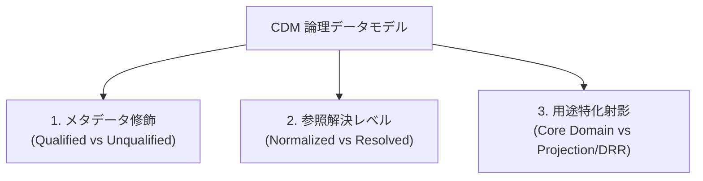
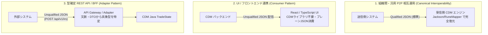
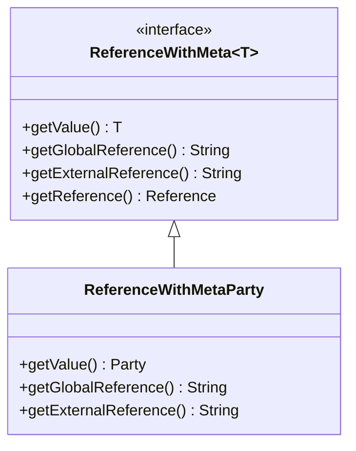

# CDM JSON シリアライゼーション仕様と方言（Dialects）

本ドキュメントでは、FINOS Common Domain Model (CDM) における JSON データ表現の仕組みと、用途・参照解決レベル・外部連携に応じて存在する**複数の JSON 方言（バリエーション）**について解説します。

---

## 1. 概要: なぜ CDM の JSON には複数の方言があるのか？

CDM の基礎データモデル（Rosetta DSL / Rune DSL で定義された型体系）は論理的に単一ですが、**「CDM 内部エンジンでの型判定・グラフ参照」**、**「外部 Web API での簡易連携」**、**「規制報告への投影」**など、利用コンテキストに応じてシリアライズ形式（JSON 方言）が分かれます。

現行の FINOS CDM（v7.x / v6.x 系列）では、主に以下の **3 つの軸** で方言が存在します：



---

## 2. 方言①: メタデータ修飾による差異（Qualified vs Unqualified）

### 2.1 Qualified JSON (Rosetta / Rune 標準形式)
`RuneJsonObjectMapper` (旧 `RosettaObjectMapper`) が標準で入出力する形式です。多態性（ポリモーフィズム）の判定やグラフ参照の解決に必要な `@` アノテーションメタデータが含まれます。

```json
{
  "@model": "cdm",
  "@type": "cdm.event.common.TradeState",
  "@version": "0.0.0.master-SNAPSHOT",
  "@key": "ba4f9326",
  "trade": {
    "product": {
      "taxonomy": [ {
        "source": "ISDA",
        "value": { "name": { "@data": "InterestRate_IRSwap_FixedFloat" } },
        "calculated": true
      } ],
      "economicTerms": {
        "payout": [ {
          "@type": "cdm.product.asset.InterestRatePayout",
          "payerReceiver": { "payer": "Party1", "receiver": "Party2" },
          "priceQuantity": {
            "quantitySchedule": { "@ref:scoped": "quantity-1" }
          },
          "dayCountFraction": { "@data": "ACT/360" }
        } ]
      }
    }
  }
}
```

#### 主要アノテーション一覧:
- `@model`: 対象モデル（例: `"cdm"`）
- `@type`: 完全修飾クラス名（抽象型 `Payout` から具体型 `InterestRatePayout` を復元するための型識別子）
- `@key` / `@key:external`: グローバルハッシュキーまたは外部識別キー
- `@ref` / `@ref:scoped` / `@ref:external`: 参照ポインタ（内部・スコープ・外部）
- `@data`: メタデータ属性を持つプリミティブ値のラッパー

### 2.2 Unqualified JSON (Clean / Plain JSON)
Web API (REST / GraphQL) やフロントエンド向けに、`@` メタデータラッパーをすべて剥ぎ取ったプレーンな JSON 構造です。

```json
{
  "trade": {
    "product": {
      "taxonomy": [ {
        "source": "ISDA",
        "value": { "name": "InterestRate_IRSwap_FixedFloat" },
        "calculated": true
      } ],
      "economicTerms": {
        "payout": [ {
          "payerReceiver": { "payer": "Party1", "receiver": "Party2" },
          "dayCountFraction": "ACT/360"
        } ]
      }
    }
  }
}
```

---

## 3. 方言②: 参照解決レベルによる差異（Normalized vs Resolved）

CDM は取引主体（Party）、計算日スケジュール、数量（Quantity）などが相互参照される**グラフ構造**を持ちます。

| 形式 | 特徴 | 主な用途 |
|---|---|---|
| **Normalized JSON (参照ポインタ形式)** | 重複データを保持せず、`@key:external` と `@ref:scoped` / `@ref:external` によるポインタで表現。データサイズが最小。 | FpML 取り込み直後、DB 保存、システム間データ交換。 |
| **Resolved JSON (インライン展開形式)** | すべての `@ref` 参照先をインライン展開（Dereferencing）し、完全なネスト構造として埋め込んだ形式。 | DWH / BI ツール分析、Elasticsearch 投入、参照解決機能を持たない外部システム連携。 |

---

## 4. 方言③: 用途特化射影（Core Domain vs Ingest vs Projection / DRR JSON）

用途特化射影における各データ形式は、前述の 2 つの直交軸（**Qualified vs Unqualified** × **Normalized vs Resolved**）において以下のように位置付けられます：

| 用途特化形式 | メタデータ修飾 (軸1) | 参照解決状態 (軸2) | 該当する表現・理由 |
|---|:---:|:---:|---|
| **1. Core Domain CDM JSON**<br>([core_data_types.md](../entities/core_data_types.md) の `TradeState`, `BusinessEvent` 等) | **Qualified** (標準)<br>*(または Unqualified)* | **Normalized** (標準)<br>*(または Resolved)* | **【標準】Qualified + Normalized**<br>CDM ランタイムが扱う標準状態。`@type` による多態性解決と `@key`/`@ref` によるグラフ参照を持つ。<br>*(※社内 Web API / UI 用途では Unqualified + Resolved に変換して利用)* |
| **2. Ingest 中間形式 JSON**<br>・`fpml-confirmation-to-trade-state`<br>・`codelist` JSON (`codelist2cdmjson.xsl`) | <br>**Qualified**<br>**Unqualified** | <br>**Normalized**<br>**Resolved** | <br>**Qualified + Normalized**: FpML の `id`/`href` を `@key:external` / `@ref:scoped` にマッピングし、CDM の `@type` を付与した形式。<br>**Unqualified + Resolved**: Genericode XML から XSLT で変換されたコードリスト。`@` メタデータを持たず、ネストされたリストとして完結。 |
| **3. Digital Regulatory Reporting (DRR) JSON**<br>(規制報告提出用) | **Unqualified**<br>(規制指定スキーマ) | **Resolved** | **Unqualified + Resolved (規制固有)**<br>各国規制当局（CFTC、EMIR Refit、JFSA 等）指定の ISO 20022 / CDE スキーマ等に射影された、メタデータなし・完全展開されたフラット/ツリー JSON。 |


---

## 5. まとめ: 方言の選定基準

| 連携相手 / ユースケース | 推奨 JSON 方言 | 理由 |
|---|---|---|
| **CDM Java / Rosetta ランタイム** | Qualified + Normalized JSON | 型の自動判別（`@type`）および参照解決機能（`ReferenceConfig`）が必須のため |
| **社内マイクロサービス / Web API** | Unqualified + Resolved JSON | 一般的な JSON パーサーで容易にデシリアライズ可能なため |
| **規制報告提出 (DRR)** | Regulatory Projection JSON | 各国金融当局が指定する ISO 20022 / CDE スキーマに合致させるため |

---

## 6. Java & Python CDM ライブラリの実装状況・対応能力

### 6.1 Java CDM ライブラリの実装（公式リファレンス実装）
Java は FINOS CDM / Rosetta (Rune) のプライマリ実装であり、最も網羅的なサポートを持ちます。

* **コア実装:** `com.regnosys.rosetta.common.serialisation.RosettaObjectMapper` および `org.finos.rune.mapper.RuneJsonObjectMapper` (Jackson ベース)。
* **Qualified JSON (`@type`, `@key`, `@ref`, `@data`):**
  * **シリアライズ / デシリアライズ:** 完全対応（標準動作）。`@type` に基づいて抽象インターフェース型（例: `Payout`）から具象クラス（`InterestRatePayout` 等）を正確にインスタンス化します。
* **Unqualified JSON (Plain JSON):**
  * **デシリアライズ:** **条件付き対応（注意が必要）**。型が確定している具象フィールドはマッピング可能ですが、多態性（Polymorphic）を持つインターフェース（`Payout`、`RateSpecification` 等）を含む場合、`@type` がないと Jackson が具象クラスを判定できず失敗します。
  * **シリアライズ:** メタデータ除外フィルタを設定するか、専用のプロジェクション DTO を経由して出力可能です（標準では Qualified になります）。
* **参照解決 (Normalized vs Resolved):**
  * `ReferenceConfig`（例: [CdmReferenceConfig.java](../../common-domain-model/rosetta-source/src/main/java/org/finos/cdm/reference/CdmReferenceConfig.java)）と Post-Processor により、メモリ上で `@key` と `@ref` を解決（Dereference）して結合する処理が組み込まれています。
* **DRR 規制スキーマ:**
  * 各国規制スキーマへの変換は、コア CDM ではなく FINOS DRR エンジン側で処理されます。

### 6.2 Python CDM ライブラリの実装（コード生成・Pydantic ベース）
Python 向けには `rosetta-dsl` の Python コードジェネレーターによって生成されたモデル（Pydantic または `dataclasses`）と `rosetta-runtime-python` が提供されます。

* **コア実装:** Pydantic `BaseModel` / Python `dataclasses` + ランタイムパーサー。
* **Qualified JSON:**
  * **シリアライズ / デシリアライズ:** 対応。Pydantic の `Field(alias="@type")` や Discriminated Union により、Rune 標準の `@` 属性付き JSON を読み書き可能です。
* **Unqualified JSON:**
  * **デシリアライズ:** Java と同様に多態性型（Union 型）で課題があります。識別子（`@type`）がない場合、Pydantic の Union 解決ルール（左優先マッチ等）により意図しないサブクラスに誤バインドされるリスクがあります。
  * **シリアライズ:** `model_dump(by_alias=False, exclude={...})` などで `@` 属性を容易に除去できるため、Plain JSON へのシリアライズは Java より手軽に行えます。
* **参照解決:**
  * Python ランタイムにも Reference Resolver が移植されていますが、Java 版の Guice DI / 高度なキャッシュ・循環参照解決エコシステムと比較すると一部機能が限定的です。

---

### 6.3 方言対応マトリクス（Java vs Python）

| JSON 方言 | 操作 | Java CDM (`RuneJsonObjectMapper`) | Python CDM (`cdm-python`) | 留意点・制約 |
|---|---|:---:|:---:|---|
| **Qualified JSON** | Deser / Ser | ✅ 完全対応 | ✅ 完全対応 | Rune / Rosetta 標準。多態性・参照キーを完全復元。 |
| **Unqualified JSON** | Deser | ⚠️ 条件付き | ⚠️ 条件付き | 抽象型・Union フィールド（`Payout` 等）で型判定不能になる場合あり。 |
| **Unqualified JSON** | Ser | ⚠️ 設定・変換要 | ✅ 容易 | Java は標準で `@` を付与するためカスタム設定が必要。Python は `exclude` 等で容易。 |
| **Normalized JSON** | 参照解決 | ✅ 完全対応 | 🟡 基本対応 | Java は `ReferenceConfig` + PostProcessor で完全グラフ解決。 |
| **Resolved JSON** | Deser / Ser | ✅ 完全対応 | ✅ 完全対応 | インライン展開済みのため標準パーサーで直接相互変換可能。 |
| **DRR 規制スキーマ** | 直接 Deser / Ser | ❌ 要 DRR エンジン | ❌ 要 DRR エンジン | コアモデルではなく DRR 拡張ルール層で変換。 |

---

### 6.4 前提バージョンおよび対応判定の技術的根拠・一次情報リンク

#### 前提ライブラリバージョン
- **FINOS CDM:** **現行メジャー `v7.x` 系列**（直前メジャー: `v6.x` 系列、最新リポジトリマスター: `0.0.0.master-SNAPSHOT`）
- **Rune DSL / Rosetta 基盤:** **`v7.x` / `v6.x` 系列**（`org.finos.rune.mapper` / `com.regnosys.rosetta`）
- **Python CDM:** `cdm-python`（FINOS CDM Python Distribution / `rosetta-dsl` Python Generator 出力版）

#### 各判定の技術的根拠と参照ソース
1. **Qualified JSON の完全対応:**
   - Java: [`ResourcesUtils.java`](../../common-domain-model/rosetta-source/src/main/java/org/finos/cdm/util/ResourcesUtils.java) および [`FpMLCodingSchemeTests.java`](../../common-domain-model/rosetta-source/src/test/java/cdm/base/staticdata/codelist/FpMLCodingSchemeTests.java) において `RuneJsonObjectMapper` が `@type` / `@key` / `@data` を標準でシリアライズ/デシリアライズ。
   - 仕様リファレンス: [Rune DSL 公式ドキュメント](https://docs.rosetta-technology.io/)
2. **Unqualified JSON の条件付き判定:**
   - CDM の中核モデルである `Payout`（`cdm.product.template.Payout`）や `RateSpecification` は抽象インターフェースとして定義されており、`@type` アノテーション（Discriminator）が欠落すると Jackson / Pydantic ともに具象クラスを自動解決できず例外が発生。
   - 仕様リファレンス: [FINOS CDM ドキュメントポータル](https://cdm.finos.org/)
3. **Normalized 参照解決の判定:**
   - Java: [`CdmReferenceConfig.java`](../../common-domain-model/rosetta-source/src/main/java/org/finos/cdm/reference/CdmReferenceConfig.java) および [`CdmRuntimeModule.java`](../../common-domain-model/rosetta-source/src/main/java/org/finos/cdm/CdmRuntimeModule.java) により `TradeState` をスコープとする参照解決器が注入され、`@key` と `@ref` を自動解決。
   - ソースコードベース: [FINOS CDM GitHub リポジトリ](https://github.com/finos/common-domain-model)
4. **DRR 規制スキーマの分離:**
   - 各国当局（CFTC、EMIR Refit、JFSA 等）への ISO 20022 射影は、コア CDM ライブラリではなく Digital Regulatory Reporting (DRR) プロジェクトが担う。
   - 参照リファレンス: [ISDA CDM ニュース・DRR](https://www.isda.org/tag/common-domain-model/)

---

## 7. システム間相互運用（Interoperability）における Unqualified JSON の実用パターン

「Unqualified JSON がそのままでは CDM Java/Python の抽象型にデシリアライズできない」という制約がある一方で、**実務のシステム間連携において Unqualified JSON がどのように使われているのか（または使えないのか）**のアーキテクチャパターンは以下の 3 つに大別されます。



### パターン 1: 【組織間・汎用相互運用】Qualified JSON が必須の標準プロトコル
金融機関間や複数ベンダー間で、**「事前合意なしに任意の商品（IRS、CDS、レポ、オプション等）の JSON を送受信し、受信側の CDM ライブラリで Qualification やライフサイクル処理を実行する」**という完全な相互運用を行う場合は、**Qualified JSON が標準仕様（Canonical Format）**となります。
- **理由**: 受信側がペイロード単体から多態性（`@type`）とグラフ参照（`@key` ↔ `@ref`）を 100% 確実に復元できる必要があるため。

### パターン 2: 【片方向の参照・表示・消費】Consumer パターン
- **概要**: CDM バックエンドからフロントエンド（React / Vue / iOS 等）や分析基盤（DWH）へデータを渡すケース。
- **実現方法**: バックエンド側で Rune メタデータを剥ぎ取った **Unqualified + Resolved JSON** を出力し、クライアント側は TypeScript インターフェースや汎用 JSON パーサーでそのまま画面表示・集計します。
- **デシリアライズ不要**: クライアント側は「CDM Java クラス」へ復元する必要がないため、何ら問題なく実用されます。

### パターン 3: 【型が確定している API / BFF】Adapter パターン
- **概要**: 社内マイクロサービスや Web フォームから取引データを受け取って CDM オブジェクトを構築するケース。
- **実現方法**:
  - `POST /api/v1/trades/interest-rate-swap` のように、エンドポイントの文脈（または DTO）で対象商品が `InterestRatePayout` であることが自明な設計にする。
  - API Gateway / BFF 層で Unqualified JSON を受け取り、専用 DTO や Builder（`InterestRatePayout.builder()`）を介して明示的に CDM オブジェクトへマッピングする。
- **多態性の解決**: ペイロード内部の `@type` ではなく、**API エンドポイントやアダプターのビジネス文脈によって型を特定**して CDM 化します。

---

## 8. JSON シリアライズにおける参照ポインタ表現の完全解説

CDM は、金融取引の複雑なリレーション（取引主体、計算日スケジュール、数量、参照金利インデックス等）を重複なく表現するため、オブジェクトツリーではなく**オブジェクトグラフ（Graph）**としてデータを保持します。これを JSON 上でシリアライズ・デシリアライズするために、Rosetta / Rune DSL は体系的な**キー（Key）と参照（Reference）のアノテーション構文**を提供しています。

---

### 8.1 キー定義アノテーション（参照される側の宣言）

オブジェクトの実体が定義されている箇所には、以下のいずれかのキーアノテーションが付与されます：

| キー構文 | 名称 | 概要・生成ルール | JSON 例 |
|---|---|---|---|
| **`@key`** | **Global Key (ハッシュキー)** | オブジェクトのプロパティ内容に基づいて Rosetta Key Processor が算出する一意なハッシュ値。ドキュメント全体から参照可能。 | `"@key": "ba4f9326"` |
| **`@key:external`** | **External Key (外部ID)** | FpML の `id="..."` や外部システム固有の識別子を取り込んだもの。外部参照ポインタから参照される。 | `"@key:external": "floatingCalcPeriodDates"` |
| **`@key:location`** | **Location Key (パスキー)** | ドキュメント構造内のスキーマパス・相対階層に基づいて付与される位置キー。 | `"@key:location": "trade.tradableProduct..."` |

### 8.2 参照ポインタアノテーション（参照する側の表現）

実体を直接埋め込まず、他の場所で定義されたキーをポインタとして参照する箇所には以下の構文が使われます：

| 参照構文 | 名称 | 対応するキー | 主な用途・特徴 |
|---|---|---|---|
| **`@ref`** | **Global Reference** | `@key` | グローバルハッシュキーを指す参照。ドキュメント全体の任意のノードを指す。 |
| **`@ref:external`** | **External Reference** | `@key:external` | FpML の `href="..."` 等に相当する外部キー参照（例: 取引主体 `party1` の参照）。 |
| **`@ref:scoped`** | **Scoped Reference** | スコープ内キー | 単一の `TradeState` 等のスコープ境界内で一意なローカル識別子（例: `"quantity-1"`）を指す参照。 |
| **`@ref:location`** | **Location Reference** | `@key:location` | オブジェクトグラフ内の階層パス・相対位置を直接指す参照。 |

### 8.3 JSON 実例: 数量スケジュールと金利インデックスの参照構造

以下は、金利スワップ（IRS）において、同一の数量スケジュール（`quantity-1`）と金利指標（`InterestRateIndex-1`）をペイアウト定義から参照ポインタで結合している実例です：

```json
{
  "@type": "cdm.product.asset.InterestRatePayout",
  "payerReceiver": {
    "payer": "Party1",
    "receiver": "Party2"
  },
  "priceQuantity": {
    "quantitySchedule": {
      "@ref:scoped": "quantity-1"
    }
  },
  "rateSpecification": {
    "@type": "cdm.product.asset.FloatingRateSpecification",
    "rateOption": {
      "@ref:scoped": "InterestRateIndex-1"
    }
  },
  "calculationPeriodDates": {
    "@key:external": "floatingCalcPeriodDates",
    "effectiveDate": {
      "adjustableDate": { "unadjustedDate": "1994-12-14" }
    }
  },
  "resetDates": {
    "@key:external": "resetDates",
    "calculationPeriodDatesReference": {
      "@ref:external": "floatingCalcPeriodDates"
    }
  }
}
```

### 8.4 Java / Python クラス生成における `ReferenceWithMeta<T>` モデル

Rosetta DSL で `[metadata reference]` や `[metadata key]` が指定された属性（例: `ReferenceWithMetaParty`, `ReferenceWithMetaCalculationPeriodDates`）は、言語バインディング上で以下のようなラッパークラスとして生成されます：



* **`getValue()`**: 参照解決後の実体オブジェクト `T`（Resolved 状態のときに取得可能）。
* **`getGlobalReference()`**: `@ref` のハッシュ文字列。
* **`getExternalReference()`**: `@ref:external` の外部 ID 文字列（例: `"Party1"`）。
* **`getReference()`**: `@ref:scoped` や `@ref:location` のメタデータを保持する `Reference` オブジェクト。

### 8.5 参照解決（Dereferencing）のライフサイクル

Java CDM ランタイムにおける参照解決の実行フロー：

```
[Normalized JSON]
   │
   ▼ (1) RuneJsonObjectMapper.readValue(...)
[TradeState (ポインタのみ保持)]
   ├─ quantitySchedule.reference = "@ref:scoped: quantity-1"
   └─ quantitySchedule.value = null  <-- 実体は未結合
   │
   ▼ (2) PostProcessors / ReferenceResolverProcessStep 実行
         (CdmReferenceConfig による TradeState スコープ探索)
[TradeState (完全解決済み Resolved 状態)]
   ├─ quantitySchedule.reference = "@ref:scoped: quantity-1"
   └─ quantitySchedule.value = NonNegativeQuantityScheduleImpl(...)  <-- 実体が自動バインド
```

1. **デシリアライズ直後**: Jackson は JSON の `@ref` や `@ref:scoped` を読み取り、`ReferenceWithMeta` の参照フィールドに値をセットします（この時点では `getValue()` は `null`）。
2. **Post-Processor によるグラフ解決**: [CdmReferenceConfig.java](../../common-domain-model/rosetta-source/src/main/java/org/finos/cdm/reference/CdmReferenceConfig.java) で定義されたルート境界（`TradeState`）に基づき、Rosetta の `ReferenceResolver` がオブジェクトツリー全体を走査して合致する `@key` / `@key:external` を探索します。
3. **実体のバインド**: 発見された実体オブジェクトが `setValue(...)` され、アプリケーション層は `getQuantitySchedule().getValue()` を呼ぶだけで実データにアクセスできるようになります。

---

### 8.6 `globalKey`（`@key`）の重複性に関する仕様（同一 globalKey が複数存在することは不正か？）

#### 結論: **不正ではありません（仕様上完全に正常・妥当な挙動です）。**

複数の要素が同一の `globalKey`（例: `"globalKey": "0"` または同一ハッシュ値）を持つ理由は以下の通りです：

1. **`globalKey` は「主キー（Primary Key）」ではなく「コンテンツハッシュ（Content Hash）」であるため**:
   - `globalKey` は RDBMS の連番主キーや `xsd:ID` のような一意性制約（Uniqueness Constraint）を持つ識別子ではありません。
   - Rosetta の [`GlobalKeyProcessStep`](../../common-domain-model/rosetta-source/src/test/java/org/finos/cdm/hashing/GlobalKeyProcessStepTest.java) および `NonNullHashCollector` は、**「対象オブジェクトの全非 null フィールドの値と型から決定論的（Deterministic）にハッシュ値を算出」**します。
   - したがって、**内容（属性値）が完全に同一であるオブジェクト同士であれば、ドキュメント内の異なる複数箇所に存在しても全く同じ `globalKey` が付与されるのが仕様上の必然**です。
2. **`"globalKey": "0"` となる理由**:
   - 対象オブジェクトが空（非 null プロパティを持たない）、または初期値状態のメタデータである場合、ハッシュ計算対象が存在しないためハッシュ値が `0`（または文字列 `"0"`）になります。同一の空オブジェクトが 4 つ存在したため、4 箇所すべてに `"0"` が出力されています。
3. **参照解決（Dereferencing）への影響**:
   - `globalKey` は内容同値性（Structural Equality）を表すため、仮に他の要素から参照されたとしても、同じ内容を持つ等価なデータとして解決されるため論理的な矛盾は発生しません。
   - 一方で、ドキュメント内で「特定の個別インスタンス」を一意に特定して参照したい場合は、`globalKey` ではなく **`@key:external`（FpML ID 由来）** や **`@ref:scoped`（スコープ識別子）** が用いられます。

