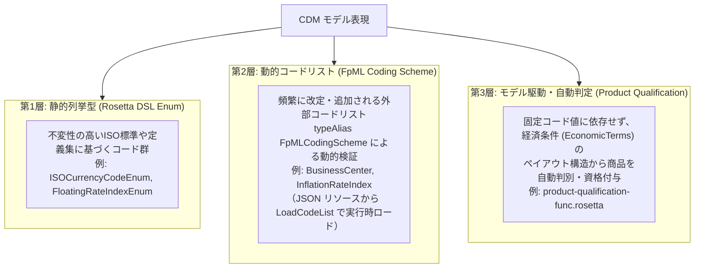

# 基準データとコード値体系 (Reference Data & Code Lists)

FINOS Common Domain Model (CDM) における「金利・市場インデックス（Index）」、「通貨（Currency）」、「都市・金融センター（Business Center）」、および「金融商品（Product Taxonomy / Product Type）」のコード値定義アーキテクチャ、Rosetta DSL 型構造、および情報源トレーサビリティの解説です。

---

## 1. CDM におけるコード値管理の 3 層アーキテクチャ

CDM は、金融業界における多種多様なコード体系（ISO 国際標準、ISDA 定義集、FpML スキーム、各国規制当局タクソノミー等）を取り扱うため、以下の **3 つの階層化アプローチ** を組み合わせています。



1. **静的列挙型 (`enum`)**:
   - Rosetta DSL 上に直接定義された列挙型。
   - ISO 4217 通貨コード (`ISOCurrencyCodeEnum`) や、主要な浮動金利インデックス一覧 (`FloatingRateIndexEnum`) など、仕様として型安全性が重視される領域で使用されます。
2. **動的コードリスト / スキーム参照 (`typeAlias ...: FpMLCodingScheme(...)`)**:
   - 都市（営業日カレンダー / 金融センター）や各種スキームなど、改定頻度が高い、あるいは外部標準として独立管理されているコード体系。
   - Rosetta DSL では文字列エイリアス型として宣言され、モデルのビルド時・実行時にクラスパス上の JSON リソース（`codelist/json/*.json`）をロードして `ValidateFpMLCodingSchemeDomain` 関数により検証されます。
3. **モデル駆動の自動判定 (Qualification)**:
   - 金融商品（Product）の分類において、単なる文字列コードの指定だけでなく、取引の経済構造（固定レグ＋変動レグ、コール/プットオプション等）から ISDA Product Taxonomy などの分類をロジックで自動判定・付与するアーキテクチャを採用しています。

---

## 2. Index 一覧（金利・為替・インフレ・株式・クレジット）のコード値定義

CDM におけるインデックス（市場観測指標）は、基本抽象型 `IndexBase` をベースとする多層構造となっています。

### 2.1 データ型階層 (`observable-asset-type.rosetta`)

インデックスの基本型と選択構造は [observable-asset-type.rosetta](../../common-domain-model/rosetta-source/src/main/rosetta/observable-asset-type.rosetta) で定義されています。

```rosetta
type IndexBase extends AssetBase:
    name string (0..1)
        [metadata scheme]
    provider LegalEntity (0..1)
    assetClass AssetClassEnum (0..1)

choice Index:
    CreditIndex
    EquityIndex
    InterestRateIndex
    ForeignExchangeRateIndex
    OtherIndex

choice InterestRateIndex:
    FloatingRateIndex
    InflationIndex
```

- **株式インデックス (`EquityIndex`)**:
  - `IndexBase` を継承。S&P 500 や 日経225 などの個別インデックスは、DSL 内の静的 enum ではなく、銘柄識別子（ISIN, RIC, Ticker 等）や `name [metadata scheme]` を用いて表現されます。
- **クレジットインデックス (`CreditIndex`)**:
  - iTraxx や CDX などのシリーズ番号 (`indexSeries`)、版数 (`indexAnnexVersion`)、ソース (`indexAnnexSource`) を保持します。

### 2.2 浮動金利インデックス（Floating Rate Index / FRO）のコード値

浮動金利インデックス（USD-SOFR、JPY-TONA、EUR-EURIBOR、GBP-SONIA 等）は、CDM において最も詳細に定義されている領域です。

#### (1) 静的列挙型: `FloatingRateIndexEnum`
- **定義場所**: [base-staticdata-asset-rates-enum.rosetta](../../common-domain-model/rosetta-source/src/main/rosetta/base-staticdata-asset-rates-enum.rosetta) (Line 6〜745)
- **スキーマ参照**: `[docReference ISDA FpML_Coding_Scheme schemeLocation "http://www.fpml.org/coding-scheme/floating-rate-index"]`
- **内容**: 2006 ISDA Definitions および 2021 ISDA Interest Rate Derivatives Definitions Floating Rate Matrix に準拠する 700 種類以上の FRO コードが列挙値として網羅されています。
  - 例: `USD_SOFR`, `JPY_TONA`, `EUR_EURIBOR_Reuters`, `GBP_SONIA`, `AUD_BBSW`, `CAD_CORRA` など。

#### (2) 動的スキーム型: `typeAlias FloatingRateIndex`
- **定義場所**: [base-staticdata-codelist-type.rosetta](../../common-domain-model/rosetta-source/src/main/rosetta/base-staticdata-codelist-type.rosetta) (Line 34)
  ```rosetta
  typeAlias FloatingRateIndex: FpMLCodingScheme(domain: "floating-rate-index")
  ```
- **リソースファイル**: `src/main/resources/codelist/json/floating-rate-index-3-10.json` (XML: `floating-rate-index-3-10.xml`)

### 2.3 インフレインデックス（Inflation Index）のコード値

- **定義場所**:
  - 列挙型: `enum InflationRateIndexEnum` ([base-staticdata-asset-rates-enum.rosetta](../../common-domain-model/rosetta-source/src/main/rosetta/base-staticdata-asset-rates-enum.rosetta) Line 670)
  - 動的スキーム: `typeAlias InflationRateIndex: FpMLCodingScheme(domain: "inflation-index-description")` ([base-staticdata-codelist-type.rosetta](../../common-domain-model/rosetta-source/src/main/rosetta/base-staticdata-codelist-type.rosetta) Line 38)
  - リソースファイル: `src/main/resources/codelist/json/inflation-index-description-2-3.json`
- **コード例**: `USA-CPI-U`, `UK-RPI`, `FRC-EXT-CPI`, `EUR-EXT-CPI` など。

---

## 3. 通貨一覧（Currency）のコード値定義

CDM における通貨コードは、ISO 国際標準（ISO 4217）を厳格に順守しつつ、デリバティブ実務で必要なオフショア通貨（CNH 等）を取り込むため、**継承（extends）** 関係を持つ 2 つの列挙型で定義されています。

### 3.1 定義場所と構造 (`base-staticdata-asset-common-enum.rosetta`)

[base-staticdata-asset-common-enum.rosetta](../../common-domain-model/rosetta-source/src/main/rosetta/base-staticdata-asset-common-enum.rosetta) にて以下のように定義されています。

#### (1) `enum ISOCurrencyCodeEnum` (Line 49〜230)
- **出典**: 国際標準化機構（ISO 4217）。SIX Financial Information メンテナンスリストに準拠。
- **注釈**: `[docReference ISO ISO_4217_Currency_Scheme schemeLocation "..."]`
- **内容**: 全世界の公式法定通貨（3文字アルファベット）および取引なしコード（`XXX`）、最新のジンバブエ・ゴールド（`ZWG`）を含む 180+ 通貨コード。
  - 例: `USD` (米ドル), `EUR` (ユーロ), `JPY` (日本円), `GBP` (英ポンド), `CHF` (スイスフラン), `AUD` (豪ドル), `CAD` (カナダドル), `CNY` (人民元) など。

#### (2) `enum CurrencyCodeEnum extends ISOCurrencyCodeEnum` (Line 231〜241)
- **出典**: FpML nonISOCurrencyScheme (`https://www.fpml.org/coding-scheme/non-iso-currency`)
- **内容**: `ISOCurrencyCodeEnum` を継承し、デリバティブ取引で頻繁に利用されるオフショア通貨および地域・歴史的通貨コード 9 件を追加定義しています：
  - `CNH`: 香港オフショア人民元 (Offshore Chinese Yuan traded in Hong Kong)
  - `CNT`: 台湾オフショア人民元 (Offshore Chinese Yuan traded in Taiwan)
  - `GGP`: ガーンジー・ポンド (Guernsey Pound)
  - `IMP`: マン島ポンド (Isle of Man Pound)
  - `JEP`: ジャージー・ポンド (Jersey Pound)
  - `KID`: ツバル・ドル (Tuvaluan Dollar)
  - `MCF`: モナコ・フラン (Monegasque Franc)
  - `SML`: サンマリノ・リラ (Sammarinese Lira)
  - `VAL`: バチカン・リラ (Vatican Lira)

### 3.2 現金資産（Cash）における利用構造

[base-staticdata-asset-common-type.rosetta](../../common-domain-model/rosetta-source/src/main/rosetta/base-staticdata-asset-common-type.rosetta) の `type Cash extends AssetBase` において、`identifier` に通貨コードを保持し、`to-enum CurrencyCodeEnum` を通じてコード値の妥当性が検証されます。

---

## 4. 都市一覧（金融センター / 営業日カレンダー: BusinessCenter）のコード値定義

利払日・決済日の営業日判定や、フィキシング観測時刻の特定に用いられる「都市（金融センター / 営業日カレンダー）」のコード値定義です。

### 4.1 Rosetta DSL 上の型定義

都市コードは、Rosetta DSL の中では静的 enum としてハードコードされておらず、**FpML Coding Scheme による動的コードリスト** として定義されています。

- **型エイリアス定義**: [base-staticdata-codelist-type.rosetta](../../common-domain-model/rosetta-source/src/main/rosetta/base-staticdata-codelist-type.rosetta) (Line 32)
  ```rosetta
  typeAlias BusinessCenter: FpMLCodingScheme(domain: "business-center")
  ```
- **利用構造**: [base-datetime-type.rosetta](../../common-domain-model/rosetta-source/src/main/rosetta/base-datetime-type.rosetta) (Line 80〜98)
  ```rosetta
  type BusinessCenters:
      businessCenter BusinessCenter (0..*)
          [metadata scheme]
      commodityBusinessCalendar CommodityBusinessCalendarEnum (0..*)
          [metadata scheme]
      businessCentersReference BusinessCenters (0..1)
          [metadata reference]

  type BusinessCenterTime:
      hourMinuteTime time (1..1)
      businessCenter BusinessCenter (1..1)
          [metadata scheme]
  ```

### 4.2 コードリストの実体リソースと読み込み機構

都市コードの実際の値一覧は、FpML の Genericode XML から変換された JSON リソースファイルとしてモデル内に同梱されています。

- **リソースファイル**:
  - JSON: `common-domain-model/rosetta-source/src/main/resources/codelist/json/business-center-9-3.json`
  - XML: `common-domain-model/rosetta-source/src/main/resources/codelist/xml/business-center-9-3.xml`
- **メタデータ**:
  - shortName: `businessCenterScheme`
  - canonicalUri: `http://www.fpml.org/coding-scheme/business-center`
  - version: `9-3` (2024-02-15 発行)
- **ロード & バリデーション関数**:
  - [base-staticdata-codelist-func.rosetta](../../common-domain-model/rosetta-source/src/main/rosetta/base-staticdata-codelist-func.rosetta) の `LoadCodeList` および `ValidateFpMLCodingSchemeDomain`。
  - Java 実装: `cdm.base.staticdata.codelist.LoadCodeListImpl`（クラスパス上の JSON を読み込み Guice キャッシュ）。
- **代表的な都市コード（4文字英字中心）**:
  - `JPTO`: Tokyo, Japan（東京）
  - `USNY`: New York, United States（ニューヨーク）
  - `GBLO`: London, United Kingdom（ロンドン）
  - `EUTA`: TARGET Settlement Day（ユーロ圏 TARGET 決済日）
  - `CHZU`: Zurich, Switzerland（チューリッヒ）
  - `HKHK`: Hong Kong（香港）
  - `SGSI`: Singapore（シンガポール）
  - `USDC`: Washington, D.C.
  - `NYFD`: New York Fed Business Day
  - `NYSE`: New York Stock Exchange Business Day
  - 全世界 150 以上の都市・決済機関カレンダーを網羅。

---

## 5. 商品一覧（金融商品分類 / タクソノミー / プロダクトタイプ）のコード値定義

CDM における金融商品の識別・分類は、**「外部タクソノミー体系の受容」** と **「モデル駆動による自動判定（Qualification）」** の 2 つの柱で構成されています。

### 5.1 外部タクソノミー受容構造 (`ProductTaxonomy`)

[base-staticdata-asset-common-type.rosetta](../../common-domain-model/rosetta-source/src/main/rosetta/base-staticdata-asset-common-type.rosetta) (Line 90) および [base-staticdata-asset-common-enum.rosetta](../../common-domain-model/rosetta-source/src/main/rosetta/base-staticdata-asset-common-enum.rosetta) で定義されています。

```rosetta
type ProductTaxonomy extends Taxonomy:
    primaryAssetClass AssetClassEnum (0..1)
        [metadata scheme]
    secondaryAssetClass AssetClassEnum (0..*)
        [metadata scheme]

type Taxonomy:
    source TaxonomySourceEnum (0..1)
    value TaxonomyValue (0..1)
    calculated boolean (0..1)
```

- **タクソノミー発信元 (`TaxonomySourceEnum`)**:
  - `ISDA`: ISDA Product Taxonomy
  - `CFI`: ISO 10962 CFI (Classification of Financial Instruments)
  - `EMIR`: 欧州 EMIR 規制タクソノミー
  - `CFTC`: 米国 CFTC 規制タクソノミー
  - `MAS`: シンガポール金融管理局タクソノミー
  - `CSA`: カナダ規制タクソノミー 等
- **主要アセットクラス (`AssetClassEnum`)**:
  - `InterestRate`, `ForeignExchange`, `Credit`, `Equity`, `Commodity`, `MoneyMarket`
- **個別銘柄/契約識別子 (`ProductIdTypeEnum`)**:
  - `ISIN` (ISO 6166), `UPI` (ANNA DSB OTC Unique Product Identifier), `FIGI` (OMG), `CUSIP`, `RIC`, `BBGID`, `SEDOL` 等

### 5.2 商品コードリストの実体リソース

CDM に同梱されている標準商品コードリスト：

#### (1) ISDA Product Taxonomy v2 (`product-taxonomy-4-0.json`)
- **スキーム URI**: `http://www.fpml.org/coding-scheme/product-taxonomy`
- **ファイル**: `src/main/resources/codelist/json/product-taxonomy-4-0.json` (version 4-0)
- **コード値形式**: `AssetClass:BaseProduct:SubProduct:TransactionType` の階層構造。
  - 金利: `InterestRate:IRSwap:FixedFloat`, `InterestRate:IRSwap:OIS`, `InterestRate:CapFloor`, `InterestRate:FRA`
  - 為替: `ForeignExchange:Spot`, `ForeignExchange:Forward`, `ForeignExchange:NDF`, `ForeignExchange:VanillaOption`
  - クレジット: `Credit:SingleName:Corporate:StandardNorthAmericanCorporate`, `Credit:Index:iTraxx:iTraxxEurope`
  - コモディティ: `Commodity:Energy:Oil:Swap:Cash` など。

#### (2) FpML Simple Product Type (`product-type-simple-1-7.json`)
- **スキーム URI**: `http://www.fpml.org/coding-scheme/product-type-simple`
- **ファイル**: `src/main/resources/codelist/json/product-type-simple-1-7.json` (version 1-7)
- **コード値例**:
  - `InterestRateSwap`, `CrossCurrencySwap`, `CreditDefaultSwap`, `FxSpot`, `FxForward`, `CapFloor`, `FRA`, `Repo`, `SecurityLending`, `TotalReturnSwap`, `VarianceSwap` など 40+ 種類。

### 5.3 CDM 独自のモデル駆動判定（Product Qualification）

CDM では、商品の定義を固定コード値だけに委ねず、取引の経済条件（`EconomicTerms`）および構成要素（`Payout`: `InterestRatePayout`, `OptionPayout`, `ForwardPayout` 等）から商品種別を自動的に導出する **Product Qualification 機構** を持っています。

- **実装ファイル**: [product-qualification-func.rosetta](../../common-domain-model/rosetta-source/src/main/rosetta/product-qualification-func.rosetta) (全 2,064 行)
- **判定関数例**:
  - `func Qualify_AssetClass_InterestRate`
  - `func Qualify_InterestRate_IRSwap_FixedFloat`
  - `func Qualify_ForeignExchange_Spot`
- **自動分類プロセス**:
  取引データが入力されると、Qualification エンジンがペイアウト構造を評価し、一致する ISDA Taxonomy 分類を判定して `Taxonomy -> calculated = True` として自動設定します。

---

## 6. まとめ・対比一覧表

| 対象領域 | Rosetta DSL 定義型 | 定義ファイル | コード値の格納場所・管理方式 | 標準規格・外部スキーム |
|---|---|---|---|---|
| **金利インデックス (FRO)** | `FloatingRateIndexEnum`<br>`typeAlias FloatingRateIndex` | `base-staticdata-asset-rates-enum.rosetta`<br>`base-staticdata-codelist-type.rosetta` | DSL 内 Enum（700+件）<br>JSON リソース（`floating-rate-index-3-10.json`） | ISDA Definitions / [FpML FRO Scheme](https://www.fpml.org/coding-scheme/floating-rate-index) |
| **通貨 (Currency)** | `ISOCurrencyCodeEnum`<br>`CurrencyCodeEnum` (extends) | `base-staticdata-asset-common-enum.rosetta` | DSL 内 Enum（ISO 180+件 + オフショア 9件） | ISO 4217 / [FpML Non-ISO Currency](https://www.fpml.org/coding-scheme/non-iso-currency) |
| **都市 (Business Center)** | `typeAlias BusinessCenter`<br>`type BusinessCenters` | `base-staticdata-codelist-type.rosetta`<br>`base-datetime-type.rosetta` | 動的コードリスト（JSON リソース: `business-center-9-3.json`、150+件） | [FpML Business Center Scheme](https://www.fpml.org/coding-scheme/business-center) |
| **商品 (Product)** | `ProductTaxonomy`<br>`AssetClassEnum`<br>`Qualify_*` 関数群 | `base-staticdata-asset-common-type.rosetta`<br>`product-qualification-func.rosetta` | JSON リソース（`product-taxonomy-4-0.json`, `product-type-simple-1-7.json`）＋ DSL 自動判定ロジック | [FpML Product Taxonomy Scheme](https://www.fpml.org/coding-scheme/product-taxonomy) / [Product Type Simple](https://www.fpml.org/coding-scheme/product-type-simple) / ISO 10962 (CFI) / UPI / ISIN |

---

## 7. 公式外部リファレンスリンク（疎通確認済み）

すべてのリンクは事前の HTTP 接続テスト（ステータス 200 OK）により実在性を確認済みです。

- [FINOS Common Domain Model 公式ポータル](https://cdm.finos.org/)
- [FINOS Common Domain Model GitHub リポジトリ](https://github.com/finos/common-domain-model)
- [FpML Coding Scheme: Floating Rate Index](https://www.fpml.org/coding-scheme/floating-rate-index)
- [FpML Coding Scheme: Business Center](https://www.fpml.org/coding-scheme/business-center)
- [FpML Coding Scheme: Product Taxonomy](https://www.fpml.org/coding-scheme/product-taxonomy)
- [FpML Coding Scheme: Simple Product Type](https://www.fpml.org/coding-scheme/product-type-simple)
- [FpML Coding Scheme: Non-ISO Currency](https://www.fpml.org/coding-scheme/non-iso-currency)
- [FpML Coding Scheme: Inflation Index Description](https://www.fpml.org/coding-scheme/inflation-index-description)
