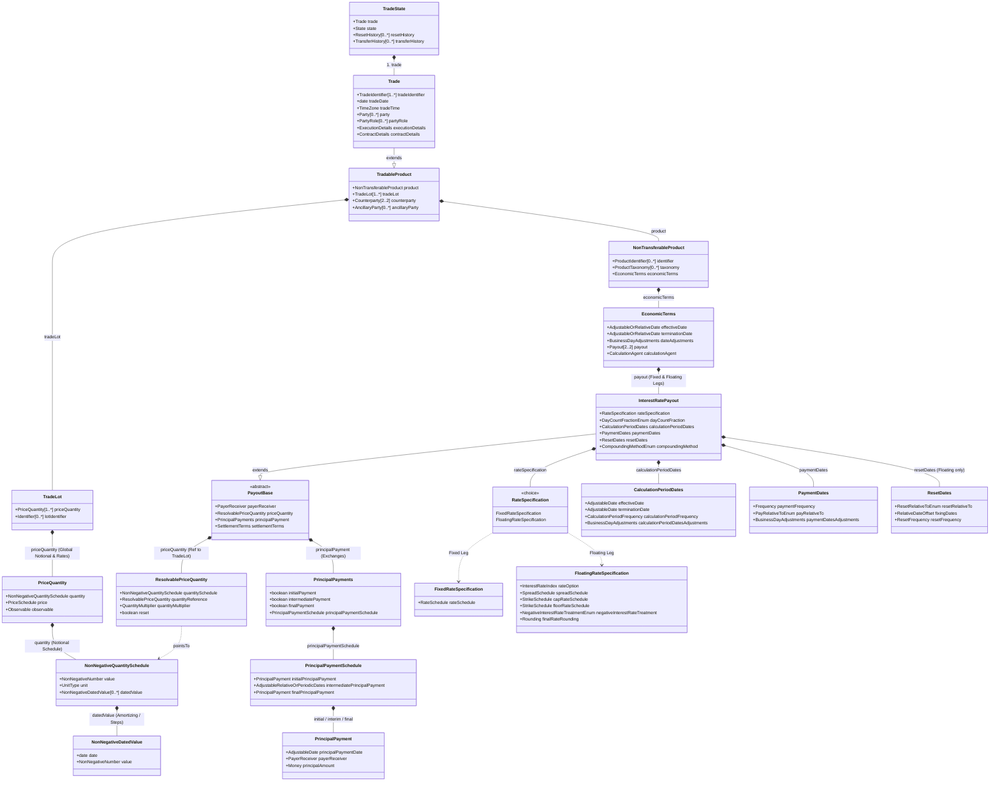
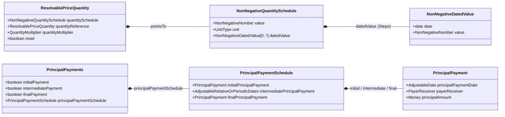

# プレーン金利スワップ（Vanilla IRS）の Trade 型構造 & クラス図リファレンス

FINOS Common Domain Model (CDM) におけるバニラ金利スワップ（Vanilla Interest Rate Swap: 固定金利レグ vs 浮動金利レグ）の `TradeState` / `Trade` の完全なデータ構造と Rosetta DSL 型定義のクラス図リファレンスです。

---

## 1. 全体構造クラス図 (Mermaid Class Diagram)

---

## 2. プレーン IRS の 4 階層モデリング詳細

### 2.1 第 1 階層：ライフサイクル & 取引ヘッダー (`TradeState` / `Trade`)
- **`TradeState`** (`cdm.event.common.TradeState`):
  - CDM のルートエンティティ。取引の最新状態（`Trade`）とそのライフサイクル進捗（`State`）をカプセル化。
- **`Trade`** (`cdm.event.common.Trade` extends `TradableProduct`):
  - `tradeIdentifier`: 取引識別子（UTI / USI 等）。
  - `tradeDate`: 約定日（Trade Date）。
  - `party`: 取引に関与する法人エンティティ一覧（`LegalEntity`, `Party`）。
  - `partyRole`: 当事者の役割（`Buyer`, `Seller`, `Broker`, `Custodian` 等）。

### 2.2 第 2 階層：取引可能商品 & カウンターパーティ (`TradableProduct`)
- **`counterparty`** (`cdm.base.staticdata.party.Counterparty`):
  - 取引の 2 当事者（`Party1`, `Party2`）を定義し、抽象的なロールと実際の `Party` 参照をバインド。
- **`tradeLot`** (`cdm.product.template.TradeLot`):
  - 取引のロット単位の価格・想定元本（`PriceQuantity`）を保持。
  - `quantity`: 想定元本額（Notional Amount、例: 50,000,000 EUR）。
- **`product`** (`cdm.product.template.NonTransferableProduct`):
  - `taxonomy`: ISDA 分類（`InterestRate:IRSwap:FixedFloat`）。
  - `economicTerms`: 経済条件・契約本体。

### 2.3 第 3 階層：経済条件 & ペイアウト (`EconomicTerms` / `Payout`)
- **`EconomicTerms`** (`cdm.product.template.EconomicTerms`):
  - スワップ契約全体の有効期間（`effectiveDate`, `terminationDate`）および共通営業日補正。
  - `payout`: プレーン IRS では **2 つの `InterestRatePayout`**（Fixed Leg と Floating Leg）を配列で保持。

### 2.4 第 4 階層：金利レグ仕様 (`InterestRatePayout`)
- **共通基盤属性 (`PayoutBase`)**:
  - `payerReceiver`: 支払当事者（`payer`）と受取当事者（`receiver`）（例: Fixed Leg は `Party1` 払 / `Party2` 受、Floating Leg は `Party2` 払 / `Party1` 受）。
  - `priceQuantity`: `TradeLot` の想定元本を参照する `ResolvablePriceQuantity`。
- **固定金利レグ (Fixed Leg)**:
  - `rateSpecification` $\rightarrow$ **`FixedRateSpecification`**:
    - `rateSchedule`: 固定金利（例: `0.025` = 2.5% p.a.）。
  - `dayCountFraction`: 日数計算基準（例: `30/360`, `30E/360`, `ACT/365.FIXED`）。
  - `calculationPeriodDates`: 利息計算期間（半年ごと `6M`, 年1回 `1Y` 等）。
  - `paymentDates`: 支払スケジュール（期末払い `CalculationPeriodEndDate`）。
- **浮動金利レグ (Floating Leg)**:
  - `rateSpecification` $\rightarrow$ **`FloatingRateSpecification`**:
    - `rateOption`: 参照金利インデックス（`EURIBOR-6M`, `USD-SOFR-COMPOUND`, `JPY-TONA` 等）。
    - `spreadSchedule`: スプレッド（例: +0.0010 = 10bps）。
    - `negativeInterestRateTreatment`: マイナス金利時の処理方法（`NegativeInterestRateTreatmentEnum -> ZeroRate` 等）。
  - `dayCountFraction`: 日数計算基準（例: `ACT/360`）。
  - `calculationPeriodDates`: 利息計算期間。
  - `paymentDates`: 支払スケジュール。
  - `resetDates`: **利率決定日（Fixing/Reset スケジュール）**（例: 各計算期間開始日の 2 営業日前 `periodMultiplier: -2, dayType: Business`）。

---

## 3. 元本（Notional）のスケジュール定義クラス

CDM において「元本のスケジュール」は、用途（利息計算用の想定元本変動か、実際の元本資金移動か、為替連動リセットか）に応じて以下のクラス（Rosetta Type）群によってモデル化されます。

### 3.1 想定元本スケジュール（Amortizing / Accreting / Step Notional）
利息計算の基礎となる想定元本が時間とともに変動（償還・逓減、増額、ステップ変動）する場合の定義クラス：

1. **`NonNegativeQuantitySchedule`** (`cdm.base.math.NonNegativeQuantitySchedule` extends `QuantitySchedule` extends `MeasureBase`):
   - `value`: 初期の想定元本金額（Initial Notional、例: 100,000,000）。
   - `unit`: 通貨（`UnitType -> currency: "USD"`, `"EUR"`, `"JPY"` 等）。
   - `datedValue`: **`NonNegativeDatedValue[0..*]`**（ステップごとの日付・金額ペアのリスト）。
2. **`NonNegativeDatedValue`** (`cdm.base.math.NonNegativeDatedValue` extends `DatedValue`):
   - `date`: その元本金額が有効になるステップ適用日（Effective Date）。
   - `value`: そのステップ日以降に適用される新しい想定元本金額。
3. **`ResolvablePriceQuantity`** (`cdm.product.common.settlement.ResolvablePriceQuantity`):
   - `InterestRatePayout` 内の `priceQuantity` 属性。
   - `TradeLot` の `PriceQuantity` に定義された `NonNegativeQuantitySchedule` をアドレス参照（`quantitySchedule`）し、各レグの利息計算にバインド。

### 3.2 実際の元本交換キャッシュフロースケジュール（Principal Exchanges）
通貨スワップ（Cross-Currency Swap）や元本交換付きスワップで、期初・期中・期末に元本資金の受け渡しが発生する場合：

1. **`PrincipalPayments`** (`cdm.product.common.settlement.PrincipalPayments`):
   - `InterestRatePayout` 内の `principalPayment` 属性。
   - `initialPayment`: 期初元本交換フラグ（`boolean`）。
   - `intermediatePayment`: 期中元本交換フラグ（`boolean`）。
   - `finalPayment`: 期末元本交換フラグ（`boolean`）。
   - `principalPaymentSchedule`: **`PrincipalPaymentSchedule`**（元本交換スケジュール）。
2. **`PrincipalPaymentSchedule`** (`cdm.product.common.settlement.PrincipalPaymentSchedule`):
   - `initialPrincipalPayment`: 期初の元本支払（`PrincipalPayment`）。
   - `intermediatePrincipalPayment`: 期中の元本支払（`AdjustableRelativeOrPeriodicDates`）。
   - `finalPrincipalPayment`: 期末（満期）の元本支払（`PrincipalPayment`）。
3. **`PrincipalPayment`** (`cdm.product.common.settlement.PrincipalPayment`):
   - `principalPaymentDate`: 元本受渡日（`AdjustableDate`）。
   - `payerReceiver`: 支払人・受取人（`PayerReceiver`）。
   - `principalAmount`: 元本受渡金額（`Money`）。

### 3.3 為替連動元本リセット（FX-Linked Notional Schedule）
為替レート（FX Fixing）に応じて期中に想定元本が再計算される Cross Currency Resetting Swap の場合：
- **`FxLinkedNotionalSchedule`** (`cdm.product.common.settlement.FxLinkedNotionalSchedule`):
  - `varyingNotionalCurrency`: 変動する側の通貨。
  - `varyingNotionalFixingDates`: 為替レート取得日スケジュール（`RelativeDateOffset`）。
  - `fxSpotRateSource`: 参照為替レートソース（`FxSpotRateSource`）。

---

## 4. 関連ドキュメント
- [product_modeling.md](product_modeling.md): 商品モデリング & ISDA 分類体系
- [event_lifecycle.md](event_lifecycle.md): 取引ライフサイクルと TradeState 状態遷移
- [core_data_types.md](../entities/core_data_types.md): 主要エンティティ & データ型リファレンス
- [fpml_ingestion.md](fpml_ingestion.md): FpML XML から CDM へのマッピング対応

