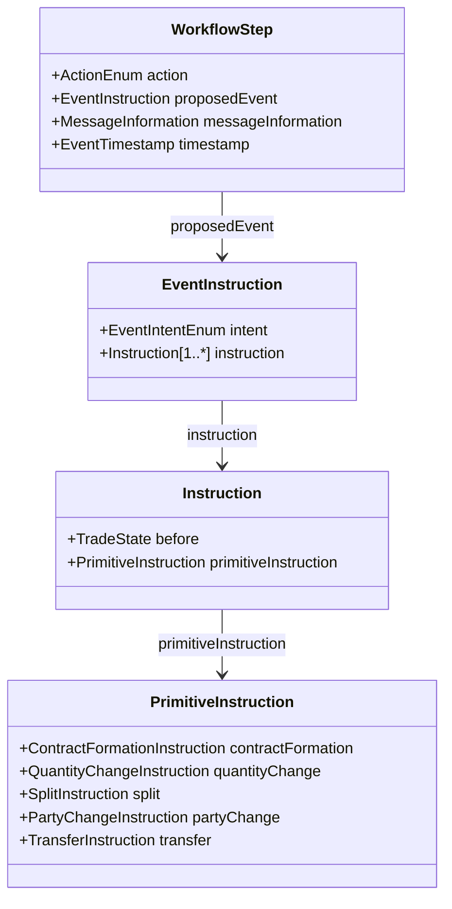

# WorkflowStep 構造と FpML ライフサイクル変換サンプル (Execution Advice)

本ページでは、FpML 5.13 の取引執行通知（`executionAdvice` / `executionAdviceRetracted`）から CDM オブジェクトへ変換（Ingestion）された出力サンプル群（全18ファイル）の構造、CDM における **`WorkflowStep`** の設計思想、および各種取引ライフサイクルイベント（新規約定、契約更改、中途解約、条件変更、訂正、取消）のモデル化手法を解説します。

---

## 1. 概要と位置づけ

CDM リポジトリの以下のフォルダには、FpML 5.13 processes execution advice メッセージを Rosetta DSL の Ingestion 関数によって変換した CDM JSON サンプル群が格納されています：

- **出力先パス**: `common-domain-model/rosetta-source/src/main/resources/ingest/output/fpml-confirmation-to-workflow-step/fpml-5-13-processes-execution-advice/`
- **入力元パス**: `common-domain-model/rosetta-source/src/main/resources/ingest/input/fpml-5-13-processes-execution-advice/`
- **ルートオブジェクト型**: **`cdm.event.workflow.WorkflowStep`**

### なぜ `Trade` や `BusinessEvent` ではなく `WorkflowStep` なのか？

デリバティブ取引のライフサイクルにおいて、取引当事者間や清算機関、マッチングプラットフォーム間で交換されるメッセージは「相手方へのイベント提案・通知・承認依頼」です。
CDM では、ビジネスイベント自体（`BusinessEvent`）と、それを伝達・承認するワークフロー層を明確に分離しています：

1. **`proposedEvent` (`EventInstruction`)**:
   - 外部メッセージ（FpML 等）によって「提案・通知されたイベント」。まだ相手方の承認や成約確認が完了していない状態。
2. **`businessEvent` (`BusinessEvent`)**:
   - 両当事者間で合意され、確定したライフサイクルイベント（Accepted 状態）。
3. **`rejected` (`boolean`)**:
   - 提案されたイベントが拒絶された状態。
4. **`previousWorkflowStep`**:
   - 前のステップへの参照を保持し、イベントの系統・追跡性（Lineage）を担保。

FpML の `executionAdvice`（執行通知）は外部メッセージであるため、Ingestion 処理では **`WorkflowStep` の `proposedEvent`** としてモデル化されます。

---

## 2. `WorkflowStep` の主要 JSON 属性構造

```json
{
  "@model": "cdm",
  "@type": "cdm.event.workflow.WorkflowStep",
  "@version": "0.0.0.master-SNAPSHOT",
  "@key": "a09fcc21",
  "action": "New",
  "messageInformation": {
    "messageId": { "@data": "IM/5" },
    "sentBy": { "@data": "IMGRUS6S" },
    "sentTo": [ { "@data": "CUSTUS3T" } ]
  },
  "timestamp": [
    {
      "dateTime": "2009-06-08T10:03:09-08:00",
      "qualification": "eventCreationDateTime"
    }
  ],
  "eventIdentifier": [
    { "assignedIdentifier": [ { "identifier": { "@data": "IM/5" } } ] }
  ],
  "proposedEvent": {
    "intent": "ContractFormation",
    "instruction": [
      {
        "primitiveInstruction": { ... },
        "before": { "trade": { ... } }
      }
    ]
  }
}
```

### 主要フィールドの役割

| フィールド名 | 型 | 説明 |
|---|---|---|
| `action` | `ActionEnum` | ワークフロー上の操作種別。`New`（新規）、`Correct`（訂正）、`Cancel`（取消/撤回）。 |
| `messageInformation` | `MessageInformation` | FpML ヘッダー情報（メッセージID、送信元 `sentBy`、宛先 `sentTo`）。 |
| `timestamp` | `EventTimestamp` | メッセージ作成日時（`eventCreationDateTime` など）。 |
| `eventIdentifier` | `Identifier` | イベントをユニークに識別する ID（当事者が付与した ID 等）。 |
| `proposedEvent` | `EventInstruction` | 提案されたビジネスイベントの内容（`intent`、`instruction`）。 |

---

## 3. ライフサイクルイベントと Primitive 操作の対応

本サンプル群では、デリバティブ取引の代表的なライフサイクルイベントが CDM の不可分操作（`PrimitiveInstruction`）と `before` 状態の組み合わせで表現されています。



### (1) 新規約定（Trade Initiation）: `ContractFormation`
- **対象サンプル**: `msg-ex51` (Single Name CDS), `msg-ex58` (CDX Index CDS), `msg-ex63` (Vanilla IRS)
- **`intent`**: `ContractFormation`
- **`primitiveInstruction`**: `contractFormation`（ISDA Master Agreement、Master Confirmation、Confirmation などの法的合意の参照を構築）
- **特徴**: `before.trade` に約定した取引内容（EconomicTerms, TradeLot, Payout, Party）が配置され、初回のアップフロント手数料（`Upfront`）がある場合は `transferHistory` に記録。

### (2) 一部契約更改（Partial Novation）: `Novation`
- **対象サンプル**: `msg-ex52` (CDS Partial Novation)
- **`intent`**: `Novation`
- **`primitiveInstruction`**: **`split`** を使用
  - **残存契約側**: `quantityChange`（減額 `Decrease`、例: 20,000,000 USD 減額）
  - **新契約側**: `partyChange`（新ブローカーへ引継、新契約バージョン番号） + `quantityChange`（新残高 `Replace` 20,000,000 USD） + `transfer`（契約更改手数料 `Novation` Fee）
- **ポイント**: CDM では「契約更改（Novation）」を専用の複雑なオブジェクトとするのではなく、取引の分割（`split`）、当事者変更（`partyChange`）、数量変更（`quantityChange`）、資金移動（`transfer`）の基本プリミティブの合成として数学的に表現します。

### (3) 中途解約（Termination）: `quantityChange`
- **一部解約（Partial Termination）**: `msg-ex54`
  - `quantityChange`: `direction: "Replace"` で残存名目元本（例: 10,000,000 USD）を指定。
  - `transfer`: 解約手数料（`TERMINATION_FEE`, `transferType: "Termination"`）。
- **全部解約（Full Termination）**: `msg-ex56`
  - `quantityChange`: `direction: "Replace"` で **`value: 0`** を指定！
  - **ポイント**: CDM には「解約」という専用の削除命令は存在せず、**数量を 0 に更新する（`quantity.value = 0`）** ことでポジションの消滅・全部解約を表現します。

### (4) 契約条件変更（Amendment）: `ContractTermsAmendment`
- **対象サンプル**: `msg-ex59`
- **`intent`**: `ContractTermsAmendment`
- **`transfer`**: 条件変更に伴う再交渉手数料（`transferType: "Renegotiation"`）。

---

## 4. 訂正（Correction）と取消（Cancellation / Retraction）

FpML メッセージ処理において極めて重要な「後からの訂正」や「取消」は、CDM では `action` 属性とメッセージヘッダーによって追跡されます。

### 訂正（Correction）のペア
各イベントには、新規通知とそれに対応する訂正通知のサンプルがペアで提供されています：

| イベント種別 | 新規通知 (`action: "New"`) | 訂正通知 (`action: "Correct"`) |
|---|---|---|
| CDS 一部契約更改 | `msg-ex52-...-novation-C02-00.json` | `msg-ex53-...-novation-correction-C02-10.json` |
| CDS 全部解約 | `msg-ex56-...-termination-C12-00.json` | `msg-ex57-...-termination_correction-C12-20.json` |
| CDX 契約変更 | `msg-ex59-...-amendment-F02-00.json` | `msg-ex60-...-amendment-correction-F02-10.json` |
| IRS 新規約定 | `msg-ex63-...-trade-initiation.json` | `msg-ex64-...-trade-initiation-correction.json` |

訂正サンプルでは、同一の `eventIdentifier` や `messageInformation` を引き継ぎつつ、`action` が `"Correct"` に更新され、修正された日付・数値が反映されます。

### 取消（Cancellation / Retraction）
- **サンプル**: `msg-ex55-execution-advice-trade-partial-termination-cancellation-C11-10.json`
- **入力 FpML**: `<executionAdviceRetracted>` ルート要素
- 以前送信された一部解約通知（`IM/26`）を取り下げるため、新規のメッセージ ID（`IM/27`）および同一の相関 ID（`correlationId: IM/C011`）を伴って発行されます。

---

## 5. コモディティ現物レグ & 規制報告（ESMA EMIR REFIT / UPI）

本フォルダ後半の `msg-ex69` 〜 `msg-ex70` には、最新の金融規制および現物コモディティ取引に対応した先進的なサンプルが含まれています。

### (1) 多様な現物受渡レグ（Physical Legs）
- `msg-ex69-commodity-swap-coal-physical-leg.json`: 石炭（Coal）
- `msg-ex69-commodity-swap-electricity-physical-leg.json`: 電力（Electricity）
- `msg-ex69-commodity-swap-environmental-physical-leg.json`: 環境クレジット・排出枠（Environmental）
- `msg-ex69-commodity-swap-gas-physical-leg.json`: 天然ガス（Gas）

これらは `CommodityPayout` および `SettlementPayout` の組み合わせにより、受渡条件や価格算定期間（`pricingDates`）が詳細にモデリングされています。

### (2) ESMA EMIR REFIT 規制レポーティング分類 & UPI
- **サンプル**: `msg-ex69-...-commodity-swap-classification-new-trade-esma-emir-refit.json`
- **UPI (ISO 4914)**:
  ```json
  "identifier": [ {
    "identifier": {
      "@scheme": "http://www.fpml.org/coding-scheme/external/iso4914",
      "@data": "QZ17F5PN51JM"
    },
    "source": "UPI"
  } ]
  ```
- **規制タクソノミー (ESMA EMIR REFIT)**:
  ```json
  "taxonomy": [ {
    "source": "Other",
    "value": {
      "name": {
        "@scheme": "http://www.fpml.org/coding-scheme/esma-emir-refit-contract-type",
        "@data": "SWAP"
      }
    }
  }, {
    "source": "ISDA",
    "value": {
      "name": { "@data": "Commodity_Forward" },
      "calculated": true
    }
  } ]
  ```
  取引分類（Contract Type）として EMIR Refit スキームの `"SWAP"`、および ISDA タクソノミーの `"Commodity_Forward"` が併記され、取引報告（Trade Reporting）への即時連携が可能な構造となっています。

---

## 6. 全18サンプルファイル一覧カタログ

| ファイル名 | 対象商品 | イベント意図 (`intent`) | 操作種別 (`action`) | 主要プリミティブ・特徴 |
|---|---|---|---|---|
| `msg-ex51-...-trade-initiation-C01-00.json` | CDS (Single Name) | `ContractFormation` | `New` | `contractFormation`, Upfront Fee |
| `msg-ex52-...-partial-novation-C02-00.json` | CDS | `Novation` | - | `split` (`partyChange`, `quantityChange`, Novation Fee) |
| `msg-ex53-...-partial-novation-correction-C02-10.json` | CDS | `Novation` | `Correct` | 更改内容の訂正 |
| `msg-ex54-...-partial-termination-C11-00.json` | CDS | (Termination) | `New` | `quantityChange` (Replace残額), Termination Fee |
| `msg-ex55-...-partial-termination-cancellation-C11-10.json` | CDS | (Termination) | - | 解約通知の取消（FpML `executionAdviceRetracted`） |
| `msg-ex56-...-full-termination-C12-00.json` | CDS | (Termination) | `New` | `quantityChange` (**value: 0**), Termination Fee |
| `msg-ex57-...-full-termination_correction-C12-20.json` | CDS | (Termination) | `Correct` | 全部解約の訂正 |
| `msg-ex58-...-trade-initiation-F01-00.json` | CDS (CDX Index) | `ContractFormation` | `New` | `contractFormation` (MasterConfirmation: DJ.CDX.NA) |
| `msg-ex59-...-trade-amendment-F02-00.json` | CDS (CDX Index) | `ContractTermsAmendment` | `New` | `transfer` (Renegotiation Fee) |
| `msg-ex60-...-trade-amendment-correction-F02-10.json` | CDS (CDX Index) | `ContractTermsAmendment` | `Correct` | 契約条件変更の訂正 |
| `msg-ex63-...-trade-initiation.json` | IRS (Fixed-Float) | `ContractFormation` | `New` | 固定/浮動スワップ新規約定 |
| `msg-ex64-...-trade-initiation-correction.json` | IRS (Fixed-Float) | `ContractFormation` | `Correct` | 固定/浮動スワップ約定訂正 |
| `msg-ex69-commodity-swap-coal-physical-leg.json` | Commodity (石炭) | `PortfolioRebalancing` | - | 石炭現物受渡レグ |
| `msg-ex69-commodity-swap-electricity-physical-leg.json` | Commodity (電力) | `PortfolioRebalancing` | - | 電力現物受渡レグ |
| `msg-ex69-commodity-swap-environmental-physical-leg.json` | Commodity (環境) | `PortfolioRebalancing` | - | 排出権・環境クレジット現物受渡レグ |
| `msg-ex69-commodity-swap-gas-physical-leg.json` | Commodity (ガス) | `PortfolioRebalancing` | - | 天然ガス現物受渡レグ |
| `msg-ex69-...-esma-emir-refit.json` | Commodity Swap | `PortfolioRebalancing` | - | ISO 4914 UPI, EMIR Refit 規制分類 (`SWAP`) |
| `msg-ex70-...-esma-emir-refit.json` | Commodity Swap | (Termination) | - | EMIR Refit 規制分類付き解約, Termination Fee |

---

## 7. 関連ドキュメント・リンク
- [取引イベント & ライフサイクル (Business Event データ構造)](./event_lifecycle.md)
- [FpML メッセージ取り込み & マッピングアーキテクチャ](./fpml_ingestion.md)
- [CDM JSON シリアライゼーション仕様 & 方言比較](./json_serialization_and_dialects.md)
- [event-workflow-type.rosetta](../../common-domain-model/rosetta-source/src/main/rosetta/event-workflow-type.rosetta)
