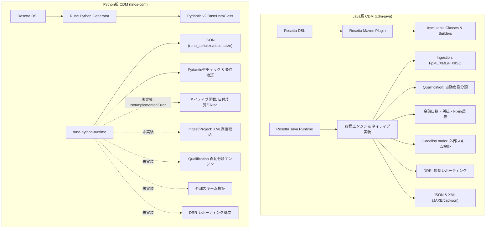

# CDM Java版とPython版の機能差・非対応機能の網羅的調査

本ドキュメントは、基準実装（Reference Implementation）としてフル機能を備える **Java版 CDM ライブラリ（`cdm-java`）** に対し、**Python版 CDM ライブラリ（`finos-cdm` / `rune-python-generator` / `rune-python-runtime`）** において現時点で非対応（未実装・スタブ・機能制限）となっている機能を、アーキテクチャ・DSL構文・ネイティブ関数・業務パイプラインの各観点から網羅的に調査・整理した技術レポートです。

---

## 1. エグゼクティブサマリ & 設計思想の違い

| 比較項目 | Java版 CDM (`cdm-java`) | Python版 CDM (`finos-cdm`) |
| :--- | :--- | :--- |
| **位置づけ** | FINOS CDM の**基準実装（フルスタック）** | **Pydantic v2 ベースのデータクラス & JSON連携** |
| **主な用途** | 電文取込(Ingest)、商品分類、利払計算、DRR報告、基幹連携 | Python エコシステム（AI/ML、データ分析、FastAPI等のWeb連携） |
| **DSL機能カバレッジ** | 全構文・全アノテーションをサポート | 式(Expression)は網羅、レポーティング構文(DRR)・一部アノテーションが未対応 |
| **ネイティブ関数** | Java具象クラス（日付・丸め・カレンダー等）を完全提供 | スタブ生成のみ（呼出時は `NotImplementedError`、要自前登録） |
| **外部電文変換** | FpML XML / FIX / ISO 20022 からの Ingest & Projection | 非対応（CDM JSON のみ対応、XML・他フォーマット直接取込不可） |
| **商品・イベント分類** | `QualifyProcessorStep` による自動分類エンジン提供 | 個別判定関数のみ生成（全体オーケストレーション機構なし） |
| **外部スキーム検証** | `CodelistLoader` によるコードリスト動的ロード・検証 | 未実装（`[metadata scheme]` 制約の検証はスキップ） |
| **オブジェクト設計** | 完全なイミュータブル + Builder パターン | Pydantic v2 モデル（ミュータブル、キーワード引数構築） |

---

## 2. 機能領域別 対比マトリクス (Feature Parity Matrix)

| 機能分類 | 具体的な機能 / コンポーネント | Java版 | Python版 | Python版の現状・制約 | 根拠・引用元（一次ソース） |
| :--- | :--- | :---: | :---: | :--- | :--- |
| **データモデル** | CDM 基本データ型・Enum生成 | ✅ | ✅ | Pydantic v2 クラスとして生成。巡回参照（SCC循環依存）も解消済み | `common-domain-model/python/README.md` L53-55 `rune-python-generator/docs/ARCHITECTURE.md` §2-§3 `rune-python-runtime/src/rune/runtime/base_data_class.py` L21-30 |
| | 基本制約（pattern, length, range） | ✅ | ✅ | Pydantic Field 制約として評価 | `rune-python-generator/docs/RUNE_LANGUAGE_GAPS.md` L91-92 |
| | ドメイン型名保持 (`typeAlias`) | ✅ | ⚠️ | **Java Path採用により基底プリミティブ型に強制展開**（`ISIN` 等の型名が喪失） | `rune-python-generator/docs/ARCHITECTURE.md` §6 (L253-294) `rune-python-generator/docs/RUNE_LANGUAGE_GAPS.md` L45 |
| | `typeAlias` の named `condition` | ✅ | ❌ | **コード生成時にサイレント破棄**（`FpMLCodingScheme` の検証がスキップ） | `rune-python-generator/docs/RUNE_LANGUAGE_GAPS.md` L87-109 |
| **DSL式言語** | 基本式（算術・論理・コレクション操作） | ✅ | ✅ | `filter`, `extract`, `flatten`, `min`, `max`, `as`, `as-key` など全43式完全対応 | `rune-python-generator/docs/RUNE_LANGUAGE_GAPS.md` L142-197 `rune-python-generator/RELEASE.md` L8-28 |
| | 関数の継承・呼出 (`extends`, `super`) | ✅ | ❌ | 文法としては存在するが Python ジェネレーター未対応 | `rune-python-generator/docs/RUNE_LANGUAGE_GAPS.md` L47-48 |
| **規制報告 (DRR)** | `report` ブロック（報告オーケストレーター） | ✅ | ❌ | **未実装**（Pythonコードが生成されない） | `rune-python-generator/docs/RUNE_LANGUAGE_GAPS.md` L54-63 |
| | `reporting rule`（項目抽出・計算ルール） | ✅ | ❌ | **未実装** | `rune-python-generator/docs/RUNE_LANGUAGE_GAPS.md` L64-73 |
| | `eligibility rule`（適格性判定ゲート） | ✅ | ❌ | **未実装** | `rune-python-generator/docs/RUNE_LANGUAGE_GAPS.md` L74-82 |
| **DSLメタデータ** | `[deprecated]` アノテーション | ✅ | ❌ | `@deprecated` や Pydantic Field への出力なし（無視） | `rune-python-generator/docs/RUNE_LANGUAGE_GAPS.md` L19 |
| | `[synonym]` アノテーション | ✅ | ❌ | FpML/FIX等のマッピングメタデータ（450+件）がコード生成時に脱落 | `rune-python-generator/docs/RUNE_LANGUAGE_GAPS.md` L24 |
| | `[rootType]`, `[qualification]`, `[projection]` | ✅ | ❌ | マーカーアノテーションが無視され、レジストリ連携もなし | `rune-python-generator/docs/RUNE_LANGUAGE_GAPS.md` L20-22 |
| | Enum メタデータラッパーの均質性 | ✅ | ⚠️ | 非アノテーション Enum が素の Enum になりメタデータ非対称 | `rune-python-generator/docs/RUNE_LANGUAGE_GAPS.md` L124-139 |
| **ネイティブ関数** | 日付・時刻演算（`AddDays`, `DateDifference` 等） | ✅ | ❌ (スタブ) | **未実装**（呼出時 `NotImplementedError`） | `common-domain-model/python/README.md` L61-63 `common-domain-model/rosetta-source/src/main/java/org/finos/cdm/CdmRuntimeModule.java` L53-65 `rune-python-runtime/src/rune/runtime/native_registry.py` L9-17 |
| | 利払計算・期間生成（`CalculationPeriods` 等） | ✅ | ❌ (スタブ) | **未実装**（Strata連携等のロジックなし） | `common-domain-model/rosetta-source/src/main/java/org/finos/cdm/CdmRuntimeModule.java` L61-63 `rune-python-runtime/src/rune/runtime/native_registry.py` L9-17 |
| | 丸め・端数処理（`RoundToNearest` 等） | ✅ | ❌ (スタブ) | **未実装**（テスト用モックのみ） | `common-domain-model/rosetta-source/src/main/java/org/finos/cdm/CdmRuntimeModule.java` L44-47 `rune-python-generator/docs/USING_NATIVE_FUNCTIONS_INTEGRATION.md` L49-58 |
| | ベクトル・配列演算（`VectorOperation` 等） | ✅ | ❌ (スタブ) | **未実装**（DSLの `get-item` 制限回避用） | `common-domain-model/rosetta-source/src/main/java/org/finos/cdm/CdmRuntimeModule.java` L37-40 `rune-python-runtime/src/rune/runtime/native_registry.py` L9-17 |
| | 外部カレンダー・営業日判定（`BusinessCenterHolidays`） | ✅ | ❌ (スタブ) | **未実装**（空プロバイダー） | `common-domain-model/rosetta-source/src/main/java/org/finos/cdm/CdmRuntimeModule.java` L50 `rune-python-runtime/src/rune/runtime/native_registry.py` L9-17 |
| | 金利指標 Fixing 観測（`IndexValueObservation`） | ✅ | ❌ (スタブ) | **未実装**（空プロバイダー） | `common-domain-model/rosetta-source/src/main/java/org/finos/cdm/CdmRuntimeModule.java` L51 `rune-python-runtime/src/rune/runtime/native_registry.py` L9-17 |
| **外部スキーム検証** | `[metadata scheme]` コードリスト動的検証 | ✅ | ❌ | `CodelistLoader` / `LoadCodeList` がスタブ。検証スキップ | `common-domain-model/python/README.md` L63-64 `rune-python-generator/docs/RUNE_LANGUAGE_GAPS.md` L110-123 `common-domain-model/rosetta-source/src/main/java/org/finos/cdm/CdmRuntimeModule.java` L67-68 |
| **業務エンジン** | 自動商品・イベント分類（Qualification Engine） | ✅ | ❌ | 個別関数はあるが、束ねて自動分類・レポート化する基盤なし | `common-domain-model/examples/src/main/java/org/finos/cdm/example/ValidateAndQualifySample.java` L23-39 `common-domain-model/rosetta-source/src/main/java/org/finos/cdm/CdmRuntimeModule.java` L32-33 `rune-python-generator/docs/RUNE_LANGUAGE_GAPS.md` L21 |
| | Ingestion パイプライン（FpML/FIX/ISO XML取込） | ✅ | ❌ | **未実装**（CDM JSON 以外の生電文は直接変換不可） | `common-domain-model/rosetta-source/pom.xml` L402-423, L562-572 `common-domain-model/python/README.md` L38-48 `rune-python-generator/python-test/cdm-tests/test_fpml510_samples.py` L32-36 |
| | Projection パイプライン（外部フォーマット投影） | ✅ | ❌ | **未実装**（外部フォーマットへの書き出し不可） | `rune-python-generator/docs/RUNE_LANGUAGE_GAPS.md` L22 `common-domain-model/python/README.md` L38-48 |
| | グローバルキー自動付与・ハッシュ計算パイプライン | ✅ | ❌ | 基本的な参照解決のみ。オブジェクト走査ハッシュ計算なし | `common-domain-model/examples/src/main/java/org/finos/cdm/example/globalkey/GlobalKeyHash.java` L29-41 `common-domain-model/rosetta-source/src/main/java/org/finos/cdm/CdmRuntimeModule.java` L35 `rune-python-runtime/src/rune/runtime/base_data_class.py` L36-52 |
| **フォーマット** | JSON シリアライズ / デシリアライズ | ✅ | ✅ | `@type`, `@model`, `@version` 対応 | `common-domain-model/python/README.md` L38-48 `rune-python-runtime/src/rune/runtime/base_data_class.py` L21-30 |
| | XML / FpML シリアライズ / デシリアライズ | ✅ | ❌ | **非対応**（JSONのみ対応） | `common-domain-model/python/README.md` L38-48 `common-domain-model/rosetta-source/pom.xml` L560-606 (JAXB/Jackson/Saxon) |
| **オブジェクト設計** | イミュータビリティと Builder パターン | ✅ | ❌ | Javaは完全不変+Builder、PythonはミュータブルPydantic v2 | `common-domain-model/examples/src/main/java/org/finos/cdm/example/ValidateAndQualifySample.java` L31 (`toBuilder()`) `rune-python-runtime/src/rune/runtime/base_data_class.py` L21-34 (`BaseDataClass`) |

---

## 3. 非対応（未実装）機能の深掘り分析

### 3.1. Rosetta DSL 構文・アノテーションの対応ギャップ

#### ① 規制レポーティング構文（DRR）の完全未対応
FINOS の Digital Regulatory Reporting (DRR) で多用される以下の3構文は、Python ジェネレーター（`rune-python-generator`）において生成ロジックが未実装（Status: ❌）です。
- **`report`**: 報告タイミング（`in T+1`）や対象スキーマ、適格性判定を統括するオーケストレーター。
- **`reporting rule`**: 入力トランザクションから各報告フィールドの値を null-safe に抽出・計算するルール。
- **`eligibility rule`**: 取引が報告対象かを判定するブール論理フィルタ。
> **影響**: Python 単体では EMIR Refit, CFTC Re-write, JFSA, MAS 等の規制報告メッセージ生成パイプラインを動かすことができません。

#### ② `typeAlias` のドメイン型名喪失と named `condition` の脱落
- **型名の消失 (The Java Path)**:
  ジェネレーターはエイリアスを基底型（`str`, `Decimal` 等）にインライン置換して生成します。そのため、`typeAlias ISIN: string` や `typeAlias CurrencyCode: string` はすべて `str` となり、型ヒントや Pydantic の JSON Schema から金融ドメイン型名が失われます。
- **named `condition` の脱落**:
  `typeAlias` に付与されたビジネスバリデーション（例: `typeAlias FpMLCodingScheme` における `ValidateFpMLCodingSchemeDomain` 呼出）が生成時に破棄され、一切チェックされません。

#### ③ マッピング・メタデータアノテーションの脱落
- **`[synonym]` の欠落**:
  CDM の DSL 内には 450 件以上の `[synonym]`（FpML、FIX、ISO 20022 のフィールド対応関係）が定義されていますが、Python コードには一切出力されません。そのため、Python 側でマッピング辞書として活用することができません。
- **`[deprecated]`, `[rootType]`, `[qualification]`, `[projection]`**:
  非推奨警告デコレータや、トップレベルエントリーポイント識別、自動分類連携用のメタデータが欠落しています。

---

### 3.2. ネイティブ関数（Java Native Functions）の未実装一覧

Java版では `CdmRuntimeModule`（Google Guice モジュール）において、DSL で表現できない処理や外部連携処理が Java クラスとして実装・注入されています。
Python版ではこれらが **`rune_execute_native(...)` を呼び出すラッパースタブ** として生成されるため、事前に `rune_register_native` で Python 実装を登録しておかない限り、実行時に **`NotImplementedError`** が発生します。

| カテゴリ | ネイティブ関数名 | Java版の実装内容 | Python版の現状 |
| :--- | :--- | :--- | :--- |
| **日付・時刻** | `Now`, `Today`, `ToTime` | システム日付・時刻の取得、文字列からの時刻型変換 | スタブ（`NotImplementedError`） |
| | `AddDays` | 営業日またはカレンダー日の加算計算 | スタブ |
| | `DayOfWeek` | 日付から曜日（DayOfWeekEnum）を特定 | スタブ |
| | `DateDifference`, `LeapYearDateDifference` | 日数差分計算（うるう年計算対応） | スタブ |
| | `CalculationPeriod`, `CalculationPeriods`, `CalculationPeriodRange` | スケジュールとロール規則に基づく利払計算期間の展開生成 | スタブ（Strata等との連携なし） |
| | `ResolveAdjustableDate`, `ResolveAdjustableDates` | 営業日調整規則（Following, Preceding 等）の適用 | スタブ |
| **数値・演算** | `RoundToNearest`, `RoundToPrecision`, `RoundToSignificantFigures` | 指定桁数・刻み幅・丸めモード（四捨五入、切捨て等）の端数処理 | スタブ（テスト用モックのみ） |
| | `VectorOperation`, `VectorGrowthOperation` | ベクトル（配列）のインデックス操作・成長率計算 | スタブ |
| | `PopOffDateList` | 日付リストの末尾要素削除 | スタブ |
| **外部データ** | `BusinessCenterHolidays` | 各金融センター（GBLO, USNY 等）の祝日・営業日カレンダー判定 | スタブ（空プロバイダー） |
| | `IndexValueObservation` | 金利指標（SOFR, EURIBOR 等）のヒストリカルFixing値取得 | スタブ（空プロバイダー） |
| **コードリスト** | `LoadCodeList` | FpML Coding Schemes の XML/JSON 動的ロード | スタブ |
| **Ingest補助** | `StringContains`, `CreateKey`, `CreateAssetKey`, `CreateKeyForQuotedCurrencyPair`, `CalculateCommodityCalculationPeriods`, `MapCommodityOptionStrikePriceSchedule` | FpML 取込時のキー生成・文字列判定・コモディティ計算 | スタブ |

---

### 3.3. 業務パイプライン・オーケストレーション機能の非対応

#### ① 商品・イベント自動分類（Qualification Engine）の欠落
Java版では、`TradeState` 等のオブジェクトを `QualifyProcessorStep` に渡すことで、モデル内の 230 以上の `Qualify_*` 関数（例: `Qualify_InterestRateStream`, `Qualify_CreditDefaultSwap`）を自動実行し、商品種別やイベント種別を判定した `QualificationReport` を出力・オブジェクトに反映できます。
Python版では個々の判定関数は生成されるものの、**全体をスキャンして自動分類を実行・レポートするオーケストレーション機構が存在しません**。

#### ② Ingestion / Projection（外部フォーマット電文変換）の欠落
- **Ingestion**: Java版には FpML XML メッセージを取り込んで `TradeState` を組み立てるパイプライン（`cdm-ingest`、`MappingProcessor`）がありますが、Python版には XML パーサーや FpML マッピング実行機構がありません。
- **Projection**: CDM オブジェクトから FpML や各規制フォーマットを出力する機能もありません。
- **現状の対応範囲**: すでに Java版等で CDM JSON にシリアライズされたファイルを `rune_deserialize` することのみが可能です。

#### ③ 外部スキーム／コードリスト検証（External Scheme Validation）の欠落
CDM モデルには、ISO 通貨コードや FpML Business Center など、`[metadata scheme]` アノテーションが付いたフィールドが多数存在します。
- Java版: `CodelistLoader` がリソース内の JSON/XML 定義を読み込み、許容値に含まれているかを検証します。
- Python版: コードリストのローダー・キャッシュが存在せず、検証メソッドも生成されないため、**実質的にノーチェック（未検証）**となります。

#### ④ オブジェクトグラフの後処理・グローバルキー自動生成パイプライン
Java版には `RosettaModelObjectProcess` や `PostProcessStep`（例: `SerialisingHashFunction` によるハッシュ計算と `globalKey` の自動付与）が存在します。Python版ではデシリアライズ時の基本的な参照解決（Reference 解決）はサポートされていますが、オブジェクト生成後の自動ハッシュ計算やグローバルキー割り当てを行うパイプラインは提供されていません。

---

## 4. アーキテクチャ・パラダイムの差異

---

## 5. ユースケース別の実用性判断・使い分けガイド

| ユースケース | 推奨言語 | 理由・判断基準 |
| :--- | :---: | :--- |
| **FpML / XML 電文の取り込み・相互変換** | **Java** | Python版には XML パーサーおよび Ingestion パイプラインが存在しないため不可。 |
| **金融日数計算、利払期日生成、Fixing観測** | **Java** | `CalculationPeriods`, `BusinessCenterHolidays` 等が Python では未実装スタブのため。 |
| **取引データの自動商品分類 (Qualify)** | **Java** | `QualifyProcessorStep` のようなオーケストレーターが Python 版にはないため。 |
| **規制報告 (DRR) の実行** | **Java** | `report` / `reporting rule` が Python コードに生成されないため。 |
| **外部コードリスト (ISO通貨・拠点) の厳密検証** | **Java** | Python版では `[metadata scheme]` 検証がスキップされるため。 |
| **CDM JSON データの参照・検証・加工** | **Python** / **Java** | Pydantic v2 モデルとして高速かつ直感的に操作可能。 |
| **AI / 機械学習モデルへの CDM 特徴量供給** | **Python** | Pandas / PyTorch / LLM パイプラインとの親和性が非常に高い。 |
| **FastAPI 等での軽量 CDM マイクロサービス API** | **Python** | Pydantic v2 のシリアライゼーションと FastAPI のネイティブ親和性。 |

---

## 6. 将来の解消方針・ロードマップ

1. **ネイティブ関数の段階的 Python 実装**:
   `rune-python-runtime` の `rune_register_native` 機構を活用し、日付演算（`dateutil` 等）や丸め処理の Python 具象実装をパッケージ化して提供することが計画されています。
2. **Rune Path による `typeAlias` 改善**:
   ジェネレーターの改修により、プリミティブ型への展開ではなく `ISIN = str` のようなエイリアス代入を維持し、ドメイン型情報を保持する方向が検討されています（[ARCHITECTURE.md](../../rune-python-generator/docs/ARCHITECTURE.md#6-design-decision-typealias-generation) 参照）。
3. **DRR / レポーティング構文のジェネレーター対応**:
   `report`, `reporting rule`, `eligibility rule` の Python コード生成機能の追加。
4. **外部コードリストローダー（CodelistLoader）の Python 移植**:
   Python ランタイム側での JSON コードリストのキャッシュおよび `[metadata scheme]` 評価エンジンの整備。

---

## 7. 関連ドキュメント

- [Java版CDM ビルド・パッケージング仕様](java_cdm_build_and_packaging.md)
- [Python版CDM ビルド・パッケージング仕様](python_cdm_build_and_packaging.md)
- [CDM JSON シリアライゼーション & 方言](../concepts/json_serialization_and_dialects.md)
- [商品モデリング & Qualification](../concepts/product_modeling.md)
- [FpML Ingestion 仕様](../concepts/fpml_ingestion.md)
