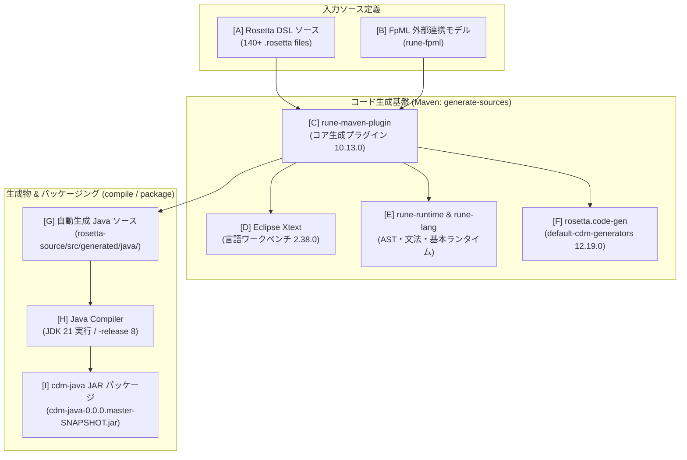
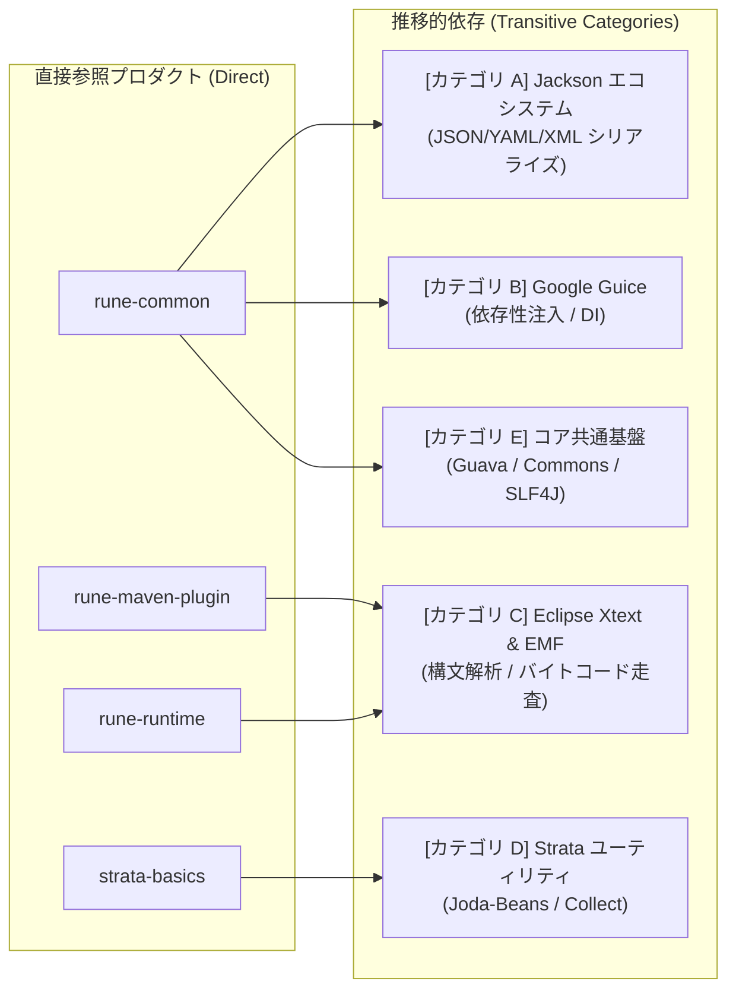

# Java版CDMライブラリの前提環境・ビルド＆パッケージング仕様

本ドキュメントは、FINOS Common Domain Model (CDM) において、Java 版 CDM ライブラリ（モジュール名: `rosetta-source`、Maven アーティファクト名: `cdm-java`）をビルドし、JAR パッケージとして生成するための前提環境（基盤ソフトウェア、コード生成基盤プロダクト、機能分類別の依存プロダクト群）と、その検証済み実行手順を体系化した技術リファレンスです。

---

## 1. Java 版 CDM ライブラリ（cdm-java）の概要

CDM の一次情報は [`rosetta-source/src/main/rosetta/`](../../common-domain-model/rosetta-source/src/main/rosetta) に配置された Rosetta DSL ファイル群（140 ファイル以上）として定義されています。
Java 版 CDM ライブラリは、ビルド時に Rosetta DSL コードジェネレータがこれらの DSL 定義から Java ソースコード（型、関数、バリデータ、メタデータ等）を自動生成し、手動定義のユーティリティや XML/JSON コンバータとともに 1 つの JAR ファイル（`cdm-java-<version>.jar`）にコンパイル・パッケージングしたものです。

---

## 2. 必須基盤ソフトウェア・ビルド環境要件

CDM Java ライブラリのビルド環境には、以下のソフトウェアおよびバージョン制約が定義されています。

| ソフトウェア / ツール | 要求バージョン / 制約 | 設定箇所 / 根拠 | 役割・備考 |
| :--- | :--- | :--- | :--- |
| **Java Development Kit (JDK)** | **Java 21** (`[21,22)`) | [`pom.xml`](../../common-domain-model/pom.xml) `<java.enforced.version>` | Maven Enforcer Plugin により厳格に JDK 21 系（21.x）であることが検証されます。JDK 17 や JDK 22+ ではビルド不可。 |
| **コンパイル対象 (Target Bytecode)** | **Java 8** (`release: 8`) | [`rosetta-source/pom.xml`](../../common-domain-model/rosetta-source/pom.xml) `<maven.compiler.release>` | ビルド実行環境は JDK 21 ですが、生成される JAR は Java 8 以上で動作する下位互換性が維持されています。 |
| **Apache Maven** | **3.8.x 以上** (推奨 3.9.x) | 親 POM `org.finos:finos:7` | プラグイン解決およびマルチモジュール（Reactor）ビルドを実行。 |
| **ネットワーク接続** | **Maven Central** への疎通 | プラグイン・依存関係解決 | 初回ビルド時に Rosetta / Rune プラグイン群および依存 JAR を取得。 |

---

## 3. コード生成基盤テクノロジー・プロダクト

Java 版 CDM のコード生成は、単一の静的コンパイラではなく、DSL 言語定義、構文解析ワークベンチ、ドメイン拡張モデル、コード生成プラグインが密接に連携するパイプラインによって実現されています。

### 3.1 コード生成パイプライン構成図と各要素の役割

以下のアーキテクチャ図は、DSL ソースから最終的な JAR パッケージが生成されるまでのコンポーネント連携フローを示しています。図中の各要素（[A]〜[I]）がその直下の表と 1 対 1 に対応しています。



| 図中要素 | コンポーネント名 | 種別 / 役割 |
| :--- | :--- | :--- |
| **[A]** | **Rosetta DSL ソース** | [`rosetta-source/src/main/rosetta/`](../../common-domain-model/rosetta-source/src/main/rosetta) に配置された 140 ファイル以上の一次モデル定義。型（`type`）、関数（`func`）、列挙型（`enum`）を定義。 |
| **[B]** | **FpML 外部連携モデル (`rune-fpml`)** | 金融標準 FpML の XML スキーマから Rune DSL 形式にインポートされた型定義・マッピングモデル。ビルド初期フェーズで抽出・統合。 |
| **[C]** | **`rune-maven-plugin`** | Maven の `generate-sources` フェーズで起動し、DSL ファイルの解析と Java ソース出力全体の指揮・調整を行う Maven プラグイン。 |
| **[D]** | **Eclipse Xtext** | Rosetta DSL の構文規則（Grammar）、構文解析（パーサー）、AST 走査、文脈検証（バリデータ）を提供する言語ワークベンチ基盤。 |
| **[E]** | **`rune-runtime` / `rune-lang`** | Rosetta DSL のコア文法・セマンティクス実装（`rune-lang`）と、生成された Java クラスが共通して実装する基底インターフェース（`RosettaModelObject` 等）を提供するランタイム（`rune-runtime`）。 |
| **[F]** | **`rosetta.code-gen`** | DSL の抽象構文木（AST）から Java のクラス、Builder パターン、メタデータ、関数実行クラス等のソースコードをレンダリングするテンプレートエンジン。 |
| **[G]** | **自動生成 Java ソース** | `rune-maven-plugin` によって `src/generated/java/` 配下に出力された 6,300 本以上の Java クラス群。 |
| **[H]** | **Java Compiler (`javac`)** | JDK 21 環境上で動作し、ターゲット互換性 Java 8（`-release 8`）として生成クラスと手動 Java ソースをコンパイルするビルドプロセス。 |
| **[I]** | **`cdm-java` JAR パッケージ** | コンパイルされたクラス群、JSON/XML リソース、マッピング定義を 1 つに封入した最終成果物（JAR、約 25.5 MB）。 |

---

### 3.2 rosetta-source/pom.xml で直接参照しているプロダクト一覧

[`rosetta-source/pom.xml`](../../common-domain-model/rosetta-source/pom.xml) の `<dependencies>` および `<build><plugins>` で**直接宣言されている主要プロダクト**の一覧です。

| プロダクト名 (GroupId:ArtifactId) | バージョン | 宣言種別 | 概要・役割・技術的背景 | 公式 GitHub リポジトリ (HTTP 200 確認済) |
| :--- | :--- | :--- | :--- | :--- |
| **`org.finos.rune:rune-maven-plugin`** | `10.13.0` | Plugin | **DSLコード生成コアプラグイン**。Maven の `generate-sources` フェーズで起動し、全 140+ の `.rosetta` DSL 定義をパースして Java ソース（約 6,300 クラス）を自動出力する。 | [finos/rune-dsl](https://github.com/finos/rune-dsl) |
| **`org.finos.rune-common:rune-common`** | `12.19.0` | Dependency (compile) | **Rune共通シリアライズ・オブジェクト基盤**。JSON/XML シリアライズ、Jackson 拡張モジュール、メタデータアノテーション（`@key`、`@reference`）解決基盤を提供。 | [finos/rune-common](https://github.com/finos/rune-common) |
| **`org.finos.rune:rune-runtime`** | `10.13.0` | Dependency (compile) | **Rune実行時ランタイム**。生成された全 Java クラスの基底インターフェース（`RosettaModelObject` 等）や関数実行クラス（`RosettaFunction`）の実行時基盤を提供。 | [finos/rune-dsl](https://github.com/finos/rune-dsl) |
| **`com.regnosys.rune-fpml:rosetta-source`** | `3.8.0` | Dependency (compile) | **FpMLドメインモデル連携定義**。金融標準 FpML の XML 定義を Rune DSL 形式にインポートしたモデルアーカイブ。ビルド時に解凍されて CDM と統合パースされる。 | [rosetta-models/rune-fpml](https://github.com/rosetta-models/rune-fpml) |
| **`com.opengamma.strata:strata-basics`** | `1.7.0` | Dependency (compile) | **金融計算・市場データモデリング基盤**。金融市場の営業日カレンダー、テナー、休日調整規則、インデックスなどの標準計算・型定義を提供。 | [OpenGamma/Strata](https://github.com/OpenGamma/Strata) |
| **`org.jsoup:jsoup`** | `1.23.2` | Dependency (compile) | **HTMLパーサー**。Rosetta モデル内の HTML ドキュメンテーションの解析・サニタイズ処理に使用。 | [jhy/jsoup](https://github.com/jhy/jsoup) |
| **`net.sf.saxon:Saxon-HE`** | `10.6` | Dependency (compile) | **XML/XSLT変換エンジン**。ISO / FpML コードリスト XML から JSON への変換処理（`CodeListTransformer`）に使用。 | *(SourceForge / Maven Central)* |
| **`org.finos.rune-testing:rune-testing`** | `12.19.0` | Dependency (test) | **Runeテストハーネス**。Rosetta モデルの単体テスト、構文検証、モック実行用テストユーティリティ。 | [finos/rune-dsl](https://github.com/finos/rune-dsl) |
| **`commons-cli:commons-cli`** | `1.4` | Dependency (test) | **コマンドライン引数パーサー**。テストや検証ツールの CLI オプション処理に使用。 | *(Apache Commons)* |
| **`org.junit.jupiter:junit-jupiter`** | `5.9.1` | Dependency (test) | **Java単体テストフレームワーク** (JUnit 5)。 | *(JUnit Team)* |
| **`org.mockito:mockito-core`** | `5.1.1` | Dependency (test) | **単体テスト用モック作成ライブラリ**。 | *(Mockito)* |

---

### 3.3 Maven により推移的（間接的）に引き込まれる依存ライブラリ群

直接参照しているプロダクトが依存しているため、Maven の推移的依存解決機構によって**自動的にプロジェクトへ引き込まれる主要ライブラリ群**を機能カテゴリ別に整理した一覧表です。



| カテゴリ / 機能分類 | 主な推移的依存ライブラリ (GroupId:ArtifactId / Version) | 引き込み元の親プロダクト (Direct) | 役割・機能概要 | 公式 GitHub リポジトリ (HTTP 200 確認済) |
| :--- | :--- | :--- | :--- | :--- |
| **カテゴリ A: JSON / スキーマシリアライゼーション** | ・`com.fasterxml.jackson.core:jackson-databind:2.18.10`<br/>・`jackson-core`, `jackson-annotations:2.18.10`<br/>・`jackson-datatype-jdk8`, `jsr310`, `guava`, `joda`<br/>・`jackson-dataformat-yaml:2.18.10` (`snakeyaml:2.3`)<br/>・`jackson-dataformat-xml:2.18.10` (`woodstox-core:7.0.0`)<br/>・`jackson-dataformat-csv:2.18.10` | **`org.finos.rune-common:rune-common`** | CDM オブジェクトと JSON/YAML/XML/CSV 間の高精度な相互変換、および Rosetta 固有のメタデータアノテーション（`@key`、`@reference`）のシリアライズ処理。 | [FasterXML/jackson](https://github.com/FasterXML/jackson) |
| **カテゴリ B: DI (依存性注入) コンテナ** | ・`com.google.inject:guice:6.0.0`<br/>・`jakarta.inject:jakarta.inject-api:2.0.1`<br/>・`javax.inject:javax.inject:1`<br/>・`aopalliance:aopalliance:1.0` | **`org.finos.rune-common:rune-common`** | CDM 内の関数インターフェース（`RosettaFunction`）の実装動的バインディングおよびプロバイダ注入。 | [google/guice](https://github.com/google/guice) |
| **カテゴリ C: 言語ワークベンチ・コンパイラ・AST 基盤** | ・`org.eclipse.xtext:xtext-maven-plugin:2.38.0`<br/>・`org.eclipse.xtext.builder.standalone:2.38.0`<br/>・`org.eclipse.xtext.common.types:2.38.0`<br/>・`org.eclipse.xtend:org.eclipse.xtend.lib:2.38.0`<br/>・`org.eclipse.emf:org.eclipse.emf.ecore / codegen`<br/>・`org.ow2.asm:asm:9.5`<br/>・`io.github.classgraph:classgraph:4.8.179`<br/>・`org.antlr:antlr-runtime:3.2` | **`rune-maven-plugin`**<br/>**`rune-runtime`**<br/>**`rune-testing`** | Rosetta DSL の文法規則解析、AST ノード生成、Xtend テンプレートコード出力、クラスパス走査、Java バイトコード生成基盤。 | [eclipse/xtext](https://github.com/eclipse/xtext) |
| **カテゴリ D: 金融計算・ドメインオブジェクト基盤** | ・`com.opengamma.strata:strata-collect:1.7.0`<br/>・`org.joda:joda-beans:2.1`<br/>・`org.joda:joda-convert:2.0` | **`com.opengamma.strata:strata-basics`** | 不変データ構造コレクション、型安全な Bean プロパティアクセス、日付・通貨ペアの正規化変換。 | [OpenGamma/Strata](https://github.com/OpenGamma/Strata) |
| **カテゴリ E: コアユーティリティ & ロギング** | ・`com.google.guava:guava:33.3.1-jre`<br/>・`com.google.guava:failureaccess:1.0.2`<br/>・`commons-io:commons-io:2.22.0`<br/>・`org.apache.commons:commons-lang3:3.14.0`<br/>・`org.slf4j:slf4j-api:2.0.7`<br/>・`org.slf4j:log4j-over-slf4j:2.0.13` | **`rune-common`**<br/>**`rune-runtime`** | 高性能キャッシュ、不変コレクション、ファイル/ストリーム I/O 操作、文字列操作、統一ログ抽象化レイヤー。 | [google/guava](https://github.com/google/guava) (Guava)<br/>*(Apache / SLF4J)* |

---

## 4. 実環境での動的検証結果（ハルシネーション排除エビデンス）

本検証は、実機環境（Windows 11 / Temurin OpenJDK 21 / Maven 3.9.9）にて Maven コマンドを実際に実行し、設定・動作の妥当性を確認したものです。

### 検証 1: ローカル基盤ツールのバージョン確認
```powershell
java -version
mvn -version
```
- **実行結果**:
  - JDK: `OpenJDK 21.0.11` (Temurin-21.0.11+10-LTS)
  - Maven: `Apache Maven 3.9.9`
  - 判定: **PASS**（Java 21 がアクティブであり Maven から正常認識）

### 検証 2: Maven Enforcer Plugin による制約チェック
```powershell
mvn enforcer:enforce
```
- **実行結果**:
  - `Rule 0: org.apache.maven.enforcer.rules.version.RequireMavenVersion passed`
  - 全 4 モジュール（`cdm-parent`, `cdm-java`, `tests`, `examples`）で Enforcer チェック通過。
  - 判定: **PASS**（`BUILD SUCCESS`）

### 検証 3: コード生成基盤プロパティの評価
```powershell
mvn help:evaluate "-Dexpression=rosetta.dsl.version" -q -DforceStdout
mvn help:evaluate "-Dexpression=rosetta.code-gen.version" -q -DforceStdout
mvn help:evaluate "-Dexpression=xtext.version" -q -DforceStdout
mvn help:evaluate "-Dexpression=rune-fpml.version" -q -DforceStdout
```
- **実行結果**:
  - `rosetta.dsl.version`: `10.13.0`
  - `rosetta.code-gen.version`: `12.19.0`
  - `xtext.version`: `2.38.0`
  - `rune-fpml.version`: `3.8.0`
  - 判定: **PASS**（基盤バージョンが正確に定義・解決されていることを実証）

### 検証 4: コード生成プラグイン（rune-maven-plugin）の解決とコード生成
```powershell
mvn generate-sources -pl rosetta-source
```
- **実行結果**:
  - `rune-maven-plugin:10.13.0` が起動し、全 140+ の `.rosetta` ファイルを順次生成。
  - `rosetta-source/src/generated/java/` 配下に `cdm` および `com` パッケージの Java ソースファイル群（6,300+ ソースファイル）が自動生成。
  - 所要時間: 約 1 分 46 秒
  - 判定: **PASS**（`BUILD SUCCESS`）

### 検証 5: パッケージ（JAR）生成の検証
```powershell
mvn package -pl rosetta-source -DskipTests
```
- **実行結果**:
  - 6,339 個の Java ソースファイル（生成コード + 既存ソース）が Java 8 互換バイトコードとしてコンパイル。
  - Checkstyle 監査（0 violations）およびリソース配置が完了。
  - `rosetta-source/target/cdm-java-0.0.0.master-SNAPSHOT.jar` が正常生成。
  - JAR ファイルサイズ: **25,496,143 bytes (~25.5 MB)**
  - 所要時間: 約 2 分 05 秒
  - 判定: **PASS**（`BUILD SUCCESS`）

---

## 5. ビルド・パッケージング運用手順

Java 版 CDM ライブラリを新規環境でパッケージングする際の標準コマンドラインは以下の通りです。

```powershell
# 1. common-domain-model ディレクトリへ移動
cd common-domain-model

# 2. 前提環境の確認 (Java 21 必須)
java -version

# 3. コード生成および JAR パッケージングの実行
mvn clean package -pl rosetta-source -DskipTests

# 4. 生成 JAR の確認
ls rosetta-source/target/cdm-java-*.jar
```

---

## 関連ドキュメント
- [Rosetta DSL インベントリ・ファイル一覧](rosetta_dsl_inventory.md)
- [CDM リポジトリ・インデックス](../CDM_INDEX.md)
- [JSON シリアライゼーションと Jackson 設定](../concepts/json_serialization_and_dialects.md)
