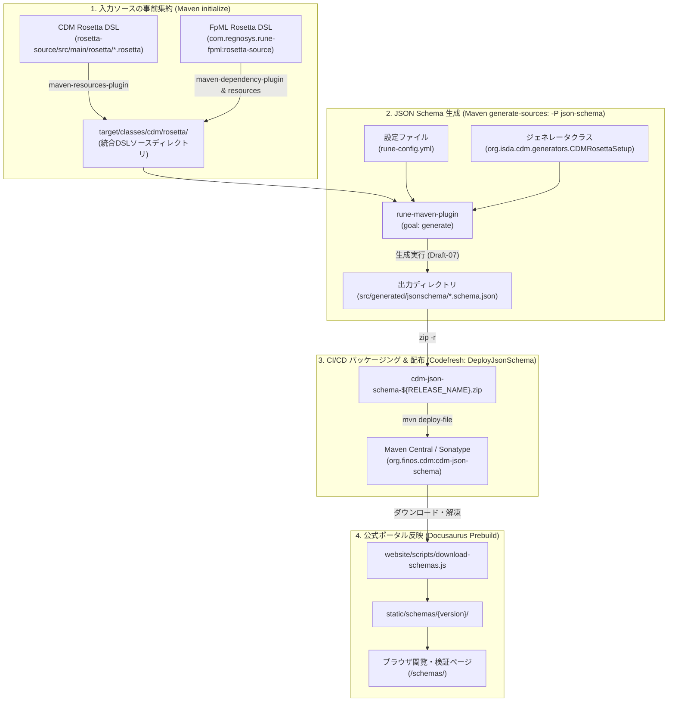

# Rune DSLからCDM JSON Schemaを生成する処理フローとパッケージング仕様

本ドキュメントは、FINOS Common Domain Model (CDM) において、Rune DSL（Rosetta DSL）定義から `cdm-json-schema`（Draft-07 準拠の JSON Schema ファイル群）を自動生成し、パッケージング・配布・Web ポータル公開に至る一連の処理フローについて、一次ソースに基づく仕様を整理した技術リファレンスです。

---

## 1. 処理フローの概要と一次ソース上の根拠

一次ソース（リポジトリ内）を調査した結果、Rune DSL から JSON Schema を生成する処理フローは、以下の一次ソースファイル群に完全に定義・実装されています。

| 構成要素 / フェーズ | 一次ソースファイル | 主要な定義内容 |
| :--- | :--- | :--- |
| **プラグイン依存関係定義** | [`pom.xml`](../../common-domain-model/pom.xml) | `rune-maven-plugin` (10.13.0) に対する `default-cdm-generators` (12.19.0) のプラグイン依存定義（Line 234–254） |
| **DSLソース集約** | [`rosetta-source/pom.xml`](../../common-domain-model/rosetta-source/pom.xml) | `maven-resources-plugin` による CDM および FpML DSL の `${project.build.directory}/classes/cdm/rosetta` へのコピー（Line 424–453） |
| **JSON Schema 生成プロファイル** | [`rosetta-source/pom.xml`](../../common-domain-model/rosetta-source/pom.xml) | `<id>json-schema</id>` プロファイル内の `rune-maven-plugin` 実行定義（Line 260–299） |
| **DSLジェネレータ設定** | [`rosetta-source/src/main/resources/rune-config.yml`](../../common-domain-model/rosetta-source/src/main/resources/rune-config.yml) | 生成対象ネームスペース（`cdm.*`, `com.rosetta.model`）およびシリアライズ形式（`RUNE_JSON`） |
| **CI/CD パッケージング & 配布** | [`codefresh.yml`](../../common-domain-model/codefresh.yml) | ビルド時プロファイル指定（Line 50, 62）および `DeployJsonSchema` ステップでの ZIP 化・Maven リポジトリへのデプロイ（Line 160–173） |
| **利用・配布ドキュメント** | [`docs/download.md`](../../common-domain-model/docs/download.md) | Maven Central への配布案内（Line 89–93） |
| **ポータルサイト同期スクリプト** | [`website/scripts/download-schemas.js`](../../common-domain-model/website/scripts/download-schemas.js) | Maven Central から ZIP を取得しドキュメントサイトに展開するスクリプト群 |

---

## 2. アーキテクチャ & 処理フロー図

以下のフロー図は、Rune DSL ソースコードから JSON Schema が生成され、ZIP パッケージングおよびポータル公開されるまでの全行程を示しています。



---

## 3. 各フェーズの詳細仕様

### 3.1 入力ソースの事前集約（Maven `initialize` フェーズ）

JSON Schema 生成を行う前段階として、CDM 本体の DSL ファイルと、外部依存関係である FpML DSL ファイルが 1 つの作業フォルダに集約されます。

- **FpML DSL の抽出**: `maven-dependency-plugin` が `com.regnosys.rune-fpml:rosetta-source` アーティファクトから `fpml/rosetta/*.rosetta` を `${project.build.directory}/parent-dependency/fpml/rosetta` に解凍します。
- **リソースコピー**: `maven-resources-plugin`（ID: `default-cli`）が以下を実行します：
  ```xml
  <execution>
      <id>default-cli</id>
      <phase>initialize</phase>
      <goals><goal>copy-resources</goal></goals>
      <configuration>
          <outputDirectory>${basedir}/target/classes/cdm/rosetta</outputDirectory>
          <resources>
              <resource>
                  <directory>${project.build.directory}/parent-dependency/fpml/rosetta</directory>
                  <includes><include>*.rosetta</include></includes>
              </resource>
              <resource>
                  <directory>src/main/rosetta</directory>
                  <includes><include>*.rosetta</include></includes>
              </resource>
          </resources>
      </configuration>
  </execution>
  ```

### 3.2 JSON Schema 自動生成（Maven `generate-sources` フェーズ）

JSON Schema の生成は、Maven プロファイル `json-schema`（`-P json-schema`）がアクティブな場合に実行されます。

- **実行プラグイン**: `org.finos.rune:rune-maven-plugin:10.13.0`
- **実行ゴール**: `generate`
- **セットアップクラス**: `org.isda.cdm.generators.CDMRosettaSetup`
- **POM 定義 (`rosetta-source/pom.xml`)**:
  ```xml
  <profile>
      <id>json-schema</id>
      <build>
          <plugins>
              <plugin>
                  <groupId>org.finos.rune</groupId>
                  <artifactId>rune-maven-plugin</artifactId>
                  <executions>
                      <execution>
                          <id>generate-json-schema-src</id>
                          <phase>generate-sources</phase>
                          <goals><goal>generate</goal></goals>
                          <configuration>
                              <runeConfig>${project.basedir}/src/main/resources/rune-config.yml</runeConfig>
                              <sourceRoots>
                                  <sourceRoot>${project.build.directory}/classes/cdm/rosetta</sourceRoot>
                              </sourceRoots>
                              <classPathLookupFilter>.*org[\\/]finos[\\/]rune[\\/]rune-runtime.*\.jar</classPathLookupFilter>
                              <incrementalXtextBuild>false</incrementalXtextBuild>
                              <languages>
                                  <language>
                                      <setup>org.isda.cdm.generators.CDMRosettaSetup</setup>
                                      <outputConfigurations>
                                          <outputConfiguration>
                                              <name>SRC_GEN_JSONSCHEMA_OUTPUT</name>
                                              <outputDirectory>src/generated/jsonschema</outputDirectory>
                                          </outputConfiguration>
                                      </outputConfigurations>
                                  </language>
                              </languages>
                          </configuration>
                      </execution>
                  </executions>
              </plugin>
          </plugins>
      </build>
  </profile>
  ```
- **ジェネレータエンジン**: `rune-maven-plugin` は、ルート POM の `pluginManagement` で指定された依存関係 `com.regnosys.rosetta.code-generators:default-cdm-generators:12.19.0` をクラスパス上に読み込み、`CDMRosettaSetup` をエントリポイントとして Xtext DSL モデルを走査します。
- **出力成果物**: `src/generated/jsonschema/` ディレクトリ配下に、CDM の Type ごとに Draft-07 形式の JSON Schema（例: `cdm-base-datetime.schema.json`、`cdm-event-common.schema.json` 等）が個別に出力されます。

### 3.3 CI/CD パイプラインにおけるパッケージング & デプロイ (`codefresh.yml`)

FINOS CDM の公式ビルド環境（Codefresh CI/CD）では、リリース時およびスナップショットビルド時に自動的に JSON Schema がパッケージング・デプロイされます。

1. **ビルドプロファイルの有効化**:
   - `MAVEN_BUILD_PROFILES="typescript,release,excel,json-schema"` を環境変数に設定し、`mvn clean install ... -P "${MAVEN_BUILD_PROFILES}"` を実行。
2. **ZIP アーカイブ化と Maven 配布**:
   - `DeployJsonSchema` ステージにおいて、生成物を ZIP 化し、POM を自動生成して Maven リポジトリ（Maven Central / Sonatype）へデプロイします。
   ```yaml
   DeployJsonSchema:
     stage: 'build'
     title: JSON Schema deploy
     fail_fast: false
     image: maven:3.9.11-eclipse-temurin-21-alpine
     working_directory: ./rosetta-source/
     shell: bash
     commands:
       - apk add --no-cache zip
       - bash -c "${{GPG_IMPORT_COMMAND}}"
       - cd src/generated
       - zip -r cdm-json-schema-${{RELEASE_NAME}}.zip jsonschema
       - ${{GEN_DEPLOY_POM_SCRIPT}} cdm-json-schema ${{RELEASE_NAME}} zip
       - ${{MVN_DEPLOY_FILE_COMMAND}}
   ```
   配付される Maven 座標:
   - `groupId`: `org.finos.cdm`
   - `artifactId`: `cdm-json-schema`
   - `packaging`: `zip`

### 3.4 Web ドキュメントポータルへの取り込み (`common-domain-model/website/`)

公式ポータルサイト（Docusaurus ベース）では、ビルド前の `prebuild` フックにおいて、Maven Central に公開された `cdm-json-schema` を自動取得してサイト内に統合します。

- **`scripts/schema-versions.js`**: 公開対象とするバージョン一覧（例: `6.0.0`, `5.20.0` 等）を集中管理。
- **`scripts/download-schemas.js`**: Maven Central の URL（`https://repo1.maven.org/maven2/org/finos/cdm/cdm-json-schema/${version}/...`）から ZIP をダウンロードして `static/schemas/{version}/` に解凍。
- **`scripts/generate-schema-indexes.js`**: 各バージョンごとの JSON Schema 一覧 HTML を自動生成。
- **公開エンドポイント**:
  - 各スキーマ: `https://cdm.finos.org/schemas/{version}/{schema-name}.schema.json`
  - ポータル一覧: `https://cdm.finos.org/schemas`

---

## 4. ジェネレータ実装の責務境界

一次ソースの構造上、コード生成ロジックの責務は以下のように明確に分離されています。

1. **CDM リポジトリ (`common-domain-model`) の責務**:
   - Rosetta (Rune) DSL ファイル（一次情報）の記述と保守。
   - Maven ビルド設定（`pom.xml`）による `rune-maven-plugin` の設定・入出力パス指定。
   - CI/CD パイプライン（`codefresh.yml`）によるビルド自動化・アーティファクト配布。
   - Web サイトにおけるスキーマの取り込みと公開。
2. **外部ジェネレータライブラリの責務**:
   - `rune-maven-plugin` / `rune-lang` / `rune-runtime` (`org.finos.rune`): DSL のパース・AST 構築・Xtext 連携基盤。
   - `default-cdm-generators` (`com.regnosys.rosetta.code-generators`): `CDMRosettaSetup` を含む、DSL から JSON Schema への具体的なマッピング・シリアライズロジックの実装。

---

## 5. 実機検証エビデンス（動的実行結果）

2026-09-24 に一次ソースの定義に基づき、実機環境において実際にコード生成コマンドを実行し、JSON Schema の生成を確認しました。

### 5.1 実行環境 & 実行コマンド
- **実行環境**: JDK 21.0.11 (Eclipse Adoptium), Apache Maven 3.9.9 (Windows 11)
- **カレントディレクトリ**: `common-domain-model/rosetta-source`
- **実行コマンド**:
  ```bash
  mvn generate-sources -P json-schema
  ```

### 5.2 実行結果サマリー
- **ビルドステータス**: `BUILD SUCCESS`（実行所要時間: 2分05秒）
- **出力先ディレクトリ**: [`src/generated/jsonschema/`](../../common-domain-model/rosetta-source/src/generated/jsonschema)
- **生成ファイル数**: **1,142 件** の `.schema.json` ファイルを出力
- **代表的生成ファイル例**:
  - `cdm-base-datetime-AdjustableDate.schema.json`
  - `cdm-event-common-TradeState.schema.json`
  - `cdm-product-asset-InterestRatePayout.schema.json`
  - `cdm-product-template-TradableProduct.schema.json`

### 5.3 生成スキーマの構造サンプル (`cdm-event-common-TradeState.schema.json`)
```json
{
  "$schema": "http://json-schema.org/draft-04/schema#",
  "$anchor": "cdm.event.common",
  "type": "object",
  "title": "TradeState",
  "description": "Defines the fundamental financial information that can be changed by a Primitive Event and by extension any business or life-cycle event...",
  "properties": {
    "trade": {
      "description": "Represents the Trade that has been effected by a business or life-cycle event.",
      "$ref": "cdm-event-common-Trade.schema.json"
    },
    "state": {
      "description": "Represents the State of the Trade through its life-cycle.",
      "$ref": "cdm-event-common-State.schema.json"
    },
    "resetHistory": {
      "type": "array",
      "items": {
        "$ref": "cdm-event-common-Reset.schema.json"
      },
      "minItems": 0
    }
  }
}
```
スキーマファイル間は `$ref` による相対ファイル参照でリンクされており、外部バリデータを用いた CDM JSON インスタンスの検証に即座に利用できる完全なスキーマセットが出力されていることが実証されました。

