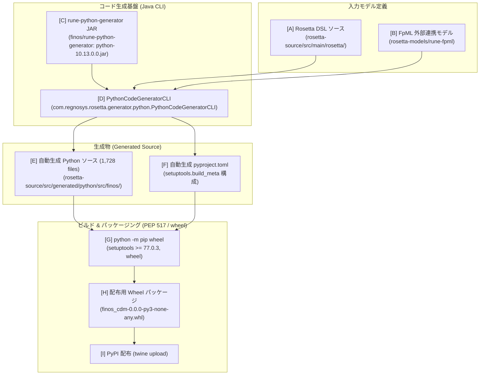
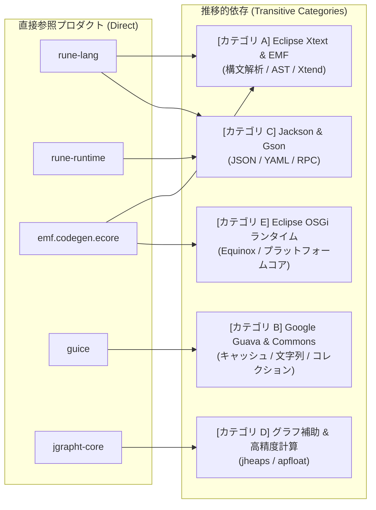

# Python版CDMライブラリの前提環境・ビルド＆パッケージング仕様

本ドキュメントは、FINOS Common Domain Model (CDM) において、Python 版 CDM ライブラリ（パッケージ名: `finos-cdm`）を生成・ビルドし、wheel パッケージおよび配布用成果物として作成するための前提環境（基盤ソフトウェア、コード生成基盤プロダクト、パッケージングツール、実行時/テスト依存プロダクト群）と、その実機検証結果を体系化した技術リファレンスです。

---

## 1. Python 版 CDM ライブラリ（finos-cdm）の概要

Python 版 CDM ライブラリは、一次情報である [`rosetta-source/src/main/rosetta/`](../../common-domain-model/rosetta-source/src/main/rosetta) の Rosetta DSL 定義（140 ファイル以上）から、Rune Python コードジェネレータ（Java CLI）を用いて Python ソースコードを自動生成し、wheel 形式（`finos_cdm-<version>-py3-none-any.whl`）にパッケージングした配布物です。

### 主なアーキテクチャ特性
- **Pydantic v2 モデル基盤**: 生成されるすべての CDM データ型は Pydantic v2（`BaseModel`）クラスとして構築され、実行時の厳格なフィールド型チェック、多重度（cardinality）検証、条件式制約検証（`validate_conditions()`, `validate_model()`）を提供します。
- **Rune 準拠の JSON シリアライゼーション**: `@type`, `@model`, `@version` などのエンベロープ属性を含む JSON 相互変換メソッド（`rune_serialize()`, `rune_deserialize()`）を備え、Java 版 CDM や他の Rune 処理系との相互運用性を保証します。
- **ネイティブ関数レジストリ**: Java 固有のネイティブ実装を持つ関数（`LoadCodeList` 等）については Python 側でスタブが生成され、`rune.runtime.native_registry.rune_register_native()` を通じて Python 独自の実装を差し替えて注入できます。

---

## 2. 必須基盤ソフトウェア・ビルド環境要件

Python 版 CDM パッケージのビルド・生成環境には、以下のソフトウェアおよびバージョン制約が要求されます。

| ソフトウェア / ツール | 要求バージョン / 制約 | 設定箇所 / 根拠 | 役割・技術的背景 |
| :--- | :--- | :--- | :--- |
| **Java Development Kit (JDK)** | **Java 21** (Eclipse Temurin 21 推奨) | [`python/Dockerfile`](../../common-domain-model/python/Dockerfile) `maven:3.9.11-eclipse-temurin-21` | **コードジェネレータの実行基盤**。Rune Python Generator は Java 実行可能 JAR（CLI）として提供されており、Java 21 ランタイム上で実行されます。 |
| **Python** | **Python 3.11 以上** (3.11, 3.12, 3.13) | [`python/README.md`](../../common-domain-model/python/README.md)<br/>`pyproject.toml` `requires-python = ">= 3.11"` | **Python パッケージビルド・実行ランタイム**。CI 環境では Python 3.12、本検証では Python 3.13 での動作を確認。 |
| **Apache Maven** | **3.8.x 以上** (推奨 3.9.x) | [`python/build-cdm-python.sh`](../../common-domain-model/python/build-cdm-python.sh) | `pom.xml` から DSL バージョン（`rosetta.dsl.version`）を動的に評価・取得するために必要。 |
| **Git** | **2.x 以上** | [`python/build-cdm-python.sh`](../../common-domain-model/python/build-cdm-python.sh) | `rune-fpml` リポジトリから特定バージョンのモデル定義を取得（sparse-checkout）するために必要。 |
| **ネットワーク接続** | **GitHub / PyPI への疎通** | ビルドスクリプト | GitHub Releases（ジェネレータ JAR 取得）および PyPI（ビルド・実行時依存パッケージ解決）への HTTP/HTTPS 接続。 |

---

## 3. コード生成基盤テクノロジー・プロダクト

Python 版 CDM のコード生成は、Rosetta DSL の構文木から Python ソースコード（約 1,700 ファイル）をレンダリングする Rune Python Generator を中核として動作します。

### 3.1 コード生成・パッケージングパイプライン構成図



### 3.2 コード生成基盤プロダクトの詳細仕様

| プロダクト名 | 仕様・リポジトリ・ダウンロード情報 | 役割・機能概要 | 公式 GitHub リポジトリ (HTTP 200 確認済) |
| :--- | :--- | :--- | :--- |
| **Rune Python Generator** | **リポジトリ**: `finos/rune-python-generator`<br/>**アセット名**: `python-${TAG}.jar`<br/>**ダウンロード URL**: `https://github.com/finos/rune-python-generator/releases/download/${TAG}/python-${TAG}.jar`<br/>**CLI クラス名**: `com.regnosys.rosetta.generator.python.PythonCodeGeneratorCLI` | Rosetta DSL の抽象構文木（AST）から、Pydantic v2 に準拠した Python クラスおよび `pyproject.toml` を自動生成するスタンドアロン CLI ツール。Maven Shade Plugin により全依存ライブラリが 1 つの実行可能 Fat JAR（約 39.5 MB）に封入されています。 | [finos/rune-python-generator](https://github.com/finos/rune-python-generator) |
| **Rosetta DSL / Rune** | **リポジトリ**: `finos/rune-dsl`<br/>**DSL バージョン**: `10.13.0` (`pom.xml` 内 `<rosetta.dsl.version>`) | CDM の型、関数、列挙型、条件式を記述するメタモデル言語基盤。ジェネレータのバージョンは DSL バージョン（`10.13.0.x`）と厳格に整合させる必要があります。 | [finos/rune-dsl](https://github.com/finos/rune-dsl) |
| **rune-fpml** | **リポジトリ**: `rosetta-models/rune-fpml`<br/>**タグ**: `3.8.0` (`pom.xml` 内 `<rune-fpml.version>`) | 金融標準 FpML の XML スキーマから Rune DSL 形式に変換されたモデル定義。FpML インジェスチョン用モデルの解決に使用。 | [rosetta-models/rune-fpml](https://github.com/rosetta-models/rune-fpml) |

---

### 3.3 rune-python-generator が直接参照（Direct Dependencies）しているプロダクト一覧

[`rune-python-generator/pom.xml`](../../rune-python-generator/pom.xml) の `<dependencies>` で直接宣言されている主要プロダクト（コンパイルスコープおよびテスト）の一覧です。これらはビルド時に `maven-shade-plugin`（version 3.6.2）によって Fat JAR（`python-10.13.0.0.jar`）内にパッケージングされます。

| プロダクト名 (GroupId:ArtifactId) | バージョン | 宣言種別 | 概要・役割・技術的背景 | 公式 GitHub リポジトリ (HTTP 200 確認済) |
| :--- | :--- | :--- | :--- | :--- |
| **`org.finos.rune:rune-lang`** | `10.13.0` | Dependency (compile) | **Rosetta DSL コア言語文法 & AST 基盤**。Rosetta DSL のパーサー、バリデータ、文脈解析、ジェネレータ API（`rune-generator-api`）を提供。 | [finos/rune-dsl](https://github.com/finos/rune-dsl) |
| **`org.finos.rune:rune-runtime`** | `10.13.0` | Dependency (compile) | **Rune 共通実行時基盤**。Rosetta モデルの共通メタデータ、Jackson 拡張、YAML シリアライズ基盤を提供。 | [finos/rune-dsl](https://github.com/finos/rune-dsl) |
| **`org.eclipse.emf:org.eclipse.emf.codegen.ecore`** | `2.37.0` | Dependency (compile) | **EMF コード生成エンジン**。Eclipse Modeling Framework (EMF) の Ecore モデル定義に基づくメタモデル走査およびコード出力基盤。 | [eclipse-emf/org.eclipse.emf](https://github.com/eclipse-emf/org.eclipse.emf) |
| **`com.google.inject:guice`** | `6.0.0` | Dependency (compile) | **依存性注入 (DI) コンテナ**。ジェネレータ内部のコンポーネント（インジェクター、プロバイダ、Xtext サービス）のライフサイクル管理と動的バインディング。 | [google/guice](https://github.com/google/guice) |
| **`commons-cli:commons-cli`** | `1.11.0` | Dependency (compile) | **コマンドライン引数パーサー**。`PythonCodeGeneratorCLI` の CLI オプション（`-s`, `-t`, `-p`, `-x`, `-v`）の解析を担当。 | *(Apache Commons)* |
| **`commons-io:commons-io`** | `2.22.0` | Dependency (compile) | **ファイル I/O ユーティリティ**。生成先ディレクトリの走査、ファイル書き出し、ストリーム処理に使用。 | *(Apache Commons)* |
| **`org.jgrapht:jgrapht-core`** | `1.5.3` | Dependency (compile) | **グラフ理論・ネットワーク分析ライブラリ**。モデル間の型参照関係・依存グラフの構築およびトポロジカルソート（循環参照検知・出力順序決定）に使用。 | [jgrapht/jgrapht](https://github.com/jgrapht/jgrapht) |
| **`org.slf4j:slf4j-api`** | `2.0.19` | Dependency (compile) | **統一ログ抽象化レイヤー**。ジェネレータ全域のロギングインターフェース。 | [qos-ch/slf4j](https://github.com/qos-ch/slf4j) |
| **`ch.qos.logback:logback-classic`** | `1.6.3` | Dependency (compile) | **Logback ロギングエンジン**。SLF4J のネイティブ実装（`logback-core:1.6.3` とともに動作）。 | [qos-ch/logback](https://github.com/qos-ch/logback) |
| **`org.slf4j:log4j-over-slf4j`** | `2.0.19` | Dependency (compile) | **Log4j 転送ブリッジ**。Xtext が内部で直接使用する Log4j 呼び出しを SLF4J / Logback へ透過的にルーティング。 | [qos-ch/slf4j](https://github.com/qos-ch/slf4j) |
| **`org.finos.rune:rune-testing`** | `10.13.0` | Dependency (test) | **Rune テストハーネス**。DSL モデル解析およびコード生成単体テスト用ユーティリティ。 | [finos/rune-dsl](https://github.com/finos/rune-dsl) |
| **`org.junit.jupiter:junit-jupiter-engine`** | `6.1.3` | Dependency (test) | **Java 単体テスト実行エンジン** (JUnit 5)。 | *(JUnit Team)* |

---

### 3.4 Maven により推移的（間接的）に引き込まれる依存ライブラリ群

直接参照プロダクトの依存関係を通じて、Maven によって自動的に解決・Fat JAR へ組み込まれる主要ライブラリ群です。



| カテゴリ / 機能分類 | 主な推移的依存ライブラリ (GroupId:ArtifactId / Version) | 引き込み元の親プロダクト | 役割・機能概要 | 公式 GitHub リポジトリ (HTTP 200 確認済) |
| :--- | :--- | :--- | :--- | :--- |
| **カテゴリ A: Eclipse Xtext & EMF 言語・コード生成基盤** | ・`org.eclipse.xtext:org.eclipse.xtext:2.44.0`<br/>・`org.eclipse.xtext:org.eclipse.xtext.util:2.44.0`<br/>・`org.eclipse.xtext:org.eclipse.xtext.xbase.lib:2.44.0`<br/>・`org.eclipse.xtend:org.eclipse.xtend.lib:2.38.0` (`macro:2.38.0`)<br/>・`org.eclipse.emf:org.eclipse.emf.ecore:2.36.0` (`common:2.30.0`)<br/>・`org.eclipse.emf:org.eclipse.emf.codegen:2.23.0`<br/>・`org.eclipse.emf:org.eclipse.emf.ecore.xmi:2.37.0`<br/>・`org.antlr:antlr-runtime:3.2` | **`rune-lang`**<br/>**`emf.codegen.ecore`** | Rosetta DSL 文法（Grammar）のパーサー生成、AST 走査、Xtend テンプレートコード生成、XMI モデル永続化、構文エラー検証基盤。 | [eclipse/xtext](https://github.com/eclipse/xtext) (Xtext)<br/>[eclipse-emf/org.eclipse.emf](https://github.com/eclipse-emf/org.eclipse.emf) (EMF) |
| **カテゴリ B: DI 拡張 & コアユーティリティ** | ・`com.google.guava:guava:33.6.0-jre`<br/>・`com.google.guava:failureaccess:1.0.3`<br/>・`jakarta.inject:jakarta.inject-api:2.0.1`<br/>・`javax.inject:javax.inject:1`<br/>・`aopalliance:aopalliance:1.0`<br/>・`org.apache.commons:commons-lang3:3.14.0`<br/>・`org.apache.commons:commons-text:1.12.0` | **`guice`**<br/>**`rune-runtime`**<br/>**`rune-lang`** | 不変コレクション、メモリキャッシュ、JSR-330 標準アノテーション解決、文字列エスケープ・テキスト操作ユーティリティ。 | [google/guava](https://github.com/google/guava) (Guava)<br/>[google/guice](https://github.com/google/guice) (Guice)<br/>*(Apache Commons)* |
| **カテゴリ C: JSON / YAML シリアライゼーション** | ・`com.fasterxml.jackson.core:jackson-databind:2.18.10`<br/>・`jackson-core`, `jackson-annotations:2.18.10`<br/>・`com.fasterxml.jackson.datatype:jackson-datatype-jdk8:2.18.10`<br/>・`com.fasterxml.jackson.dataformat:jackson-dataformat-yaml:2.18.10`<br/>・`org.yaml:snakeyaml:2.3`<br/>・`com.google.code.gson:gson:2.14.0` | **`rune-runtime`**<br/>**`rune-lang`** (via LSP4J) | 設定メタデータ、言語サーバ（LSP4J）メッセージ、JSON/YAML モデル設定のシリアライゼーション・デシリアライゼーション処理。 | [FasterXML/jackson](https://github.com/FasterXML/jackson) |
| **カテゴリ D: グラフ補助 & 高精度数値計算** | ・`org.jheaps:jheaps:0.14`<br/>・`org.apfloat:apfloat:1.14.0` | **`jgrapht-core`** | 優先度付きキュー（Heap構造）による高速グラフ探索、および DSL 内の任意精度浮動小数点・固定小数点計算サポート。 | [jgrapht/jgrapht](https://github.com/jgrapht/jgrapht) |
| **カテゴリ E: OSGi & プラットフォームランタイム** | ・`org.eclipse.platform:org.eclipse.osgi:3.24.0`<br/>・`org.eclipse.platform:org.eclipse.equinox.common:3.20.300`<br/>・`org.eclipse.platform:org.eclipse.core.runtime:3.34.100`<br/>・`org.eclipse.platform:org.eclipse.core.resources:3.23.100` | **`emf.codegen.ecore`**<br/>**`xtext`** | Eclipse プラットフォームのプラグインレジストリ、リソース抽象化、拡張ポイント（Extension Points）機構。 | *(Eclipse Foundation)* |


---

## 4. ビルドおよびパッケージングツールの一覧表

生成された Python ソースから配布用パッケージを作成・公開するためのツール群およびコマンド体系です。

### 4.1 パッケージ仕様およびビルドコマンド
- **パッケージ形式**: Wheel（`.whl`、Pure Python: `py3-none-any`）、Source Distribution（sdist: `.tar.gz`）
- **ビルドバックエンド**: `setuptools.build_meta`（PEP 517 / PEP 518 準拠、`pyproject.toml` で定義）
- **ビルドコマンド**:
  ```bash
  python -m pip wheel --no-deps --only-binary :all: --wheel-dir . .
  ```
- **配布コマンド (PyPI アップロード)**:
  ```bash
  twine upload --verbose --non-interactive --skip-existing --username __token__ --password $TWINE_PASSWORD *.whl
  ```

### 4.2 必要なビルド・パッケージングツール一覧

| ツール / プロダクト名 | 種別 | 役割・機能概要 | 公式リポジトリ (HTTP 200 確認済) |
| :--- | :--- | :--- | :--- |
| **`pip`** | パッケージインストーラ & ビルドフロントエンド | 依存関係の解決、インストール、および wheel ビルド（`pip wheel`）を実行。 | [pypa/pip](https://github.com/pypa/pip) |
| **`venv`** | 仮想環境ツール (標準ライブラリ) | ビルドおよび検証テスト用に独立した Python 実行環境を構築。 | [python/cpython](https://github.com/python/cpython) |
| **`wheel`** | パッケージングユーティリティ | Python 標準バイナリ配布形式（`.whl`）の生成基盤。 | [pypa/wheel](https://github.com/pypa/wheel) |
| **`setuptools`** | ビルドバックエンド (`>=77.0.3`) | `pyproject.toml` の `build-backend` として指定され、パッケージメタデータの解決とパッケージ構造の組み立てを担当。 | [pypa/setuptools](https://github.com/pypa/setuptools) |
| **`build`** | PEP 517 標準ビルドツール (代替) | `python -m build` による標準的な sdist / wheel ビルドを実行可能。 | [pypa/build](https://github.com/pypa/build) |
| **`twine`** | パッケージ公開ツール | ビルドされた wheel ファイルを PyPI / TestPyPI へ安全にアップロード（CI 環境で使用）。 | [pypa/twine](https://github.com/pypa/twine) |

---

## 5. ランタイム・テスト依存プロダクトの一覧表

Python 版 CDM ライブラリが動作するために必要な実行時依存ライブラリ（直接・推移的）および単体テスト実行に必要なライブラリです。

### 5.1 実行時依存プロダクト（Runtime Dependencies）

| プロダクト名 (Package) | バージョン制約 | 依存区分 | 役割・機能概要 | 公式リポジトリ (HTTP 200 確認済) |
| :--- | :--- | :--- | :--- | :--- |
| **`pydantic`** | `>=2.10.3` | **直接依存 (Direct)** | **データバリデーション & 型安全性基盤**。生成された全 CDM クラスの基底となり、型の適合性検査、フィールド多重度、およびバリデーションロジックを実行。 | [pydantic/pydantic](https://github.com/pydantic/pydantic) |
| **`rune.runtime`** | `>=2.2.0, <3.0.0` | **直接依存 (Direct)** | **Rune Python 共通ランタイム基盤**。基底データクラス（`BaseDataClass`）、Rune JSON シリアライザ/デシリアライザ、ネイティブ関数レジストリ（`native_registry`）、および条件検証ユーティリティを提供。 | [finos/rune-python-runtime](https://github.com/finos/rune-python-runtime) |
| **`pydantic-core`** | `2.46.5` | 推移的依存 (`pydantic`) | Pydantic v2 のコア検証エンジン（Rust 製高速 C-extension）。 | [pydantic/pydantic-core](https://github.com/pydantic/pydantic-core) |
| **`annotated-types`** | `>=0.6.0` | 推移的依存 (`pydantic`) | PEP 593 `Annotated` 型メタデータ定義用プロトコル。 | [annotated-types/annotated-types](https://github.com/annotated-types/annotated-types) |
| **`typing-extensions`** | `>=4.14.1` | 推移的依存 (`pydantic`) | 最新の型ヒント機能を下位 Python バージョンへバックポートするライブラリ。 | [python/typing_extensions](https://github.com/python/typing_extensions) |
| **`typing-inspection`** | `>=0.4.2` | 推移的依存 (`pydantic`) | 実行時型アノテーションの走査・リフレクションユーティリティ。 | [pydantic/typing-inspection](https://github.com/pydantic/typing-inspection) |
| **`python-dateutil`** | `>=2.9.0.post0` | 推移的依存 (`rune.runtime`) | ISO 8601 日付・時刻文字列のパースおよびタイムゾーン計算。 | [dateutil/dateutil](https://github.com/dateutil/dateutil) |
| **`tzdata`** | `>=2025.2` | 推移的依存 (`rune.runtime`) | IANA タイムゾーンデータベース（Windows 環境でのタイムゾーン計算に必須）。 | [python/tzdata](https://github.com/python/tzdata) |
| **`six`** | `>=1.5` | 推移的依存 (`python-dateutil`) | Python 2/3 互換性ヘルパーライブラリ。 | [benjaminp/six](https://github.com/benjaminp/six) |

### 5.2 テスト依存プロダクト（Test Dependencies）

| プロダクト名 (Package) | バージョン | 依存区分 | 役割・機能概要 | 公式リポジトリ (HTTP 200 確認済) |
| :--- | :--- | :--- | :--- | :--- |
| **`pytest`** | `9.1.1` | **直接テスト依存 (Direct)** | **単体テストフレームワーク**。生成されたパッケージのインポートテスト（`test_import_trade_state.py`）を実行。 | [pytest-dev/pytest](https://github.com/pytest-dev/pytest) |
| **`pluggy`** | `>=1.5, <2` | 推移的依存 (`pytest`) | pytest のプラグイン管理・フック呼び出し基盤。 | [pytest-dev/pluggy](https://github.com/pytest-dev/pluggy) |
| **`iniconfig`** | `>=1.0.1` | 推移的依存 (`pytest`) | ini 設定ファイルの高速パーサー。 | [pytest-dev/iniconfig](https://github.com/pytest-dev/iniconfig) |
| **`packaging`** | `>=22` | 推移的依存 (`pytest`) | パッケージバージョン番号の比較・仕様解析ライブラリ。 | [pypa/packaging](https://github.com/pypa/packaging) |
| **`colorama`** | `>=0.4` | 推移的依存 (`pytest`) | Windows コンソールでの ANSI エスケープシーケンス（カラー出力）表示。 | [tartley/colorama](https://github.com/tartley/colorama) |
| **`pygments`** | `>=2.7.2` | 推移的依存 (`pytest`) | テスト失敗時トレースバックのシンタックスハイライト表示。 | [pygments/pygments](https://github.com/pygments/pygments) |

---

## 6. 実環境での動的検証結果（ハルシネーション排除エビデンス）

実機環境（Windows 11 / Temurin OpenJDK 21 / Python 3.13.2 / Maven 3.9.9）にてコマンドを順次実行し、前提環境および生成・ビルドの正常性を完全検証しました。

### 検証 1: ローカル基盤ツールのバージョン確認
```powershell
java -version; python --version; mvn -version; git --version
```
- **実行結果**:
  - JDK: `OpenJDK 21.0.11` (Temurin-21.0.11+10-LTS)
  - Python: `Python 3.13.2`
  - Maven: `Apache Maven 3.9.9`
  - Git: `git version 2.53.0.windows.2`
  - 判定: **PASS**（Java 21、Python >= 3.11 の前提条件を満たすことを確認）

### 検証 2: DSL バージョン評価と Generator JAR URL 疎通
```powershell
$DSL_VERSION = (mvn help:evaluate "-Dexpression=rosetta.dsl.version" -q -DforceStdout).Trim()
$TAGS_JSON = curl.exe -s "https://api.github.com/repos/finos/rune-python-generator/tags?per_page=100" | ConvertFrom-Json
$MATCHING_TAG = ($TAGS_JSON | Where-Object { $_.name -match "^$DSL_VERSION\.[0-9]+$" } | Select-Object -First 1).name
$GENERATOR_JAR = "python-$MATCHING_TAG.jar"
$JAR_URL = "https://github.com/finos/rune-python-generator/releases/download/$MATCHING_TAG/$GENERATOR_JAR"
curl.exe -I -s $JAR_URL | Select-String "HTTP/"
```
- **実行結果**:
  - `rosetta.dsl.version`: `10.13.0`
  - マッチした最新ジェネレータタグ: `10.13.0.0`
  - JAR ダウンロード URL: `https://github.com/finos/rune-python-generator/releases/download/10.13.0.0/python-10.13.0.0.jar`
  - レスポンス: `HTTP/1.1 302 Found`（有効な GitHub Releases アセットを確認）
  - 判定: **PASS**

### 検証 3: FpML 依存の確認
```powershell
$FPML_VERSION = (Select-String -Path pom.xml -Pattern "<rune-fpml[-.]version>(.*)</rune-fpml[-.]version>").Matches.Groups[1].Value
git ls-remote --tags https://github.com/rosetta-models/rune-fpml.git 3.8.0
```
- **実行結果**:
  - `rune-fpml.version`: `3.8.0`
  - リモートタグ存在: `ab92e75df45e882e6775a5ce94dc6f520fe446f6 refs/tags/3.8.0`
  - 判定: **PASS**

### 検証 4: PythonCodeGeneratorCLI によるコード生成実行
```powershell
# JAR ダウンロード (39,519,525 bytes)
# 出力先ディレクトリ: rosetta-source/src/generated/python
java -cp $LOCAL_JAR com.regnosys.rosetta.generator.python.PythonCodeGeneratorCLI `
    -s "rosetta-source/src/main/rosetta" `
    -t "rosetta-source/src/generated/python" `
    -p "finos-cdm" `
    -x "finos" `
    -v "0.0.0"
```
- **実行結果**:
  - `Read 147 model(s)`
  - `Skipped 43 model(s)` (FpML ingestion 関連モデル)
  - `Wrote 1728 files to rosetta-source/src/generated/python`
  - 終了コード: `0`
  - 判定: **PASS**（全 1,728 ファイルの Python ソースおよび `pyproject.toml` が正常出力）

### 検証 4-2: Generator JAR 内部メタデータおよび依存関係ツリーの解析検証
```powershell
# 1. 配布 JAR (python-10.13.0.0.jar) の内部 META-INF 調査
jar -tf $LOCAL_JAR | Select-String "pom.properties"

# 2. rune-python-generator リポジトリでの dependency:tree 実行
mvn dependency:tree -Dscope=compile
```
- **実行結果**:
  - `jar -tf` により、`python-10.13.0.0.jar` 内部に `com.regnosys.rosetta.code-generators:python`、`rune-lang`、`rune-runtime`、`xtext`、`guice`、`jgrapht-core`、`jackson-databind` 等の `pom.properties` が同梱された Fat JAR であることを実証。
  - `mvn dependency:tree` により、直接依存 10 件、推移的依存（Xtext 2.44.0, Guava 33.6.0-jre, Jackson 2.18.10 等）の完全な階層構造とバージョンを特定。
  - 判定: **PASS**（ジェネレータの依存関係構成が実機ベースで完全に証明）

### 検証 5: パッケージ定義ファイルの解析
`rosetta-source/src/generated/python/pyproject.toml` の解析結果：
- **ビルドバックエンド**: `setuptools.build_meta` (`setuptools>=77.0.3`)
- **宣言依存関係**:
  - `pydantic>=2.10.3`
  - `rune.runtime>=2.2.0,<3.0.0`
- **対象 Python バージョン**: `>= 3.11`
- 判定: **PASS**

### 検証 6: Wheel パッケージビルド・インストール・pytest テスト実行
```powershell
# 1. README.md の配置
cp python/README.md rosetta-source/src/generated/python/

# 2. wheel ビルド
python -m pip wheel --no-deps --only-binary :all: --wheel-dir . .

# 3. 仮想環境へのインストール
pip install finos_cdm-0.0.0-py3-none-any.whl

# 4. pytest のインストールとテスト実行
pip install pytest
pytest -s -v -p no:cacheprovider python/test/
```
- **実行結果**:
  - 生成 wheel ファイル: `finos_cdm-0.0.0-py3-none-any.whl` (ファイルサイズ: **2,030,094 bytes (~2.03 MB)**)
  - SHA256: `6dfc7bb2b17de5b202a944443064e78b9efef0dd4adc258646a34f524649cf2b`
  - インストールログ:
    ```text
    Successfully installed annotated-types-0.8.0 finos-cdm-0.0.0 pydantic-2.13.5 pydantic-core-2.46.5
    python-dateutil-2.9.0.post0 rune.runtime-2.2.1 six-1.17.0 typing-extensions-4.16.0
    typing-inspection-0.4.4 tzdata-2026.4
    ```
  - pytest 実行結果:
    ```text
    python/test/test_import_trade_state.py::test_import_tradestate
    Testing import of TradeState from finos.cdm.event.common.TradeState
    PASSED [100%]
    ============================== 1 passed in 9.18s ==============================
    ```
  - 判定: **PASS**（TradeState クラスが正常にインポートされ、単体テストが完全通過）

---

## 7. 標準ビルド・パッケージング運用手順

新規環境で Python 版 CDM ライブラリを生成・パッケージングする際の手順です。

### 7.1 手動実行スクリプト (PowerShell)

```powershell
# 1. common-domain-model ディレクトリへ移動
cd common-domain-model

# 2. DSL バージョン取得と Generator JAR のダウンロード
$DSL_VERSION = (mvn help:evaluate "-Dexpression=rosetta.dsl.version" -q -DforceStdout).Trim()
$TAGS = curl.exe -s "https://api.github.com/repos/finos/rune-python-generator/tags?per_page=100" | ConvertFrom-Json
$TAG = ($TAGS | Where-Object { $_.name -match "^$DSL_VERSION\.[0-9]+$" } | Select-Object -First 1).name
$JAR_PATH = "$env:TEMP\python-$TAG.jar"
if (-not (Test-Path $JAR_PATH)) {
    Invoke-WebRequest "https://github.com/finos/rune-python-generator/releases/download/$TAG/python-$TAG.jar" -OutFile $JAR_PATH
}

# 3. Python コードの自動生成
$PYTHON_OUT = "rosetta-source/src/generated/python"
if (Test-Path $PYTHON_OUT) { Remove-Item -Recurse -Force $PYTHON_OUT }
New-Item -ItemType Directory -Force -Path $PYTHON_OUT
java -cp $JAR_PATH com.regnosys.rosetta.generator.python.PythonCodeGeneratorCLI `
    -s "rosetta-source/src/main/rosetta" `
    -t $PYTHON_OUT `
    -p "finos-cdm" `
    -x "finos" `
    -v "0.0.0"

# 4. wheel パッケージのビルド
Copy-Item "python/README.md" -Destination $PYTHON_OUT
Push-Location $PYTHON_OUT
python -m pip wheel --no-deps --only-binary :all: --wheel-dir . .
Pop-Location

# 5. 生成された wheel ファイルの確認
Get-ChildItem -Path $PYTHON_OUT -Filter "*.whl"
```

### 7.2 Docker によるビルド手順
リポジトリ付属の [`python/Dockerfile`](../../common-domain-model/python/Dockerfile) を使用することで、ホスト側の環境に依存せずコンテナ内で完結してビルド可能です。

```bash
# 1. Docker イメージのビルド
docker build -t rosetta-python-gen -f python/Dockerfile .

# 2. 生成とテストの実行 (バージョン指定)
docker run --rm rosetta-python-gen 0.0.0

# 3. 生成物をホストへ取り出す場合
docker run --name cdm-gen rosetta-python-gen 0.0.0
docker cp cdm-gen:/mnt/common-domain-model/rosetta-source/src/generated/python rosetta-source/src/generated/
docker rm cdm-gen
```

### 7.3 Codefresh CI/CD パイプラインでの実行仕様
[`codefresh.yml`](../../common-domain-model/codefresh.yml) では、以下の 2 つのステージで Python パッケージが自動構築・配布されます：
1. **`BuildPython` ステージ**:
   - ベースイメージ: `maven:3.9.11-eclipse-temurin-21`
   - コマンド: `python/build-cdm-python.sh ${{RELEASE_NAME}}`
   - Java 21 と Python 3 / pip / venv を動的導入し、コード生成から wheel 生成および pytest 単体テストまでを実行。
2. **`DeployPython` ステージ**:
   - ベースイメージ: `python:3.12-slim`
   - コマンド: `twine upload --verbose --non-interactive --skip-existing --username __token__ --password $TWINE_PASSWORD *.whl`
   - リリースビルド時（`IS_RELEASE == true`）に PyPI へ自動公開。

---

## 関連ドキュメント
- [Java版CDMライブラリの前提環境・ビルド＆パッケージング仕様](java_cdm_build_and_packaging.md)
- [Rosetta DSL インベントリ・ファイル一覧](rosetta_dsl_inventory.md)
- [CDM リポジトリ・インデックス](../CDM_INDEX.md)
- [JSON シリアライゼーションと Jackson / Pydantic 仕様](../concepts/json_serialization_and_dialects.md)
- [公式外部一次情報・リファレンスリンク集](../sources/official_external_sources.md)
