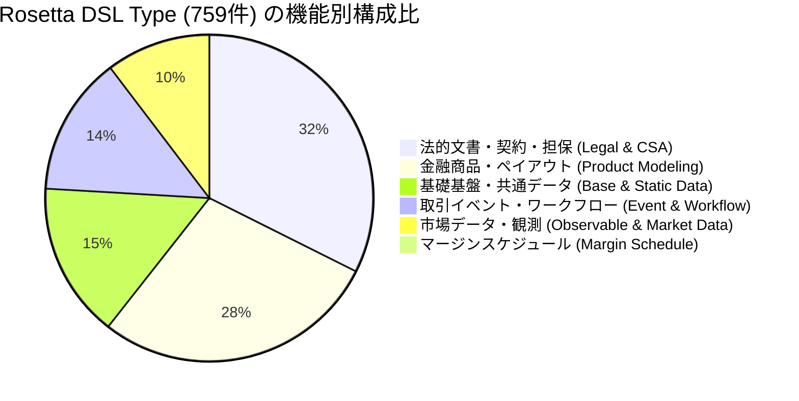
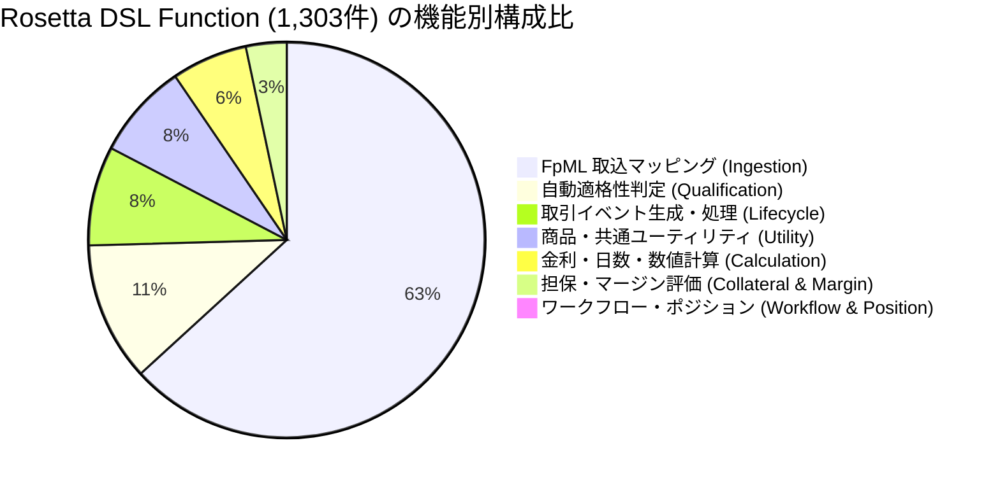
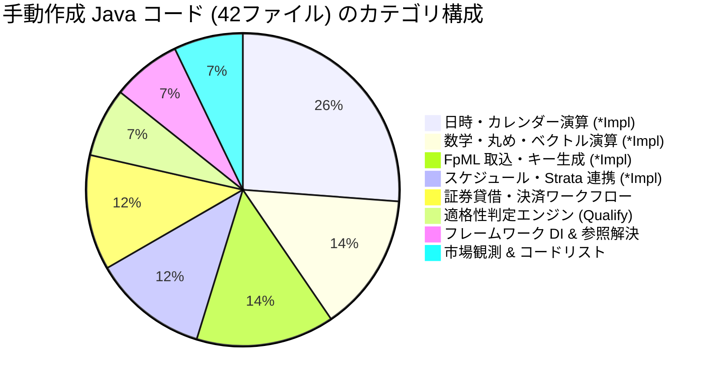

# Rosetta DSL 型・関数・列挙型の分類別メトリクス & カタログ

FINOS Common Domain Model (CDM) の Rosetta DSL 定義ファイル群（145 ファイル）に含まれるすべての `type`（データ型）、`func`（関数）、`enum`（列挙型）の網羅的集計とカテゴリ別分類カタログです。

---

## 1. 全体サマリー

| 項目 | 定義数 | 構成比・補足 |
|---|---|---|
| **総 DSL ファイル数** | **145** ファイル | `rosetta-source/src/main/rosetta/` 配下の全 `.rosetta` ファイル |
| **総 Type（型定義）数** | **759** 型 | 金融商品、法的契約、ライフサイクル、市場データ等のデータ構造 |
| **総 Function（関数定義）数** | **1,303** 関数 | FpML マッピング、商品・イベント自動判定、ライフサイクル処理、計算等 |
| **総 Enum（列挙型）数** | **279** 列挙型 | コードリスト、ビジネスセンター、金融用語定数等 |

---

## 2. ドメインプレフィックス（レイヤー）別集計

Rosetta DSL ファイルの命名規則プレフィックスに基づく 7 つの主要ドメイン別の集計です。

| ドメイン（プレフィックス） | ファイル数 | Type 数 | Function 数 | Enum 数 | 主な対象領域・名前空間 |
|---|---|---|---|---|---|
| **`ingest-fpml-`** | 44 | **0** | **817** | 0 | FpML XML メッセージから CDM へのデータ抽出・変換・マッピング関数群 |
| **`product-`** | 24 | **213** | **188** | 56 | 金融商品（IRS, CDS, オプション, コモディティ等）、ペイアウト、決済、適格性判定 |
| **`legaldocumentation-`** | 17 | **245** | **5** | 74 | ISDA/ICMA/ISLA マスター契約、CSA 担保契約、取引追記条項 |
| **`base-`** | 26 | **116** | **90** | 75 | 日時、営業日、日数計算、数学関数、当事者(Party)、識別子、共通資産データ |
| **`event-`** | 16 | **104** | **151** | 35 | 取引イベント（約定、更改、清算等）、状態遷移(TradeState)、ワークフロー、ポジション |
| **`observable-`** | 15 | **78** | **29** | 37 | 参照金利(FRO: SOFR/TONA等)、複利計算、市場観測イベント、価格・数量(PriceQuantity) |
| **`margin-schedule-`** | 3 | **3** | **23** | 2 | 規制証拠金（Initial Margin / Variation Margin）計算スケジュール |
| **合計** | **145** | **759** | **1,303** | **279** | |

---

## 3. Type（型定義：759件）のビジネス機能別分類

### 3.1 法的文書・契約・担保 (Legal Documentation & CSA): 245 型 (32.3%)
- **CSA 担保契約** (`cdm.legaldocumentation.csa`): **162 型**（適格担保資産、ヘアカット、担保評価条件等）
- **取引追記条件・契約条項** (`cdm.legaldocumentation.transaction*`): **32 型**
- **マスター契約** (`cdm.legaldocumentation.master*`): **30 型**（ISDA 2002/1992, ICMA GMRA, ISLA GMSLA）
- **法務共通** (`cdm.legaldocumentation.common`): **21 型**

### 3.2 金融商品・ペイアウト (Product Modeling & Payout): 213 型 (28.1%)
- **商品テンプレート・構造** (`cdm.product.template`): **58 型**（`TradableProduct`, `EconomicTerms`, `Payout` 等）
- **資産・ペイアウト構造** (`cdm.product.asset`): **53 型**（`InterestRatePayout`, `EquityPayout`, `CommodityPayout` 等）
- **担保仕様** (`cdm.product.collateral`): **39 型**（`Collateral`, `CollateralPortfolio` 等）
- **決済条件・受渡方法** (`cdm.product.common.settlement`): **30 型**（`SettlementTerms`, `CashSettlementTerms` 等）
- **計算期間・支払スケジュール** (`cdm.product.common.schedule`): **29 型**（`CalculationPeriodDates`, `PaymentSchedule` 等）
- **浮動金利定義** (`cdm.product.asset.floatingrate`): **4 型**（`FloatingRateSpecification` 等）

### 3.3 基礎基盤・共通データ (Base & Static Data): 116 型 (15.3%)
- **日時・カレンダー・期間** (`cdm.base.datetime`): **32 型**（`BusinessCenterTime`, `AdjustableDate`, `Frequency` 等）
- **共通資産参照** (`cdm.base.staticdata.asset.common`): **31 型**（`Asset`, `Security`, `Commodity` 等）
- **取引当事者・法人識別子** (`cdm.base.staticdata.party`, `cdm.base.staticdata.identifier`): **28 型**（`Party`, `PartyRole`, `LegalEntity`, `Identifier` 等）
- **数学仕様・端数処理** (`cdm.base.math`): **19 型**（`Rounding`, `Quantity` 等）
- **その他コードリスト・クレジット** (`cdm.base.staticdata.*`): **6 型**

### 3.4 取引イベント・ライフサイクル (Lifecycle & Workflow): 104 型 (13.7%)
- **取引イベント共通** (`cdm.event.common`): **69 型**（`TradeState`, `BusinessEvent`, `Trade`, `Instruction` 等）
- **ワークフロー管理** (`cdm.event.workflow`): **15 型**（`WorkflowStep`, `EventInstruction` 等）
- **ポジション・ポートフォリオ** (`cdm.event.position`): **12 型**（`Position`, `PortfolioState` 等）
- **命令合成・リセット** (`cdm.event.instructioncomposition*`): **8 型**

### 3.5 市場データ・観測・価格 (Observable & Market Data): 78 型 (10.3%)
- **価格・数量・市場観測値** (`cdm.observable.asset`): **44 型**（`Price`, `PriceQuantity`, `Observable` 等）
- **参照金利 (FRO)** (`cdm.observable.asset.fro`): **14 型**（`FloatingRateOption` 等）
- **観測イベント** (`cdm.observable.event`): **12 型**（`MarketEvent`, `CorporateAction` 等）
- **金利計算仕様** (`cdm.observable.asset.calculatedrate`): **8 型**（`CalculateFloatingRate`, `CompoundedIndex` 等）

### 3.6 マージンスケジュール (Margin Schedule): 3 型 (0.4%)
- **規制証拠金スケジュール** (`cdm.margin.schedule`): **3 型**（`InitialMarginSchedule` 等）

---

## 4. Function（関数定義：1,303件）の目的・機能別分類

### 4.1 外部データ取込・FpML マッピング (Ingestion / Mapping): 817 関数 (62.7%)
FpML XML 構造から CDM オブジェクトへのデータ抽出および型安全な変換を担う関数群。
- **価格・数量・単価マッピング** (`cdm.ingest.fpml.confirmation.pricequantity`): **124 関数**
- **その他データマッピング** (`cdm.ingest.fpml.confirmation.other`): **99 関数**
- **日付・スケジュールマッピング** (`cdm.ingest.fpml.confirmation.datetime`): **71 関数**
- **共通・当事者・決済・支払マッピング** (`...common`, `...party`, `...settlement`, `...payment`): **152 関数**
- **商品別マッピング** (全 23 商品ファイル: Swap, CDS, Option, FRA, Commodity, FX 等): **321 関数**
- **法務・ワークフロー・メッセージ・状態取込**: **50 関数**

### 4.2 自動適格性判定 (Qualification Functions): 147 関数 (11.3%)
モデル化された商品データやイベントデータが特定の金融商品区分や取引イベント区分に合致するかを自動判定（Boolean 判定）する関数群。
- **金融商品適格性判定** (`cdm.product.qualification`): **112 関数**（例: `Qualify_InterestRateSwap_FixedFloat`, `Qualify_CreditDefaultSwap` 等）
- **取引イベント適格性判定** (`cdm.event.qualification`): **35 関数**（例: `Qualify_Execution`, `Qualify_Novation`, `Qualify_Allocation` 等）

### 4.3 取引ライフサイクル・イベント生成 (Lifecycle / Event Processing): 105 関数 (8.1%)
取引の発生（Execution）から配分（Allocation）、清算（Clearing）、更改（Novation）、解約（Termination）等のライフサイクル状態遷移を実行する関数群。
- **取引イベント生成・状態更新** (`cdm.event.common`): **100 関数**（例: `Create_Execution`, `Create_Novation`, `Process_Allocation` 等）
- **命令合成・リセット処理** (`cdm.event.instructioncomposition*`): **5 関数**

### 4.4 商品・共通ユーティリティ (Product & Base Utility): 101 関数 (7.8%)
- **日時計算・営業日判定** (`cdm.base.datetime`): **27 関数**（`AddBusinessDays`, `DateDifference` 等）
- **商品テンプレート・スケジュール・決済共通** (`cdm.product.*`): **33 関数**
- **その他基盤・ヘルパー関数**: **41 関数**

### 4.5 金利・日数・数値計算 (Calculation & Math): 80 関数 (6.1%)
- **浮動金利・複利計算** (`cdm.observable.asset.calculatedrate`, `cdm.product.asset.floatingrate`): **41 関数**（例: `CalculateFloatingRate`, `CompoundedIndex` 等）
- **数学関数・丸め** (`cdm.base.math`, `cdm.base.math.util`): **30 関数**（例: `RoundToPrecision`, `Abs` 等）
- **日数計算分数 (Day Count Fraction)** (`cdm.base.datetime.daycount`): **23 関数**（例: `Actual360`, `Actual365`, `Thirty360` 等）
- **資産計算** (`cdm.product.asset.calculation`): **10 関数**

### 4.6 担保・マージン・評価 (Collateral & Margin): 43 関数 (3.3%)
- **規制マージンスケジュール計算** (`cdm.margin.schedule`): **23 関数**（例: `CalculateInitialMargin` 等）
- **担保適格性・評価・ヘアカット** (`cdm.product.collateral`, `cdm.legaldocumentation.csa`): **20 関数**

### 4.7 ワークフロー & ポジション管理 (Workflow & Position): 10 関数 (0.8%)
- **ワークフローステップ検証・遷移** (`cdm.event.workflow`): **6 関数**
- **ポジション集計・状態更新** (`cdm.event.position`): **4 関数**

---

## 5. 手動作成された Java コード（`src/main/java`：42 ファイル / 43 クラス）の分類メトリクス

Rosetta DSL 側で宣言されているものの、DSL 単体では完結しない処理（日付/時刻のネイティブ取得、丸め演算、OpenGamma Strata ライブラリ連携、Guice DI バインディング、適格性判定エンジン等）を補完するために手動で実装された Java コード群です。

| カテゴリ | パッケージ | ファイル数 (クラス数) | 主な役割・代表クラス |
|---|---|---|---|
| **1. 日時・カレンダー計算関数** | `cdm.base.datetime.functions` | **11** (11) | 日付加算(`AddDaysImpl`), 日数差(`DateDifferenceImpl`), 閏年日数差(`LeapYearDateDifferenceImpl`), 曜日(`DayOfWeekImpl`), 現在日時(`NowImpl`), 本日(`TodayImpl`), 時刻変換(`ToTimeImpl`), 日付リスト操作(`PopOffDateListImpl`), 調整可能日付解決(`ResolveAdjustableDateImpl`), 祝日プロバイダ(`BusinessCenterHolidaysEmptyDataProvider`) |
| **2. 数学・丸め・ベクトル演算関数** | `cdm.base.math.functions` | **6** (6) | 四則演算(`ArithmeticOpImpl`), 最近接丸め(`RoundToNearestImpl`), 精度丸め(`RoundToPrecisionImpl`), 有効数字丸め(`RoundToSignificantFiguresImpl`), ベクトル演算(`VectorOperationImpl`, `VectorGrowthOperationImpl`) |
| **3. FpML 取込・キー生成・商品マッピング** | `cdm.ingest.fpml.confirmation.*` | **6** (6) | 文字列包含(`StringContainsImpl`), キー生成(`CreateKeyImpl`, `CreateAssetKeyImpl`, `CreateKeyForQuotedCurrencyPairImpl`), コモディティ計算期間(`CalculateCommodityCalculationPeriodsImpl`), ストライクスケジュール(`MapCommodityOptionStrikePriceScheduleImpl`) |
| **4. スケジュール・計算期間生成 (Strata連携)** | `cdm.product.common.schedule.functions` | **5** (5) | 計算期間生成(`CalculationPeriodImpl`, `CalculationPeriodsImpl`), 期間範囲判定(`CalculationPeriodRangeImpl`), 調整可能日付ユーティリティ(`AdjustableDateUtils`), OpenGamma Strata マッパー(`CdmToStrataMapper`) |
| **5. 証券貸借・決済ワークフロー連携** | `cdm.security.lending.functions` | **5** (5) | 新規決済実行(`RunNewSettlementWorkflow`), 返却決済実行(`RunReturnSettlementWorkflow`, `RunReturnSettlementWorkflowInput`), 決済ヘルパー(`SettlementFunctionHelper`), ワークフローヘルパー(`WorkflowFunctionHelper`) |
| **6. 自動分類・適格性判定エンジン** | `org.finos.cdm.qualify` | **3** (3) | 商品適格性ハンドラー(`EconomicTermsQualificationHandler`), イベント適格性ハンドラー(`BusinessEventQualificationHandler`), プロバイダー(`CdmQualificationHandlerProvider`) |
| **7. フレームワーク基盤・DI・参照解決** | `org.finos.cdm.*` | **3** (3) | Guice モジュール(`CdmRuntimeModule`), 参照設定(`CdmReferenceConfig`), リソース読み込み(`ResourcesUtils`) |
| **8. 市場観測プロバイダ & コードリスト** | `cdm.observable.*`, `cdm.base.staticdata.*`, `org.finos.cdm.codelist` | **3** (3) | 観測値空プロバイダ(`IndexValueObservationEmptyDataProvider`), コードリストロード(`LoadCodeListImpl`), コードリスト変換(`CodeListTransformer`) |
| **手動 Java 合計** | | **42** ファイル (43 クラス) | |

---

## 6. 関連ドキュメント
- [cdm_architecture.md](cdm_architecture.md): CDM システムアーキテクチャ & コード生成規則
- [core_data_types.md](../entities/core_data_types.md): 主要エンティティ & データ型リファレンス
- [qualification_and_calculation.md](../functions/qualification_and_calculation.md): 関数 & 自動適格性判定の解説
- [CDM_INDEX.md](../CDM_INDEX.md): CDM 総合ナビゲーションガイド

